# Инструкции по практическим работам и подготовке отчётов

## 1. Что было проанализировано

Проанализированы файлы `ПЗ 1.pdf` - `ПЗ 16.pdf`. Сравнение выполнено по содержимому, размеру и SHA-256. В комплекте не 16 разных работ, а 7 уникальных практических работ.

| Одинаковые PDF-файлы | Фактическая работа | Необходимая среда | Статус для Bizagi Process Modeler 4.0.0.012 |
|---|---:|---|---|
| ПЗ 1, ПЗ 2 | № 1. Интерфейс и функциональные возможности | Bizagi Process Modeler | Выполнима, кроме спорной команды «Тени» |
| ПЗ 3, ПЗ 4 | № 2. Моделирование бизнес-процесса | Bizagi Process Modeler | Выполнима |
| ПЗ 5, ПЗ 6 | № 3. Документирование и публикация | Bizagi Process Modeler | Выполнима |
| ПЗ 7, ПЗ 8 | № 4. Имитационное моделирование | Bizagi Process Modeler | Выполнима при наличии вкладки симуляции |
| ПЗ 9, ПЗ 10, ПЗ 11 | № 5. Прототипирование исполняемого процесса | Bizagi Studio и портал Bizagi | В Modeler не выполняется |
| ПЗ 12, ПЗ 13 | № 6. Исполнение и администрирование | Bizagi Studio и портал Bizagi | В Modeler не выполняется |
| ПЗ 14, ПЗ 15, ПЗ 16 | № 7. Проектирование и исполнение в ELMA | ELMA 4.1 Community Edition | В Modeler не выполняется |

Вывод: для сдачи достаточно выполнить по одному представителю каждой одинаковой группы. Практики № 1-4 можно проходить в Bizagi Process Modeler 4.0.0.012. Практики № 5-6 требуют Bizagi Studio/Bizagi Suite, а № 7 - ELMA 4.1 Community Edition. У Modeler нет модели данных исполняемого приложения, конструктора экранных форм, движка бизнес-правил, организационной структуры портала и средств администрирования запущенных экземпляров.

## 2. Общая организация работы и отчёта

### 2.1. Перед началом каждой практики

1. Создайте отдельную рабочую папку: `Практика N - Фамилия И.О.`.
2. Скопируйте туда исходный `.bpm`, если он выдан преподавателем. Не изменяйте единственный экземпляр исходника.
3. Сразу сохраните рабочую копию под именем `<ФИО студента> - ПР N.bpm`.
4. Подготовьте отчёт с разделами:
   - название работы;
   - цель работы;
   - постановка задачи;
   - ход выполнения;
   - полученные результаты;
   - выводы;
   - приложения или перечень передаваемых файлов.
5. Включите отображение расширений файлов в Проводнике Windows. Это позволит различать `.bpm`, `.pdf`, `.docx`, `.xlsx`, `.png` и другие результаты.
6. Для каждого скриншота заранее соблюдайте правило: на изображении должны быть видны название диаграммы или окна, изменённые параметры и результат действия. Не делайте снимок всего экрана, если важная область становится нечитаемой.

### 2.2. Как фиксировать ход выполнения

После каждого смыслового этапа добавляйте в отчёт четыре элемента:

1. Кратко сформулированное действие: что было создано или изменено.
2. Скриншот результата или диалогового окна с введёнными параметрами.
3. Подпись вида `Рисунок N - ...`.
4. Одно-два предложения проверки: какой объект, параметр или результат виден на снимке и с каким контрольным значением он совпадает.

Не заменяйте описание хода работы набором картинок. Скриншот подтверждает действие, но не объясняет его.

### 2.3. Что обязательно включать в выводы

Вывод должен содержать не пересказ шагов, а анализ:

- какие возможности инструмента были изучены;
- какой артефакт получен;
- прошла ли модель валидацию;
- какие ограничения установленной версии программы обнаружены;
- для симуляции - как изменились показатели и почему;
- чем статическая BPMN-модель отличается от исполняемого приложения.

> Иллюстрации размещены непосредственно рядом с поясняемыми действиями. Они показывают нужное окно, команду или ожидаемый результат. Подписи и расположение кнопок могут немного отличаться из-за локализации и сборки программы; при этом названия создаваемых объектов и контрольные значения, приведённые в тексте, менять не следует. После каждого смыслового шага сразу делайте собственный снимок результата для отчёта.

## 3. Практическая работа № 1: интерфейс и функциональные возможности

### 3.1. Цель и исходные данные

Цель - освоить интерфейс Bizagi Process Modeler, изменение готовой BPMN-модели, расширенные атрибуты, форматирование, проверку, публикацию, экспорт и презентационные действия. Исходный файл - `Задание1.bpm`. Рабочий результат сохраняется как `<ФИО студента>.bpm`.

### 3.2. Пошаговое выполнение

#### Шаг 1. Запустить программу, зарегистрироваться и открыть исходную модель

1. Пройдите инструктаж по технике безопасности, включите компьютер и дождитесь полной загрузки Windows.
2. Запустите **Bizagi Process Modeler** через меню **Пуск**.
3. Разверните окно на весь экран. В рабочем окне должны быть видны лента, палитра BPMN слева, вкладки диаграмм и панель свойств.
4. Если учётной записи Bizagi ещё нет, нажмите **Sign up/Регистрация**, создайте бесплатную учётную запись на портале Bizagi и подтвердите адрес электронной почты. После подтверждения вернитесь в Modeler и выполните вход. Пароль и содержимое письма в отчёт не помещайте.
5. Откройте **Файл → Открыть**, выберите `Задание1.bpm` и дождитесь загрузки всех диаграмм модели.
6. Сразу выполните **Файл → Сохранить как** и создайте рабочую копию `<ФИО студента>.bpm`. Дальнейшие изменения вносите только в эту копию.
7. Откройте сведения о программе через **Файл → Справка/About** и зафиксируйте версию `4.0.0.012`. Если отображается другая сборка, запишите её номер в отчёте.

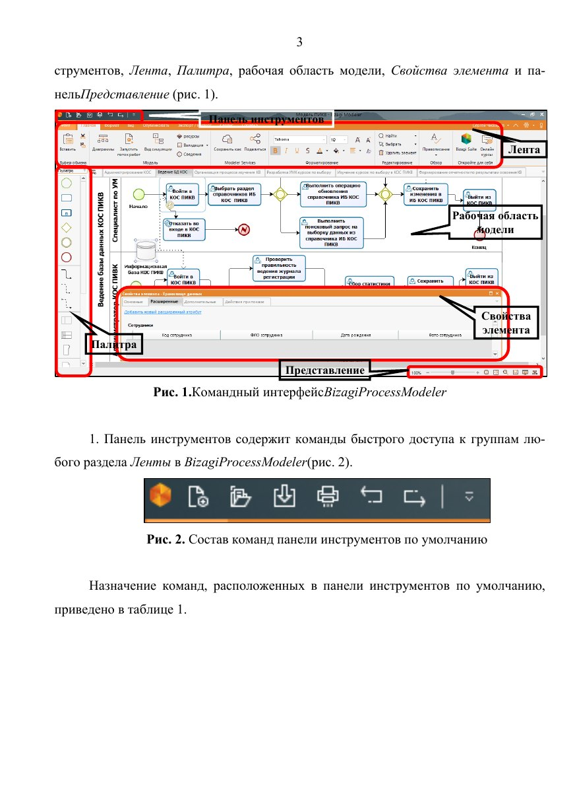

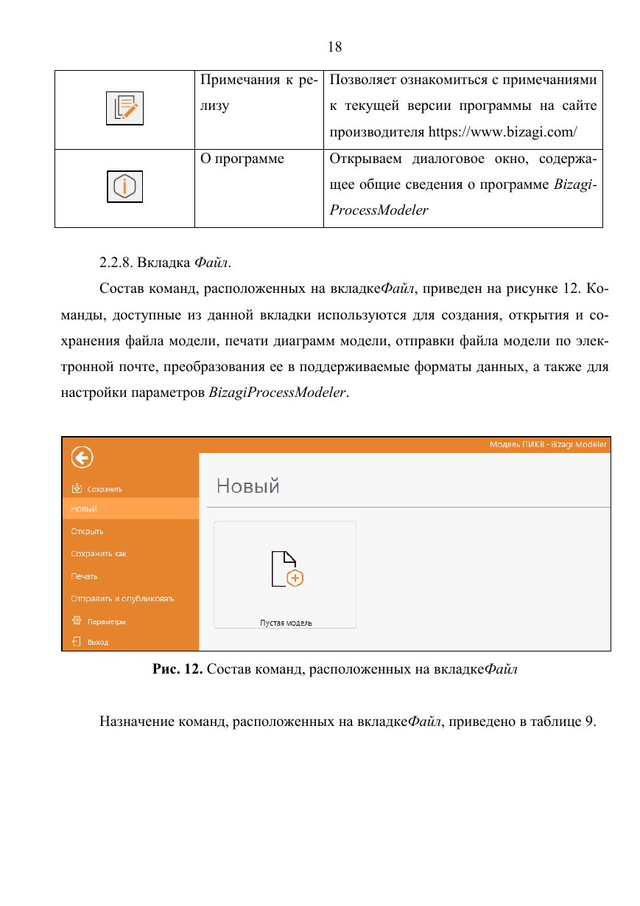

**Контроль:** в заголовке окна отображается имя рабочей копии; исходный файл остался без изменений.

**В отчёт:** снимок полного окна, снимок версии, имя открытого файла и краткое назначение областей интерфейса.

#### Шаг 2. Изучить ленту и установить единое форматирование

1. Поочерёдно откройте вкладки **Главная**, **Формат**, **Вид**, **Опубликовать** и **Экспорт/Импорт**.
2. На вкладке **Главная** найдите сохранение, проверку модели, ресурсы и режим показа; на **Формат** - шрифт, размер, начертание, выравнивание, заливку и границы; на **Вид** - сетку и команды отображения; на **Опубликовать** - Word, PDF и Web; на **Экспорт/Импорт** - изображения и XML.
3. Откройте первую диаграмму, нажмите `Ctrl+A`, чтобы выделить все элементы диаграммы.
4. На вкладке **Формат** выберите шрифт `Tahoma`, размер `10` и начертание **полужирное**.
5. Щёлкните свободное место, затем выборочно проверьте задачу, событие, шлюз и подпись потока: для каждого элемента должны отображаться `Tahoma`, `10`, **Bold**.
6. Повторите пункты 3-5 на каждой диаграмме модели, включая `Администрирование КОС` и вложенные подпроцессы.

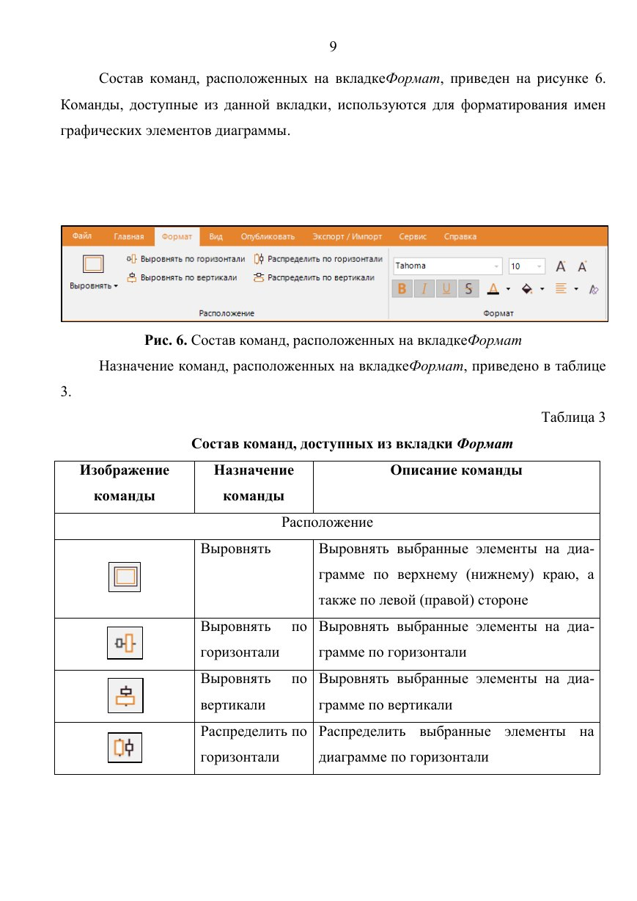

**Контроль:** ни на одной диаграмме не осталось подписей с другим шрифтом, размером или начертанием.

**В отчёт:** общий вид диаграммы после форматирования и крупный снимок панели **Формат**, где видны `Tahoma`, `10` и полужирное начертание.

#### Шаг 3. Добавить таблицу «Автор курса» к хранилищу данных

1. На диаграмме найдите хранилище `Информационная база КОС ПИКВ` и выделите его.
2. Откройте контекстное меню **Свойства**.
3. Включите отображение расширенных свойств/атрибутов для этого элемента.
4. Перейдите в раздел **Расширенные атрибуты**, нажмите **Добавить** и введите имя `Автор курса`.
5. В поле типа выберите **Таблица/Table**, затем откройте редактор структуры таблицы кнопкой с многоточием.
6. Создайте шесть столбцов в указанном порядке:

| № | Столбец | Тип в Modeler | Что вводится |
|---:|---|---|---|
| 1 | Код автора | Number | целый идентификатор автора |
| 2 | ФИО автора | TextBox | фамилия, имя и отчество |
| 3 | Категория автора | TextBox | категория автора курса |
| 4 | Фото автора | Image | файл изображения |
| 5 | Телефон автора | TextBox | номер телефона как текст |
| 6 | Электронная почта автора | TextBox | адрес электронной почты |

7. Подтвердите структуру таблицы, закройте свойства и сохраните модель сочетанием `Ctrl+S`.
8. Повторно откройте свойства хранилища и убедитесь, что таблица и все шесть столбцов сохранились.

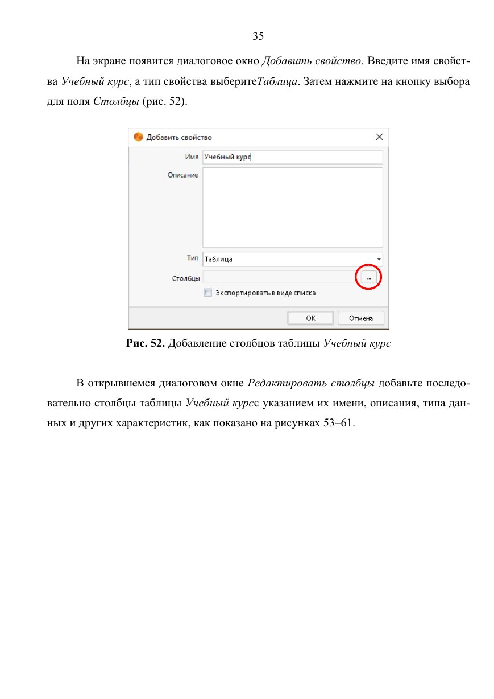

**Контроль:** таблица называется строго `Автор курса`; названия столбцов не сокращены, их порядок совпадает с таблицей выше.

**В отчёт:** окно свойств хранилища и редактор таблицы с полностью видимыми шестью строками.

#### Шаг 4. Изменить типы элементов и создать подпроцесс

1. Найдите задачу `Войти в КОС ПИКВ`.
2. Щёлкните её правой кнопкой, откройте **Тип задачи/Task type** и выберите **Пользовательская задача/User Task**. Внутри фигуры должен появиться значок пользователя.
3. Перейдите на диаграмму `Администрирование КОС`.
4. Для каждого шлюза на этой диаграмме откройте контекстное меню **Тип шлюза/Gateway type** и выберите **Включающий/Inclusive (OR)**. Внутри ромба должен появиться круг.
5. Найдите задачу `Обработать заявку на доступ к ресурсам`, откройте её контекстное меню и выберите **Преобразовать в подпроцесс/Convert to subprocess**.
6. Убедитесь, что внизу элемента появился маркер `+`. Откройте подпроцесс двойным щелчком и проверьте, что создана отдельная вкладка. Если содержимое подпроцесса не задано, оставьте внутри корректную минимальную последовательность `Начальное событие → Обработать заявку → Конечное событие`.
7. Вернитесь на родительскую диаграмму и сохраните модель.

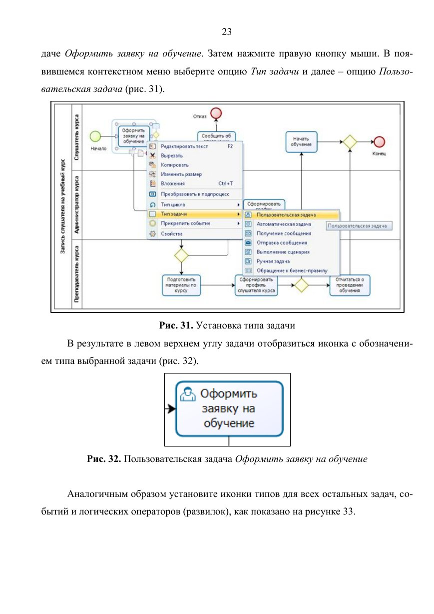

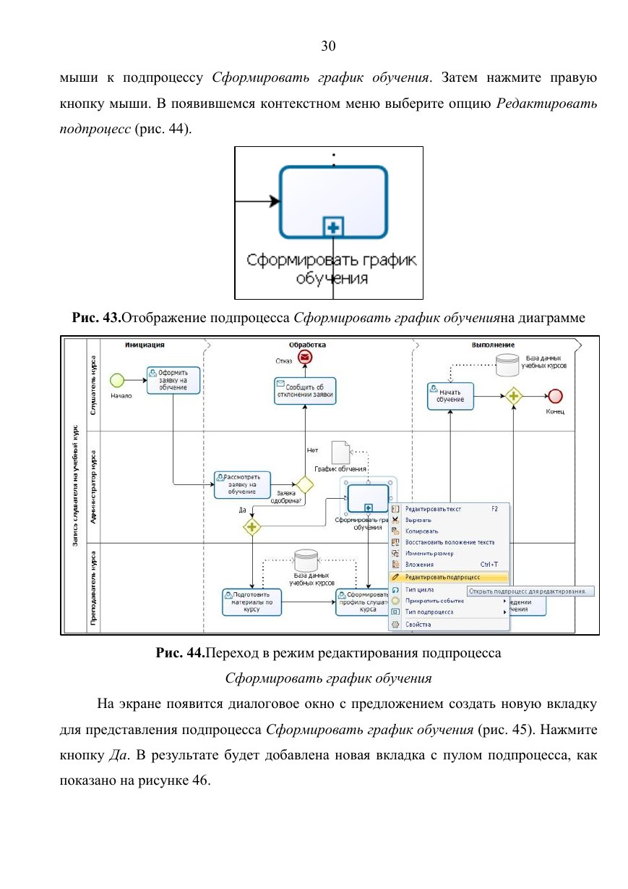

**Контроль:** `Войти в КОС ПИКВ` имеет значок пользователя; все шлюзы `Администрирование КОС` имеют символ OR; преобразованная задача имеет `+`.

**В отчёт:** три отдельных рисунка - тип пользовательской задачи, один шлюз OR и родительская диаграмма с разворачиваемым подпроцессом.

#### Шаг 5. Включить сетку и проверить доступность теней

1. Откройте вкладку **Вид/View**.
2. Нажмите **Сетка/Grid**. На фоне диаграммы должна появиться координатная сетка.
3. Полностью разверните ленту и проверьте наличие команды **Тени/Shadows**.
4. Если команда присутствует, включите её и зафиксируйте появление теней у фигур.
5. Если команды нет, не заменяйте её заливкой, рамкой или другой функцией. Сделайте снимок полностью раскрытой вкладки **Вид** и внесите в отчёт формулировку: `В установленной сборке Bizagi Process Modeler отдельная команда «Тени/Shadows» на полностью раскрытой вкладке «Вид» не отображается; сетка включена, отсутствие команды зафиксировано`.

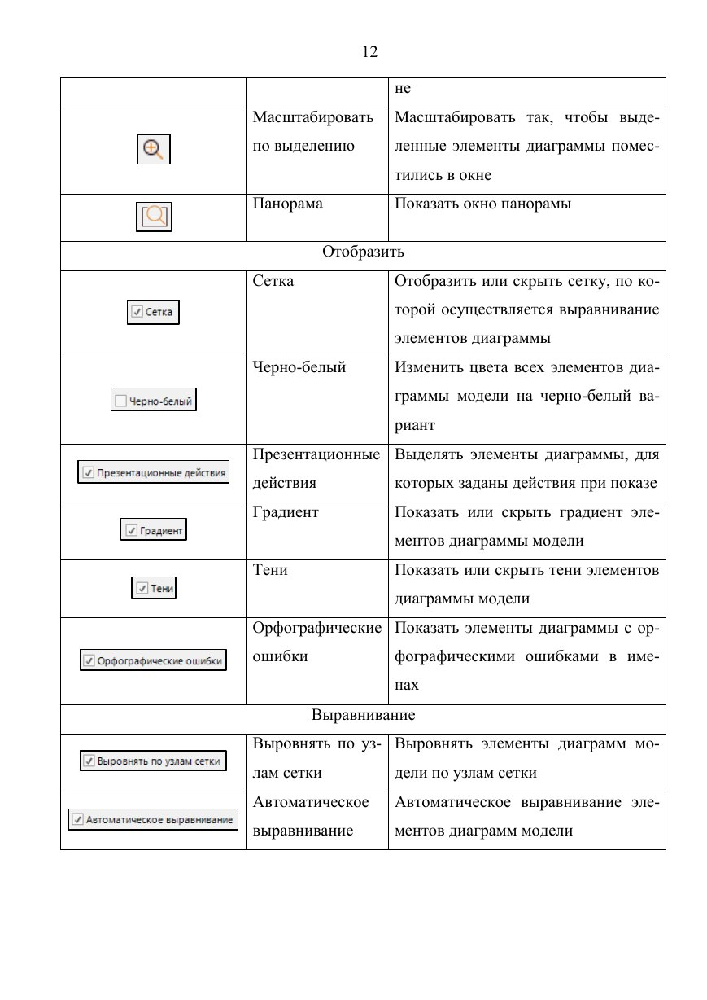

**Контроль:** сетка видна. По теням в отчёте есть либо результат включения, либо документированное ограничение интерфейса конкретной сборки.

#### Шаг 6. Выполнить валидацию и устранить ошибки

1. Сохраните модель.
2. На вкладке **Главная** нажмите **Валидация/Validate**.
3. Если появился список ошибок, откройте первую запись двойным щелчком: Modeler выделит проблемный элемент.
4. Исправьте конкретную причину: добавьте отсутствующее начальное или конечное событие, соедините разорванный поток, удалите поток без источника/приёмника, подпишите исходящие ветви шлюза или завершите маршрут.
5. Снова запустите проверку. Повторяйте цикл, пока окно не сообщит, что модель проверена без ошибок.

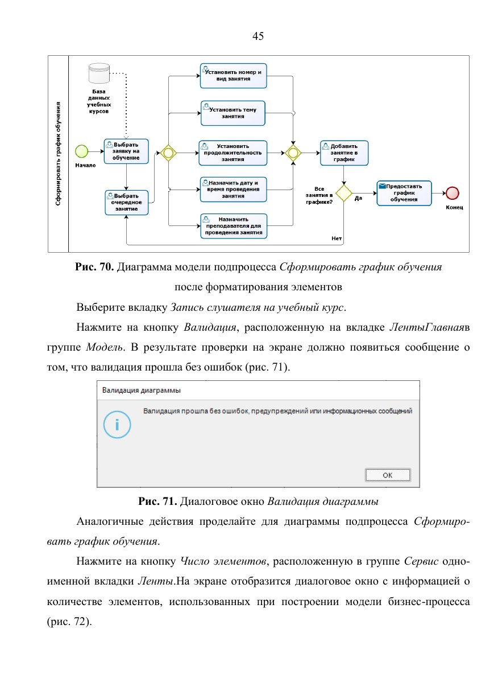

**В отчёт:** итоговое окно успешной проверки. Если ошибки исправлялись, добавьте таблицу `Сообщение → Причина → Выполненное исправление → Результат повторной проверки`.

#### Шаг 7. Опубликовать модель в Word, PDF и Web

1. Откройте вкладку **Опубликовать/Publish** и выберите **Word**.
2. В мастере отметьте все диаграммы модели, перенесите их в список публикации и расположите в логическом порядке: сначала верхнеуровневые процессы, затем подпроцессы.
3. Включите публикацию описаний и расширенных атрибутов.
4. Выберите папку практики и сформируйте `<ФИО>_ПР1.docx`.
5. Повторите те же действия для **PDF**, создав `<ФИО>_ПР1.pdf`.
6. Выберите **Web**, укажите отдельную папку `<ФИО>_ПР1_Web` и сформируйте HTML-публикацию.
7. Откройте каждый результат. Проверьте наличие всех диаграмм, читаемость подписей, таблицу `Автор курса` и отсутствие обрезанных краёв.

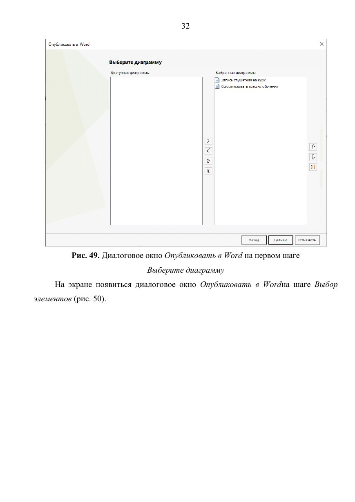

**В отчёт:** окно выбора диаграмм для публикации и по одному фрагменту открытых Word, PDF и Web-результатов.

#### Шаг 8. Экспортировать диаграммы и расширенные атрибуты

1. Откройте вкладку **Экспорт/Импорт**.
2. Выберите экспорт в растровое изображение и сохраните каждую диаграмму как PNG, например `Администрирование_КОС.png`.
3. Повторите экспорт в доступный векторный формат (`SVG`, `EMF` или другой векторный вариант, показанный в меню) и сохраните файл рядом с PNG.
4. Выберите экспорт расширенных атрибутов в **XML** и сохраните `<ФИО>_ПР1_атрибуты.xml`.
5. Откройте PNG и векторный файл, увеличьте изображение и убедитесь, что подписи не обрезаны. XML откройте в браузере или текстовом редакторе и найдите в нём строку `Автор курса`.

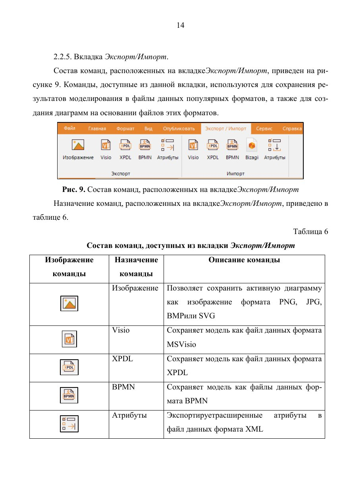

**В отчёт:** список созданных файлов, открытый PNG и фрагмент XML со строкой `Автор курса`. Поясните: PNG хранит пиксели, векторный формат масштабируется без потери резкости, XML переносит структурированные свойства.

#### Шаг 9. Настроить четыре разных презентационных действия

Выполните этот шаг на диаграмме `Администрирование КОС`. Для четырёх разных операций назначьте четыре разных действия.

1. Выберите первую операцию, откройте **Свойства → Действия при показе/Presentation actions**, нажмите `+`, выберите **Открыть URL** и введите безопасный адрес с `https://`.
2. Выберите вторую операцию, добавьте действие **Открыть файл** и укажите небольшой локальный PDF или текстовый файл без персональных данных.
3. Выберите третью операцию, добавьте действие **Открыть изображение** и укажите PNG/JPG из папки практики.
4. Выберите четвёртую операцию, добавьте действие **Показать текст** и введите краткое пояснение назначения операции.
5. Для каждого элемента нажмите **ОК**, повторно откройте свойства и убедитесь, что действие сохранилось.

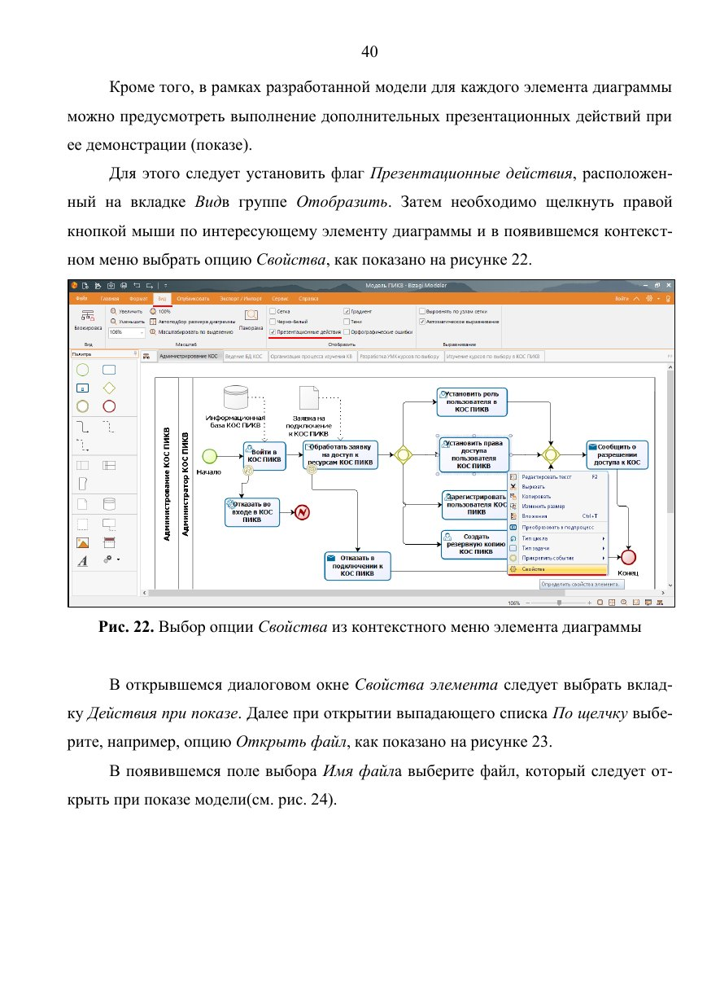

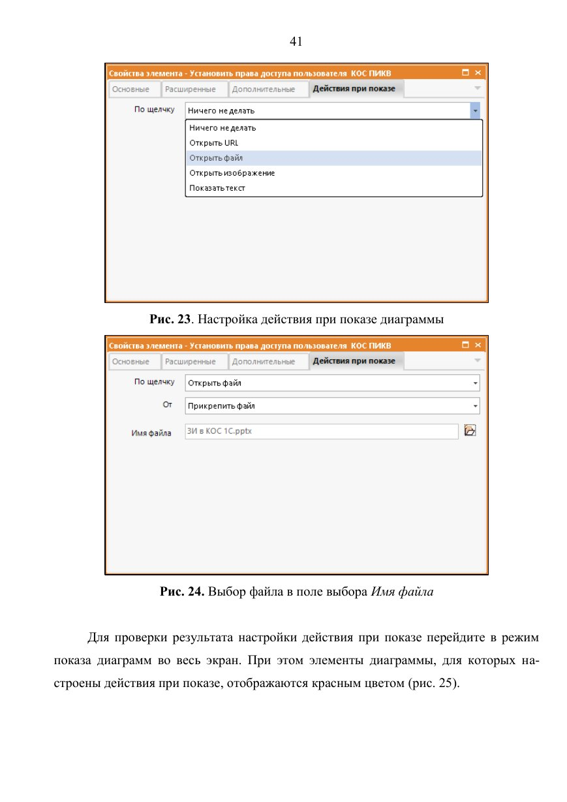

6. Нажмите **Запустить показ/Presentation mode**.
7. Последовательно щёлкните все четыре операции и проверьте, что открываются URL, файл, изображение и текст.
8. Завершите показ клавишей `Esc`.

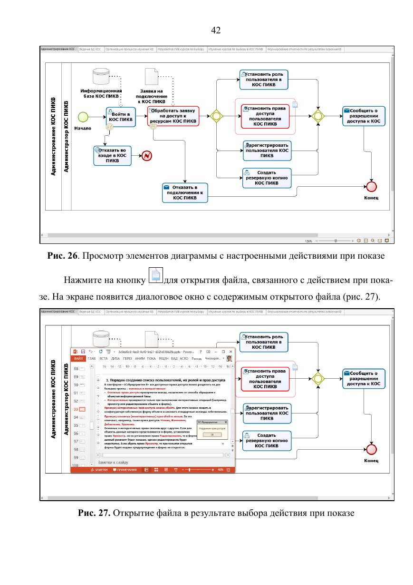

**В отчёт:** таблица `Операция → Тип действия → Настроенное значение → Фактический результат`, снимки окна настройки и результата запуска каждого типа действия.

#### Шаг 10. Финально сохранить и собрать отчёт

1. Нажмите `Ctrl+S`, закройте Modeler и повторно откройте `<ФИО студента>.bpm`.
2. Проверьте таблицу `Автор курса`, тип `Войти в КОС ПИКВ`, шлюзы OR, подпроцесс, сетку, валидацию и действия при показе.
3. Убедитесь, что все опубликованные и экспортированные файлы открываются.
4. В отчёте расположите доказательства в том же порядке, в котором выполнены шаги 1-9.
5. В выводе объясните, чем публикация отличается от экспорта, зачем нужна валидация и какие ограничения обнаружены в сборке 4.0.0.012.

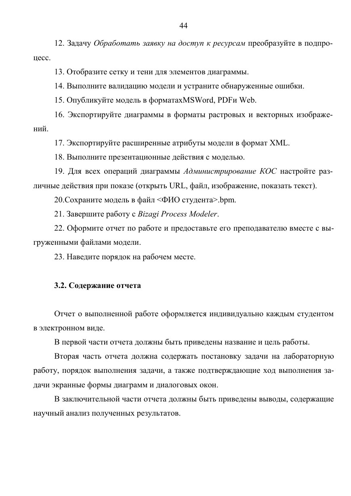

### 3.3. Комплект сдачи

- `<ФИО студента>.bpm`;
- `<ФИО>_ПР1.docx` и `<ФИО>_ПР1.pdf`;
- папка Web-публикации;
- растровые и векторные изображения всех диаграмм;
- `<ФИО>_ПР1_атрибуты.xml`;
- электронный отчёт с названием, целью, постановкой задачи, пошаговым ходом выполнения, результатами и аналитическими выводами.

## 4. Практическая работа № 2: моделирование бизнес-процесса

### 4.1. Цель и логика процесса

Цель - создать BPMN-модель процесса `Запись слушателя на учебный курс`, подпроцесс `Сформировать график обучения`, расширенный атрибут хранилища и оформить диаграммы.

Участники: `Слушатель курса`, `Администратор курса`, `Преподаватель курса`.

Этапы: `Инициация`, `Обработка`, `Выполнение`.

Основная логика:

1. Слушатель оформляет заявку.
2. Администратор рассматривает заявку и в шлюзе `Заявка одобрена?` выбирается одна из двух ветвей.
3. При отказе выполняется отправка сообщения `Сообщить об отклонении заявки`, после чего срабатывает конечное событие-сообщение `Отказ`.
4. При одобрении параллельно выполняются подпроцесс `Сформировать график обучения` и последовательность `Подготовить материалы по курсу → Сформировать профиль слушателя курса`.
5. После завершения обеих ветвей параллельно выполняются `Начать обучение` и `Отчитаться о проведении обучения`; после их объединения процесс завершается событием `Конец`.

### 4.2. Пошаговое выполнение

#### Шаг 1. Подготовить чистую диаграмму

1. Откройте Bizagi Modeler и создайте новую модель.
2. Сохраните её как `Фамилия И.О._ПР2.bpm`.
3. Перетащите из палитры **Пул/Pool** на пустое поле.
4. Щёлкните текст названия пула и замените его на `Запись слушателя на учебный курс`.
5. Растяните пул за маркеры границы так, чтобы справа осталось место для всех операций.

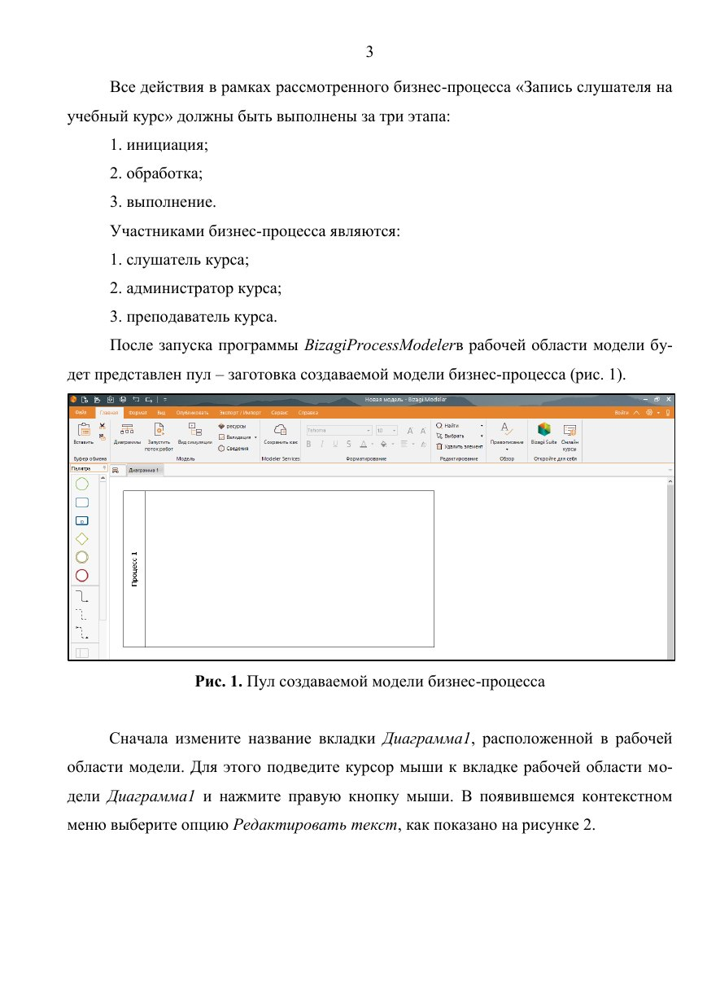

#### Шаг 2. Создать три дорожки

1. Выделите пул.
2. Используйте появившуюся кнопку добавления дорожки либо перетащите **Дорожку/Lane** из палитры внутрь пула.
3. Повторите действие, пока внутри пула не будет трёх дорожек.
4. Переименуйте их сверху вниз: `Слушатель курса`, `Администратор курса`, `Преподаватель курса`.
5. Если текст не помещается, увеличьте высоту дорожки или ширину области заголовка.

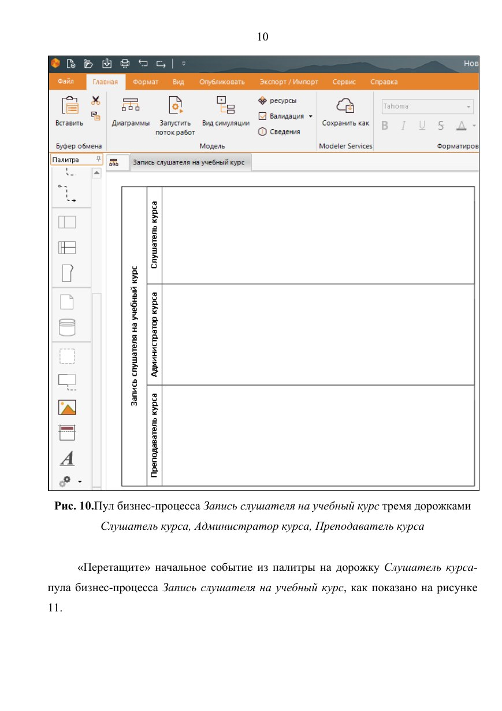

**Проверка:** дорожки находятся внутри одного пула, не перекрывают друг друга и имеют читаемые названия.

#### Шаг 3. Расставить элементы процесса

1. В дорожке слушателя поставьте начальное событие `Начало`.
2. Справа от него добавьте задачу `Оформить заявку на обучение`.
3. В дорожке администратора добавьте задачу `Рассмотреть заявку на обучение`.
4. После неё добавьте исключающий шлюз `Заявка одобрена?`.
5. Ветвь `Нет` направьте к задаче `Сообщить об отклонении заявки`, затем к конечному событию `Отказ`.
6. Ветвь `Да` направьте к параллельному разветвлению.
7. В дорожке администратора разместите свёрнутый подпроцесс `Сформировать график обучения`.
8. Во второй параллельной ветви, в дорожке преподавателя, последовательно разместите `Подготовить материалы по курсу` и `Сформировать профиль слушателя курса`.
9. После подпроцесса и задачи формирования профиля установите параллельный шлюз объединения. Все входящие ветви должны входить в один ромб с символом `+`.
10. Сразу после объединения установите параллельный шлюз-разделитель. Одну ветвь направьте в дорожку слушателя к задаче `Начать обучение`, вторую - в дорожку преподавателя к задаче `Отчитаться о проведении обучения`.
11. После этих двух задач установите ещё один параллельный шлюз объединения и соедините его с конечным событием `Конец`.
12. Добавьте объект данных `График обучения` рядом с подпроцессом и хранилище `База данных учебных курсов` рядом с операциями преподавателя. Соедините их с задачами пунктирными ассоциациями данных, а не сплошными потоками управления.

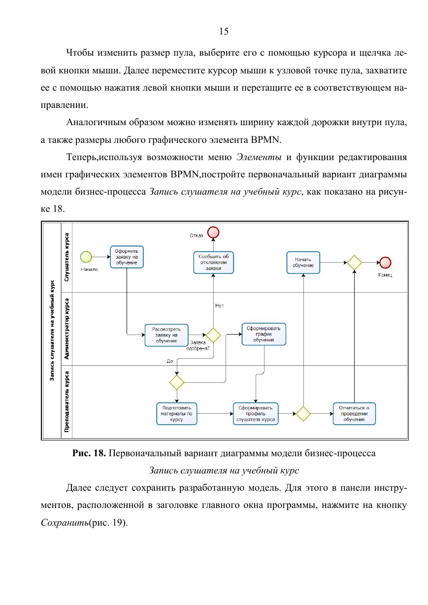

**Практическое правило соединения:** наведите указатель на элемент, потяните маркер быстрого создания к следующему элементу и выберите нужный тип. Для уже созданных фигур используйте **Поток управления/Sequence Flow**. После каждого соединения слегка переместите целевой элемент: линия должна остаться прикреплённой.

#### Шаг 4. Назначить типы задач и шлюзов

1. Для каждой задачи откройте контекстное меню **Тип задачи/Task type**.
2. Назначьте типы по таблице:

| Элемент | Тип BPMN | Признак на фигуре |
|---|---|---|
| Оформить заявку на обучение | User Task | значок пользователя |
| Рассмотреть заявку на обучение | User Task | значок пользователя |
| Сообщить об отклонении заявки | Send Task | значок конверта |
| Подготовить материалы по курсу | User Task | значок пользователя |
| Сформировать профиль слушателя курса | User Task | значок пользователя |
| Начать обучение | User Task | значок пользователя |
| Отчитаться о проведении обучения | User Task | значок пользователя |
| Сформировать график обучения | Collapsed Subprocess | маркер `+` внизу |

3. Шлюзу `Заявка одобрена?` назначьте тип **Исключающий/Exclusive** - внутри ромба должен быть символ `X` либо пустой ромб в принятом стиле Bizagi.
4. Всем трём шлюзам синхронизации назначьте тип **Параллельный/Parallel** - внутри каждого ромба должен быть `+`.
5. Подпишите исходящие потоки исключающего шлюза: верхнюю ветвь `Нет`, нижнюю ветвь `Да`.
6. Конечное событие отказа преобразуйте в событие-сообщение и назовите `Отказ`; обычное конечное событие успешной ветви назовите `Конец`.


*Иллюстрация из ПЗ 3, стр. 23: назначение типа задачи и вид пользовательской задачи.*

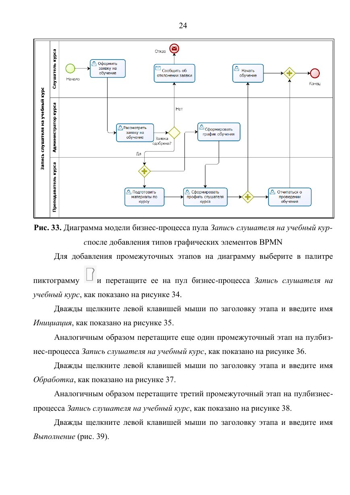

**В отчёт:** снимок контекстного меню для одного типа задачи, одного шлюза и общий вид модели после назначения типов.

#### Шаг 5. Создать фазы

1. Перетащите из палитры элемент **Фаза/Milestone** в пул.
2. Растяните его вертикальную границу на всю высоту пула.
3. Создайте три фазы: `Инициация`, `Обработка`, `Выполнение`.
4. В `Инициация` оставьте начальное событие и `Оформить заявку на обучение`.
5. В `Обработка` разместите `Рассмотреть заявку на обучение`, шлюз решения, уведомление об отказе, параллельную подготовку графика и материалов, а также `Сформировать профиль слушателя курса`.
6. В `Выполнение` разместите `Начать обучение`, `Отчитаться о проведении обучения`, заключительный параллельный шлюз и событие `Конец`.
7. Не соединяйте фазы потоками - это области разметки, а не операции.

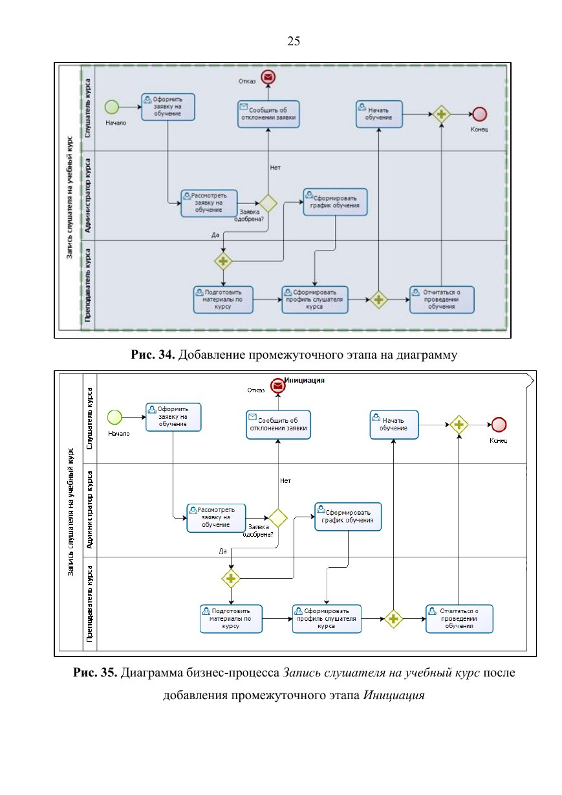

*Иллюстрация из ПЗ 3, стр. 25: добавление и размещение промежуточного этапа.*

#### Шаг 6. Детализировать подпроцесс

1. Выделите `Сформировать график обучения`.
2. Убедитесь, что это именно свёрнутый подпроцесс: внизу элемента должен быть знак `+`.
3. Щёлкните правой кнопкой и выберите **Редактировать подпроцесс/Edit subprocess**.


4. На открывшейся вкладке создайте последовательность `Начало → Выбрать заявку на обучение → Выбрать очередное занятие`.
5. После `Выбрать очередное занятие` поставьте параллельный шлюз-разделитель.
6. Создайте пять параллельных пользовательских задач:
   - `Установить номер и вид занятия`;
   - `Установить тему занятия`;
   - `Установить продолжительность занятия`;
   - `Назначить дату и время проведения занятия`;
   - `Назначить преподавателя для проведения занятия`.
7. Соедините выходы пяти задач параллельным шлюзом-объединением.
8. После объединения добавьте пользовательскую задачу `Добавить занятие в график`.
9. Добавьте исключающий шлюз `Все занятия в графике?`.
10. Поток `Нет` верните к задаче `Выбрать очередное занятие`; поток `Да` направьте к задаче отправки `Предоставить график обучения`, затем к конечному событию `Конец`.
11. Добавьте хранилище `База данных учебных курсов` и соедините его пунктирной ассоциацией с задачей `Выбрать заявку на обучение`.
12. Проверьте подпроцесс отдельно: все пять параллельных ветвей должны сходиться перед добавлением занятия, цикл должен возвращаться только по ветви `Нет`.
13. Вернитесь на вкладку основного процесса и убедитесь, что подпроцесс сохранил маркер `+`.

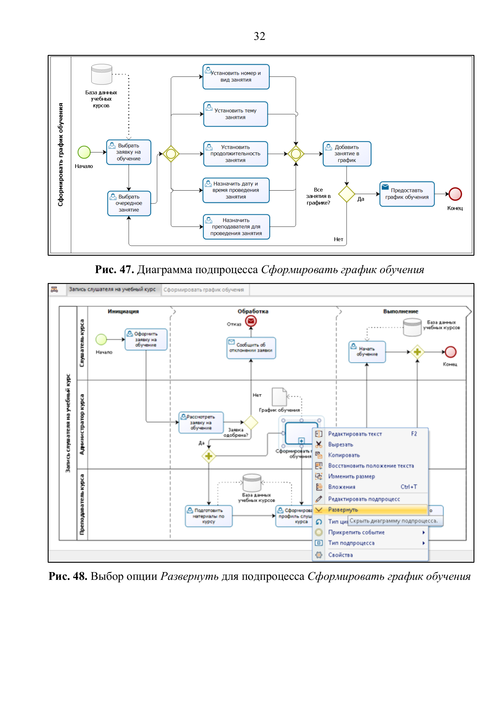

#### Шаг 7. Добавить расширенный атрибут-таблицу

1. Щёлкните свободную область диаграммы правой кнопкой и откройте **Свойства диаграммы**.
2. Перейдите в раздел **Расширенные атрибуты/Extended attributes**.
3. Нажмите **Добавить**.
4. Введите имя `Учебный курс`.
5. В поле типа выберите **Таблица/Table**.
6. Нажмите кнопку с многоточием у структуры таблицы.


7. Последовательно добавьте восемь столбцов с точными типами и ограничениями:

| Столбец | Тип | Дополнительная настройка |
|---|---|---|
| Код курса | Number | целое число, диапазон 1-100 |
| Название курса | TextBox | однострочный текст |
| Дата создания курса | Date | календарная дата |
| Описание курса | TextArea | многострочный текст |
| Автор курса | TextBox | однострочный текст |
| Сложность курса | Choice | `Начальный`, `Продвинутый`, `Профессиональный` |
| Продолжительность курса | Number | диапазон 10-200 |
| Ссылка на электронный ресурс курса | URL | полный адрес с `http://` или `https://` |

8. Для `Сложность курса` откройте редактор допустимых значений и внесите три значения отдельными строками в указанном порядке.
9. Для двух числовых столбцов включите проверку диапазона: `1-100` и `10-200`.
10. Подтвердите структуру, сохраните свойства диаграммы, снова откройте таблицу и сравните каждую строку с таблицей выше.

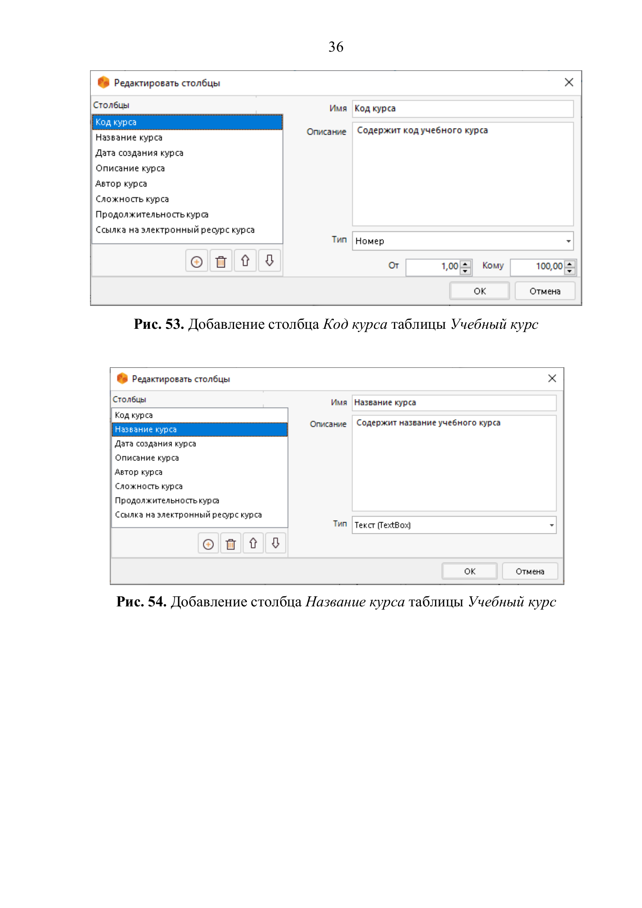

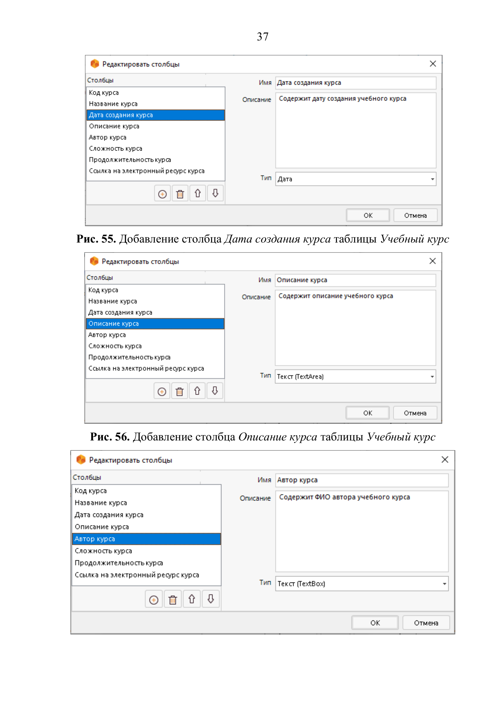

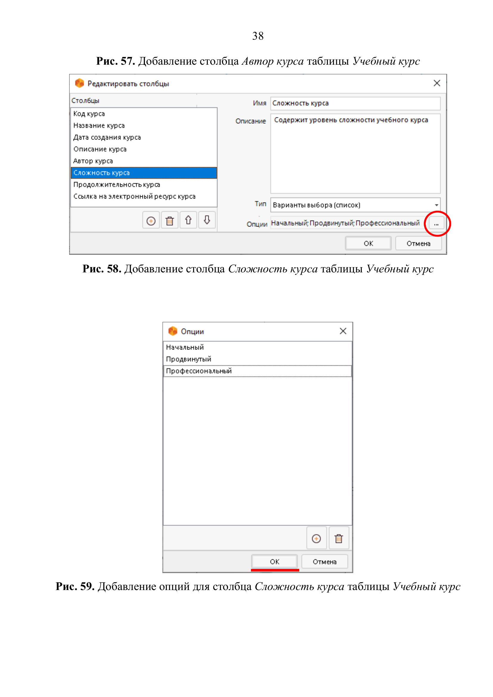

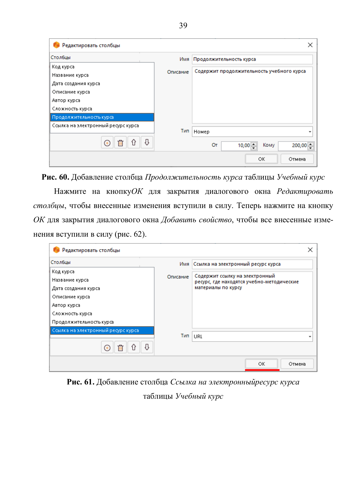

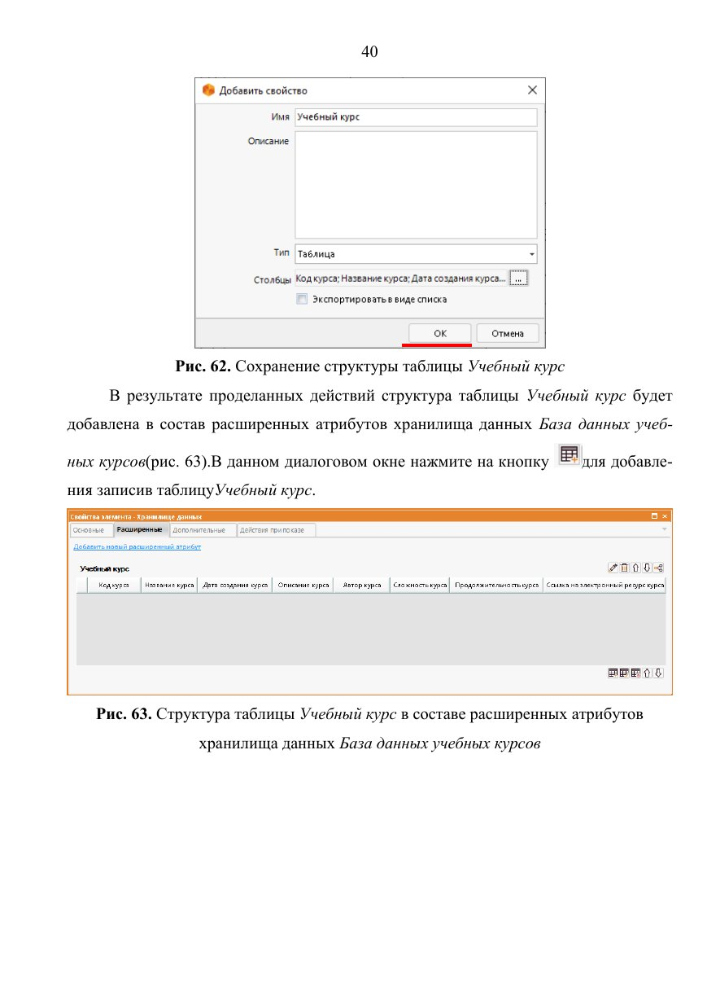

#### Шаг 8. Выровнять, проверить и подготовить печать

1. Выделяйте несколько элементов с зажатой клавишей `Ctrl`.
2. Используйте команды выравнивания и одинаковых интервалов на вкладке **Формат**.
3. Уберите пересечения линий; предпочтительны горизонтальные и вертикальные участки.
4. Убедитесь, что подписи потоков не перекрывают фигуры.
5. Запустите **Валидацию** и исправьте ошибки.
6. Сохраните модель.

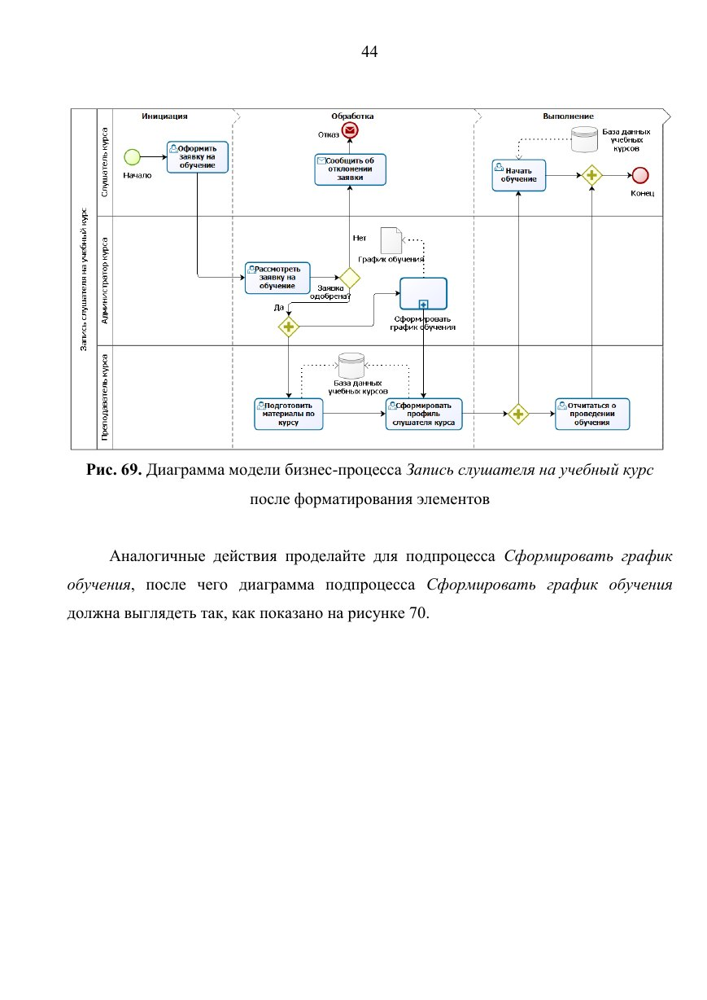

7. Откройте **Файл → Печать** или **Предварительный просмотр**.
8. Выберите альбомную ориентацию для широкой схемы.
9. Установите масштаб размещения на одной странице, только если надписи остаются читаемыми; иначе используйте несколько страниц.
10. Переключите страницы стрелками и проверьте отсутствие обрезанных дорожек.

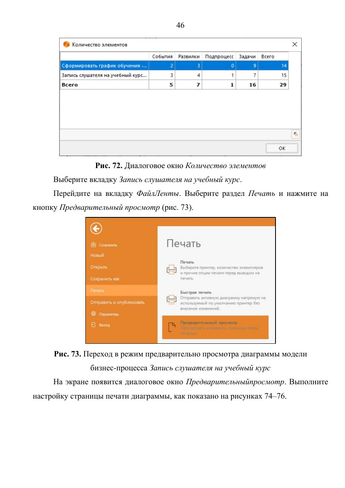

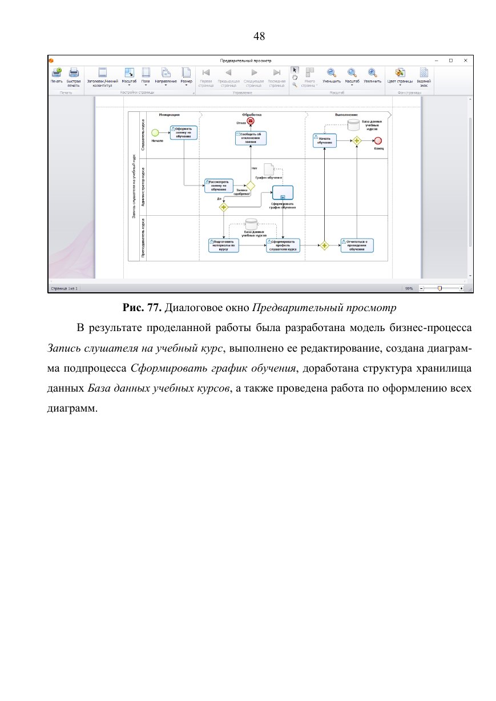

**В отчёт по работе № 2:** снимки создания пула, трёх дорожек, промежуточной схемы, назначения типов, подпроцесса, структуры расширенного атрибута, результата валидации и итоговой диаграммы. После каждого рисунка одним абзацем объясните, что именно изменилось.

### 4.3. Комплект сдачи

- файл модели `<ФИО студента>.bpm`;
- электронный отчёт с основной и дочерней диаграммами, расширенным атрибутом, валидацией и предварительным просмотром.

## 5. Практическая работа № 3: документирование и публикация

### 5.1. Подготовка

Откройте проверенный файл из работы № 2. Если модель не прошла валидацию, сначала исправьте её. Создайте новую рабочую копию для работы № 3.

### 5.2. Пошаговое выполнение

#### Шаг 1. Сделать отдельную копию модели

1. Откройте проверенный файл работы № 2.
2. Сразу выполните **Файл → Сохранить как**.
3. Сохраните копию под именем `Фамилия И.О._ПР3.bpm`.
4. Закройте и повторно откройте новый файл, чтобы исключить случайное редактирование работы № 2.


*Иллюстрация из ПЗ 1, стр. 18: через «Сохранить как» создаётся отдельная копия для следующей работы.*

#### Шаг 2. Заполнить свойства основного процесса

1. На основной диаграмме щёлкните свободное место правой кнопкой.
2. Выберите **Свойства основного процесса**.
3. Введите название `Основной процесс`.
4. В поле описания напишите, что процесс включает запись слушателя на курс и формирование графика обучения.
5. Если поле описания мало, нажмите кнопку разворачивания справа от него.
6. Сохраните свойства и откройте их повторно для проверки.

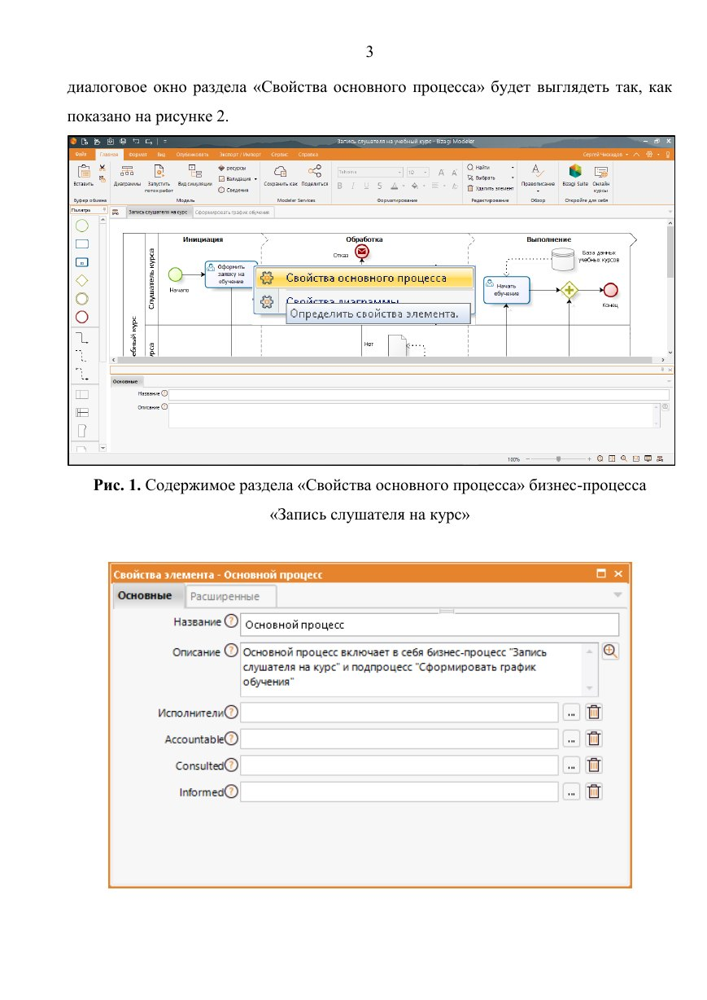

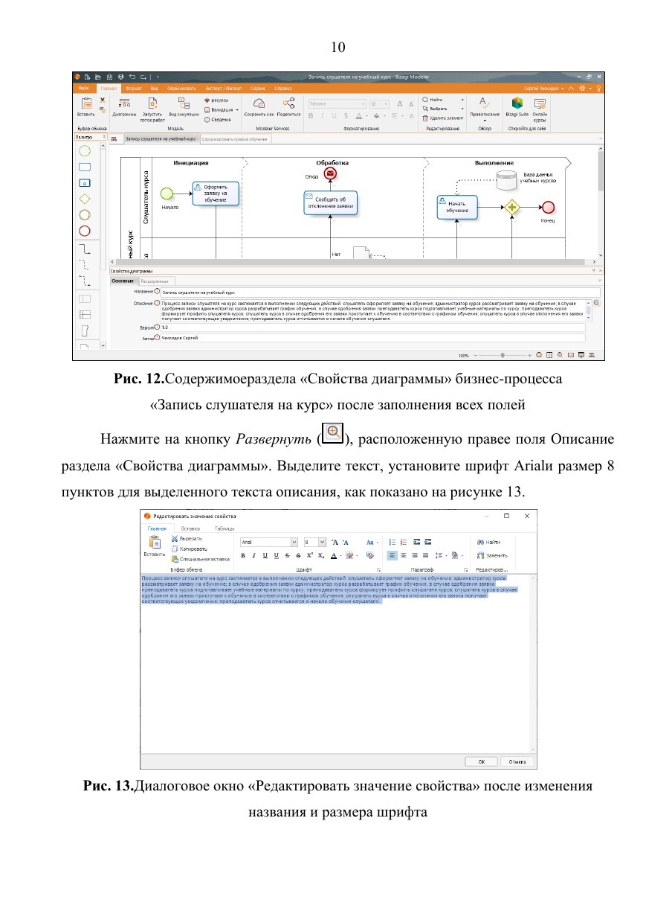

*Иллюстрации из ПЗ 5, стр. 3 и 10: свойства процесса заполняются отдельно от свойств конкретной диаграммы.*

#### Шаг 3. Создать ресурсы

1. На вкладке **Главная** нажмите **Ресурсы**.
2. В окне управления ресурсами нажмите `+`.
3. Введите `Слушатель курса`, добавьте описание его участия, оставьте тип **Роль** и нажмите **ОК**.
4. Повторите для `Администратор курса` и `Преподаватель курса`.
5. Проверьте отсутствие дубликатов и опечаток.

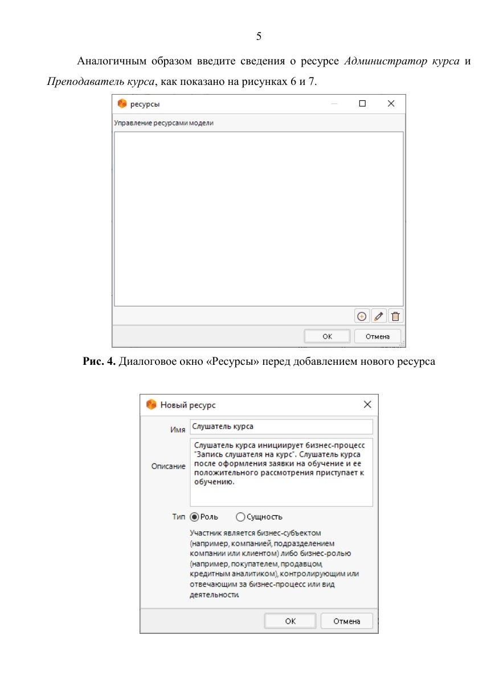

#### Шаг 4. Заполнить RACI основного процесса

1. Снова откройте **Свойства основного процесса**.
2. Напротив **Исполнители** нажмите многоточие и выберите администратора курса.
3. Напротив **Accountable/Ответственный** выберите администратора курса.
4. Напротив **Consulted/Консультируемый** выберите преподавателя курса.
5. Напротив **Informed/Информируемый** выберите слушателя курса.
6. Подтвердите выбор и убедитесь, что все четыре поля заполнены.

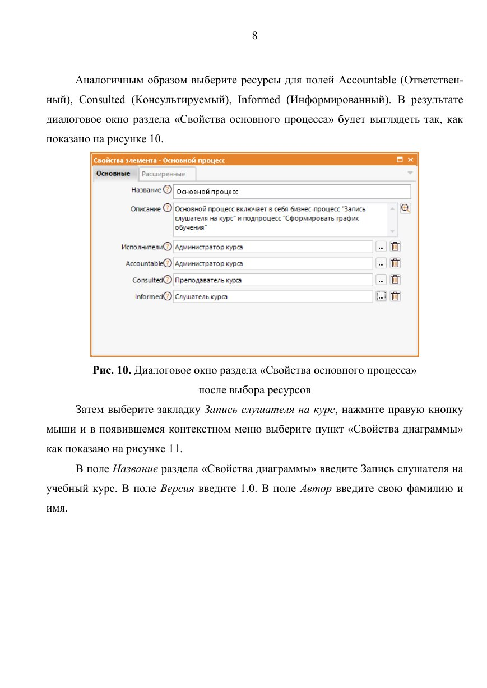

**В отчёт:** расшифруйте RACI: кто выполняет, кто несёт итоговую ответственность, кого консультируют и кого информируют.

#### Шаг 5. Документировать каждую задачу и подпроцесс

Для каждого элемента выполняйте один и тот же цикл:

1. Выделите элемент на диаграмме.
2. Щёлкните правой кнопкой и выберите **Свойства**.

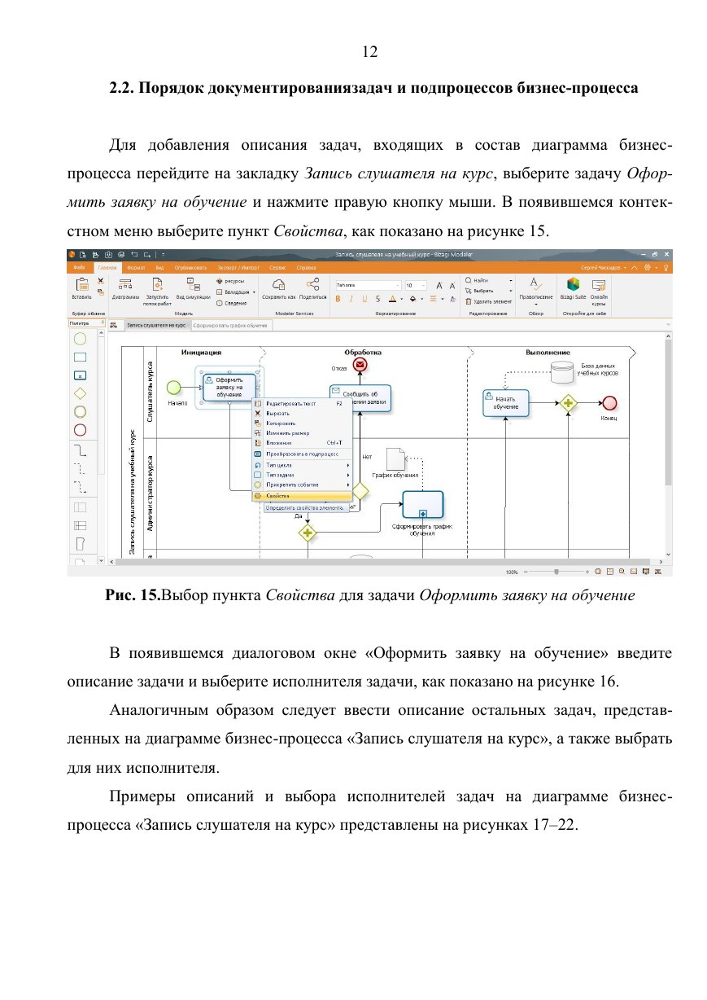

3. Проверьте название — оно должно совпадать с подписью на диаграмме.
4. В поле **Описание** внесите текст из таблицы ниже; его можно стилистически расширить, но нельзя менять смысл входа и результата.
5. В поле **Исполнители** назначьте ресурс из таблицы.
6. Для подпроцесса нажмите кнопку разворачивания описания и вставьте полное описание цели и результата.
7. Нажмите **ОК** или закройте окно с сохранением.
8. Поставьте отметку в рабочем чек-листе, чтобы не пропустить элемент.

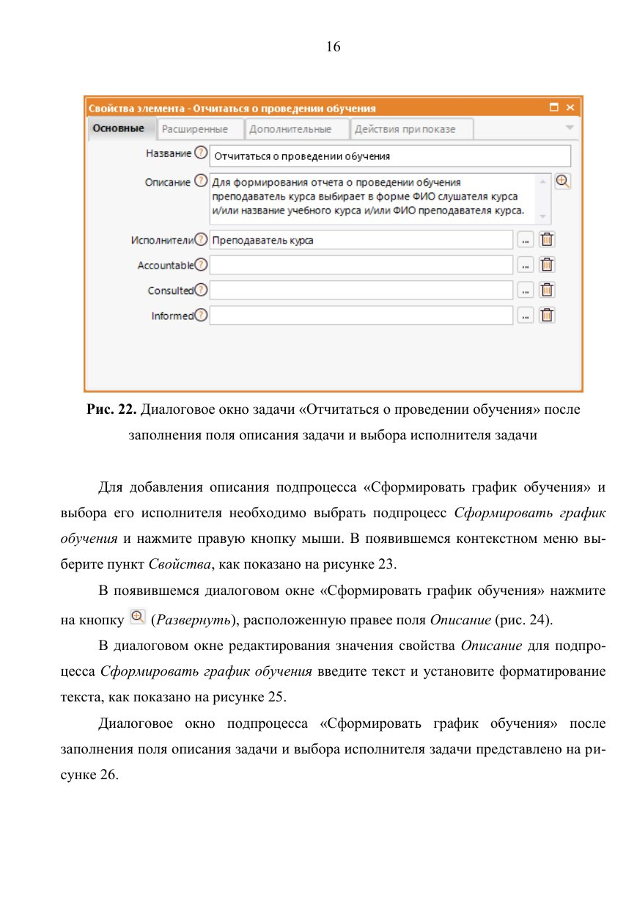

**Минимальная формула описания:** `Исполнитель получает [вход], выполняет [действие], формирует [результат], который используется [следующим элементом]`.

| Элемент | Исполнитель | Готовое содержание описания |
|---|---|---|
| Оформить заявку на обучение | Слушатель курса | Слушатель выбирает учебный курс, вводит сведения о себе, дату начала и пожелания; результатом является новая заявка на рассмотрение. |
| Рассмотреть заявку на обучение | Администратор курса | Администратор проверяет полноту заявки и возможность обучения; результатом является решение об одобрении либо отклонении. |
| Сообщить об отклонении заявки | Слушатель курса | Слушатель получает уведомление и причину отказа; после ознакомления отрицательная ветвь процесса завершается. |
| Сформировать график обучения | Администратор курса | Администратор выбирает занятия, задаёт темы, виды, длительность, даты, время и преподавателей; результатом является готовый график обучения. |
| Подготовить материалы по курсу | Преподаватель курса | Преподаватель подготавливает учебные материалы и ссылки на электронные ресурсы; результат передаётся в профиль слушателя. |
| Сформировать профиль слушателя курса | Преподаватель курса | Преподаватель создаёт профиль, связывает его с курсом, материалами и графиком; результатом является готовое рабочее пространство слушателя. |
| Начать обучение | Слушатель курса | Слушатель получает доступ к профилю и графику, изучает материалы и загружает отчёты по занятиям. |
| Отчитаться о проведении обучения | Преподаватель курса | Преподаватель проверяет отчёты, фиксирует баллы и результат проведения обучения. |
| Подпроцесс Сформировать график обучения | Администратор курса | Подпроцесс циклически добавляет очередное занятие в график; для каждого занятия устанавливаются номер, вид, тема, длительность, дата, время и преподаватель, после чего готовый график передаётся в основной процесс. |

#### Шаг 6. Документировать дорожки, фазы, события, данные и шлюзы

1. Для каждой дорожки откройте **Свойства** и опишите ответственность роли в процессе.
2. Для каждой фазы укажите, какие результаты должны быть достигнуты к её завершению.
3. Для начального события опишите условие запуска процесса.
4. Для конечного события опишите результат завершения.
5. Для промежуточного события укажите, что его вызывает и как процесс продолжается.
6. Для объекта данных укажите состав информации и где она используется.
7. Для хранилища данных укажите назначение без вымышленных технических деталей.
8. Для шлюза опишите проверяемое условие и смысл каждой ветви.
9. Для потоков `Да` и `Нет` добавьте описание условия перехода, если соответствующее поле доступно.

Используйте следующие смысловые формулировки:

| Объект | Содержание описания |
|---|---|
| Дорожка Слушатель курса | Инициирует заявку, получает решение, начинает обучение и передаёт отчёты по занятиям. |
| Дорожка Администратор курса | Рассматривает заявку и при одобрении формирует график обучения. |
| Дорожка Преподаватель курса | Готовит материалы, формирует профиль и проверяет результаты обучения. |
| Фаза Инициация | От появления потребности в обучении до регистрации заявки. |
| Фаза Обработка | От рассмотрения заявки до подготовки графика, материалов и профиля. |
| Фаза Выполнение | Начало обучения, проверка результатов и завершение процесса. |
| Начальное событие Начало | Процесс запускается, когда слушатель принимает решение записаться на курс. |
| Конечное событие Отказ | Процесс завершён без обучения; слушатель получил уведомление о причине отклонения. |
| Конечное событие Конец | График и профиль подготовлены, обучение начато, результаты зафиксированы. |
| Шлюз Заявка одобрена? | Проверяет решение администратора; `Да` запускает подготовку обучения, `Нет` направляет к уведомлению об отказе. |
| Параллельные шлюзы | Одновременно запускают независимые действия и не пропускают процесс дальше до завершения всех входящих ветвей. |
| Объект График обучения | Содержит перечень занятий, даты, время, темы, виды, длительность и назначенных преподавателей. |
| Хранилище База данных учебных курсов | Хранит сведения об учебных курсах и используется при выборе курса и подготовке материалов. |
| Поток Да | Используется, когда заявка одобрена. |
| Поток Нет | Используется, когда заявка отклонена. |

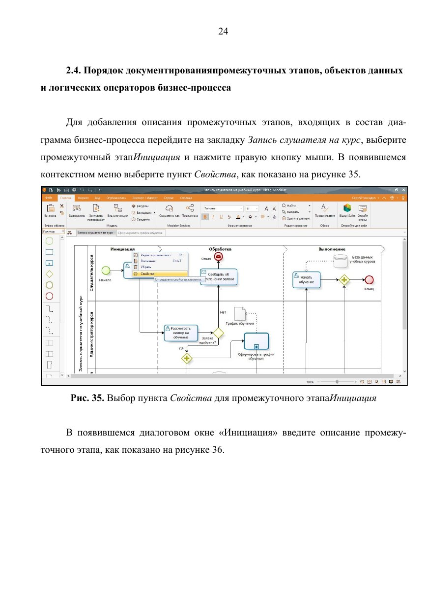

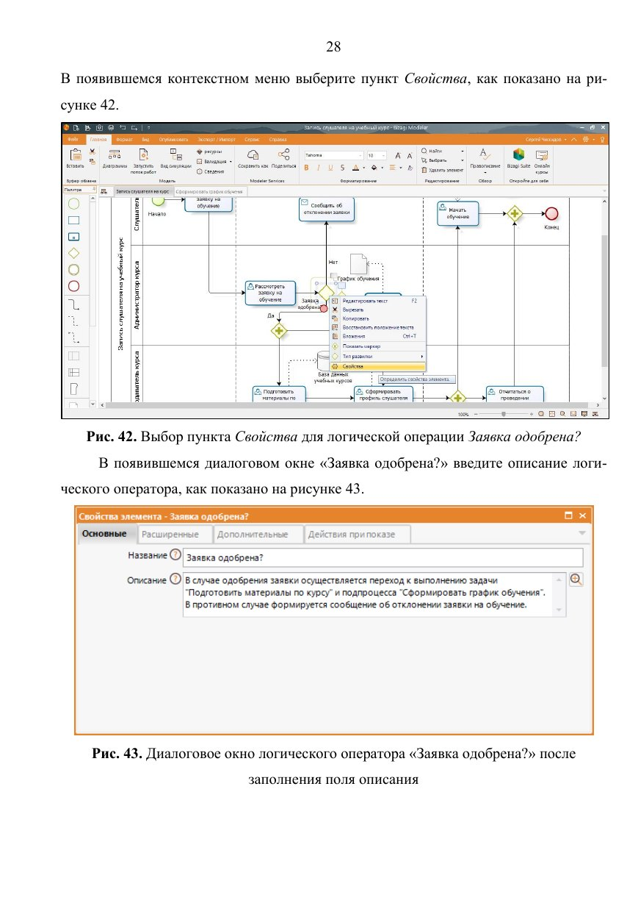

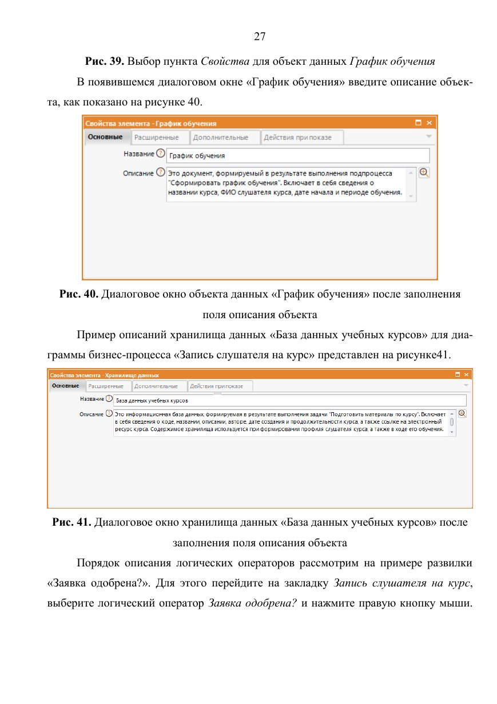

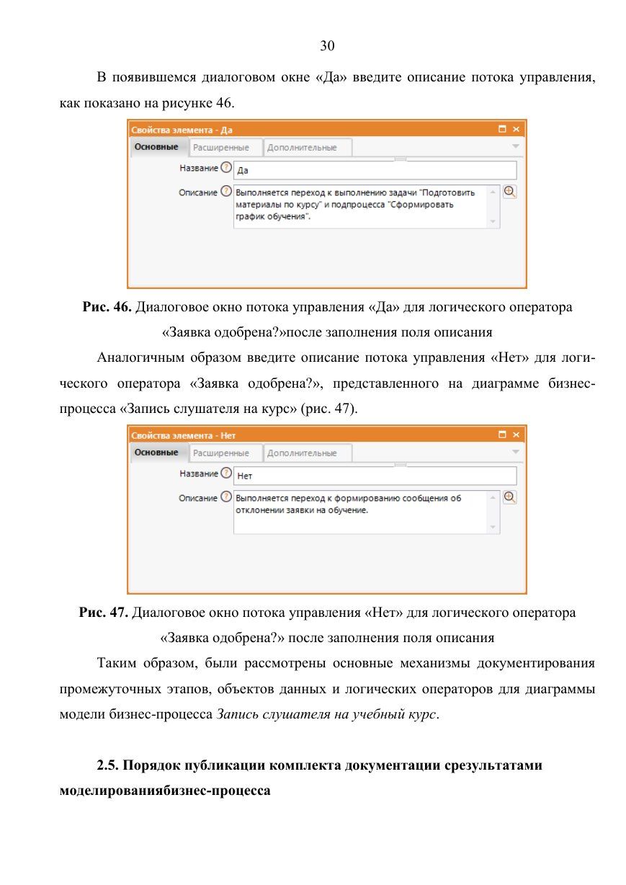

*Иллюстрации из ПЗ 5, стр. 27 и 30: отдельные окна для данных и условий перехода.*

#### Шаг 7. Опубликовать документацию

1. Сохраните и провалидируйте обе диаграммы.
2. Откройте вкладку **Опубликовать**.
3. Выберите **Word**.
4. На первом шаге перенесите основную диаграмму и подпроцесс в список выбранных диаграмм.


5. На следующем шаге отметьте элементы и свойства, которые должны попасть в документ: описания, ресурсы, расширенные атрибуты и диаграммы.
6. Задайте порядок разделов.
7. Выберите альбомную ориентацию для диаграмм.
8. Укажите имя `Фамилия_ПР3_документация.docx` и нажмите **Готово**.

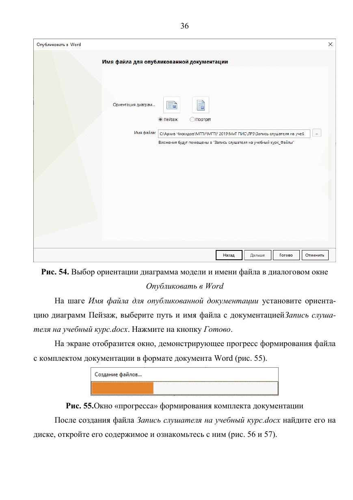

9. Откройте DOCX и проверьте оглавление, изображения и русские символы.
10. Повторите публикацию в PDF и Excel. Для PDF включите обе диаграммы и свойства элементов; для Excel включите основной процесс и подпроцесс, чтобы получить перечень элементов и их описаний в табличном виде.
11. В каждом файле проверьте наличие основной диаграммы и подпроцесса, а не только титульной страницы.

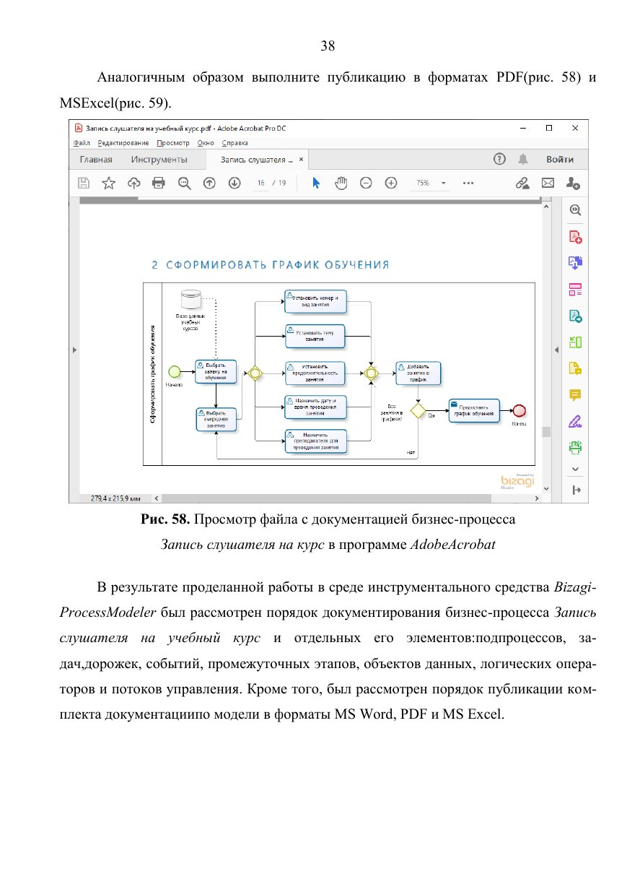

12. Если в сборке 4.0.0.012 отдельная кнопка PDF недоступна, сначала сформируйте Word-документ, затем сохраните его как PDF средствами Microsoft Word. Если недоступна публикация Excel, зафиксируйте полностью раскрытую вкладку **Опубликовать** и приложите Word/PDF; не подменяйте Excel изображением без пояснения ограничения.

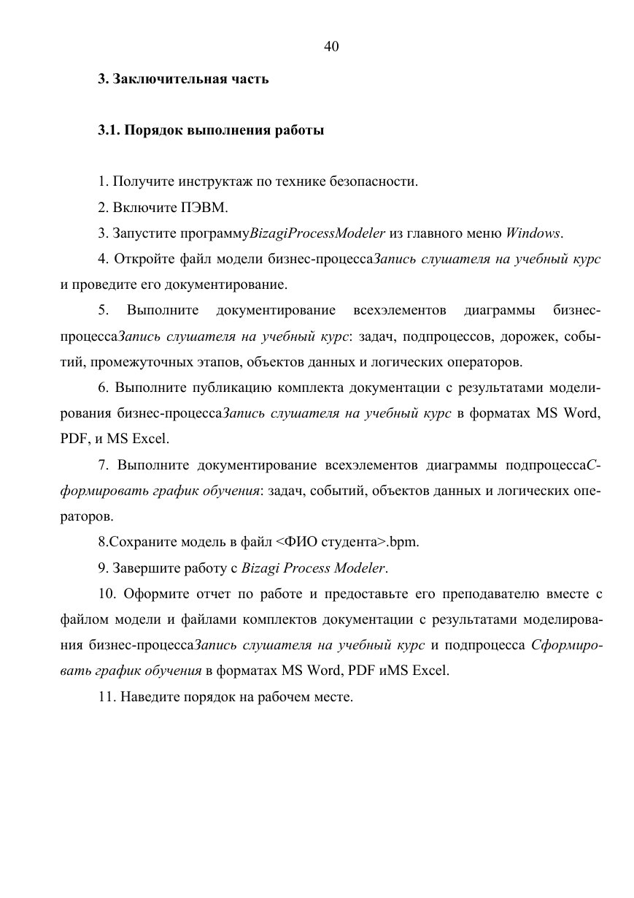

### 5.3. Комплект сдачи

- `<ФИО студента>.bpm`;
- публикация Word;
- публикация PDF;
- публикация Excel;
- электронный отчёт.

## 6. Практическая работа № 4: имитационное моделирование

### 6.1. Важное условие

Для симуляции нужна завершённая и валидная процессная диаграмма. Перед началом проверьте, что у задач корректны значения количества входящих и выходящих токенов, а подпроцесс является встроенным или имеет заданное суммарное время обработки.

В работе создаются два независимых сценария: `КАК ЕСТЬ` и `КАК ДОЛЖНО БЫТЬ`.

### 6.2. Пошаговое выполнение

#### Шаг 1. Подготовить модель

1. Откройте полностью документированную модель работы № 3.
2. Сохраните копию как `Фамилия И.О._ПР4.bpm`.
3. Запустите валидацию основной диаграммы и подпроцесса.
4. Исправьте все разрывы потоков и некорректные шлюзы: симуляция не должна начинаться на заведомо ошибочной модели.
5. На вкладке **Главная** нажмите **Вид симуляции/Simulation View**.


*Иллюстрация из ПЗ 3, стр. 45: перед переходом в Simulation View должна быть получена успешная валидация.*

#### Шаг 2. Создать сценарий «КАК ЕСТЬ»

1. Откройте управление сценариями симуляции.
2. Создайте новый сценарий или переименуйте исходный в `КАК ЕСТЬ`.
3. Введите описание сценария текущего процесса.
4. Укажите автора и версию `1.0`.
5. Установите длительность `40 часов`.
6. Выберите базовую единицу времени `Minutes`.
7. Выберите валюту `RUB — Russian Ruble`.
8. Установите `Replication = 0` и `Seed = 0`.
9. Нажмите **ОК**.

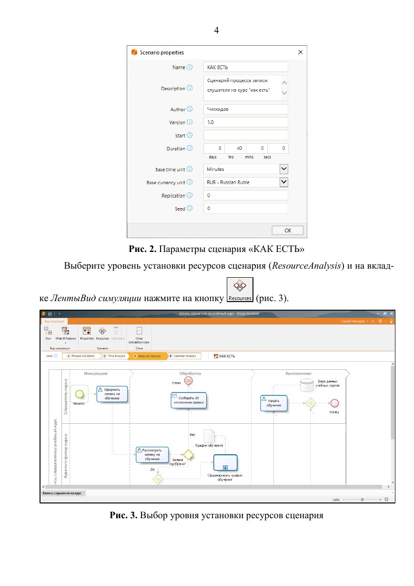

**В отчёт:** снимок всего окна свойств сценария; в тексте поясните, почему минуты выбраны базовой единицей при длительности сценария 40 часов.

#### Шаг 3. Задать ресурсы и стоимость

1. Перейдите на уровень **Resource Analysis**.
2. Нажмите **Resources**.
3. На вкладке **Availability** задайте: слушатель — `10`, администратор — `1`, преподаватель — `1`.
4. Перейдите на вкладку **Costs**.
5. Задайте фиксированную стоимость: слушатель — `0`, администратор — `30000`, преподаватель — `60000`.
6. Для всех трёх ресурсов установите почасовые расходы `0`.
7. Нажмите **ОК**, снова откройте окно и перепроверьте числа.

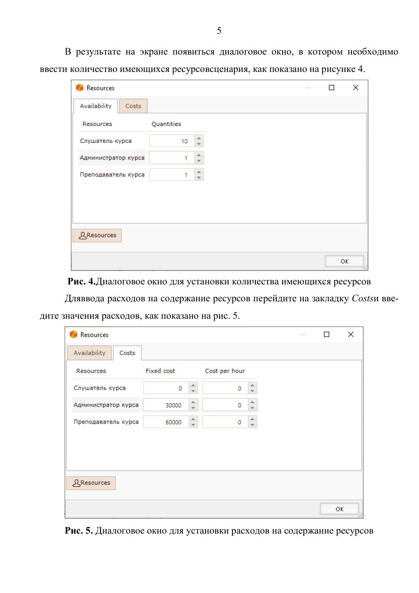

#### Шаг 4. Настроить входной поток заявок

1. Перейдите на уровень анализа времени или ресурсов, на котором доступно начальное событие.
2. Выделите событие `Начало`.
3. Нажмите значок параметров рядом с событием.
4. У параметра интервала поступления нажмите кнопку выбора распределения.
5. Выберите **Triangular Distribution**.
6. Введите `Most likely = 40`, `Min = 30`, `Max = 50` минут.
7. Введите `Max. arrival count = 80`.
8. Нажмите **ОК**.

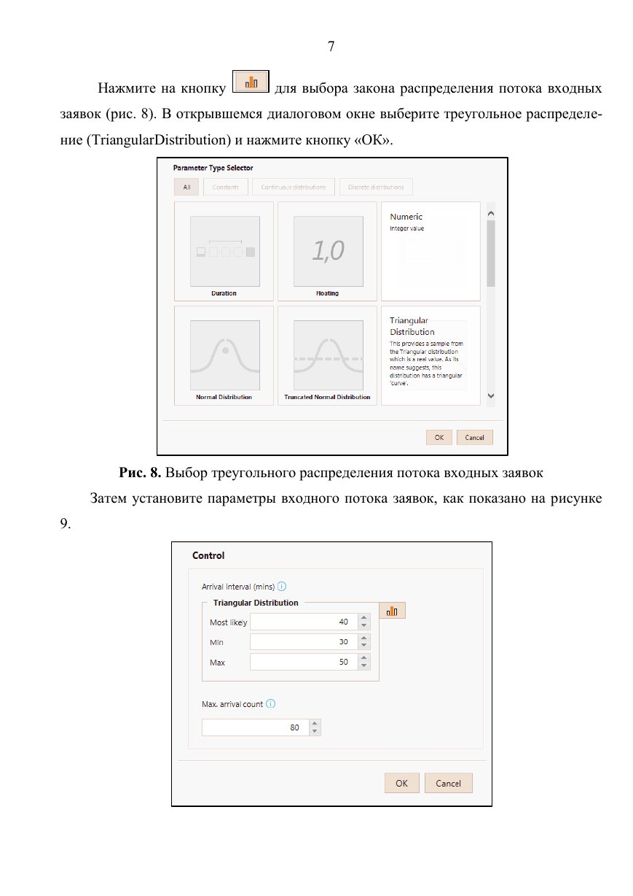

**Проверка:** минимальное значение не больше наиболее вероятного, а наиболее вероятное не больше максимального: `30 ≤ 40 ≤ 50`.

#### Шаг 5. Заполнить параметры каждой операции

1. Выделите операцию.
2. Нажмите значок шестерёнки параметров.
3. Раскройте **Time** и введите время ожидания и выполнения.
4. Раскройте **Cost** и введите стоимость действия.
5. Раскройте **Resource**, выберите нужную роль и количество.
6. Нажмите **ОК**.
7. Повторно откройте параметры и сравните их с таблицей ниже.

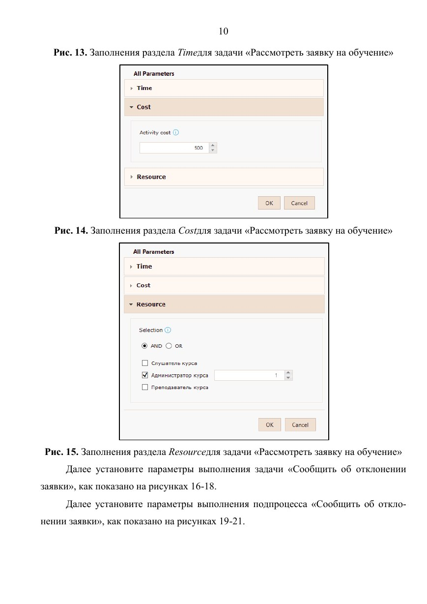

| Операция «КАК ЕСТЬ» | Ожидание, мин | Выполнение, мин | Стоимость | Ресурс |
|---|---:|---:|---:|---|
| Оформить заявку на обучение | 0 | 15 | 0 | Слушатель, 10 |
| Рассмотреть заявку на обучение | 5 | 30 | 500 | Администратор, 1 |
| Сообщить об отклонении заявки | 0 | 5 | 100 | Администратор, 1 |
| Сформировать график обучения | 0 | 40 | 2000 | Администратор, 1 |
| Подготовить материалы по курсу | 15 | 90 | 10000 | Преподаватель, 1 |
| Сформировать профиль слушателя | 5 | 20 | 2000 | Преподаватель, 1 |
| Отчитаться о проведении обучения | 10 | 30 | 5000 | Преподаватель, 1 |
| Начать обучение | 5 | 15 | 0 | Слушатель, 10 |

#### Шаг 6. Настроить вероятность шлюза

1. Выделите шлюз `Заявка одобрена?`.
2. Нажмите шестерёнку параметров.
3. Установите для ветви `Нет` значение `20%`.
4. Установите для ветви `Да` значение `80%`.
5. Убедитесь, что сумма равна `100%`.
6. Нажмите **ОК**.

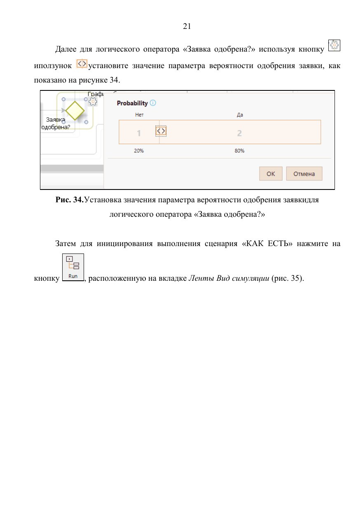

#### Шаг 7. Выполнить «КАК ЕСТЬ» и сохранить доказательства

1. Нажмите **Run**.
2. Не закрывайте окно до сообщения о завершении.
3. Нажмите **Да** для просмотра результатов.
4. Зафиксируйте число созданных и завершённых экземпляров, время цикла, очереди, стоимость и загрузку ресурсов.
5. Сохраните результаты в Excel, если кнопка доступна.
6. Сделайте снимки общего результата и наиболее загруженного ресурса.

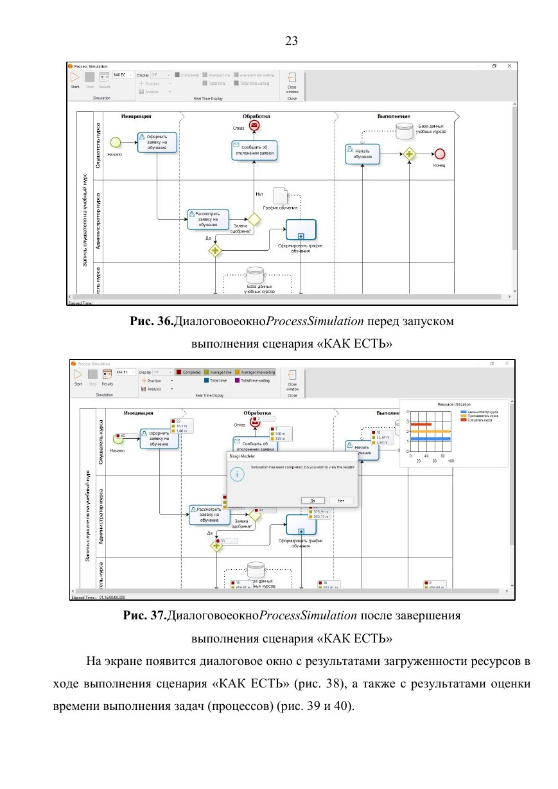

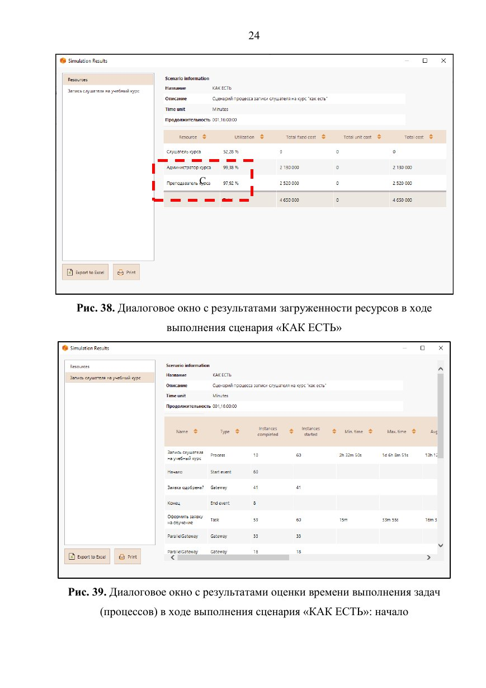

*Иллюстрации из ПЗ 7, стр. 23–24: окно симуляции до/после запуска и таблицы результатов.*

#### Шаг 8. Создать сценарий «КАК ДОЛЖНО БЫТЬ»

1. Откройте **Manage simulation scenarios**.
2. Нажмите **New**; если доступно дублирование, можно скопировать `КАК ЕСТЬ`, чтобы сохранить общие параметры.
3. Назовите новый сценарий `КАК ДОЛЖНО БЫТЬ`.
4. Проверьте длительность, базовую единицу времени, валюту и входной поток.

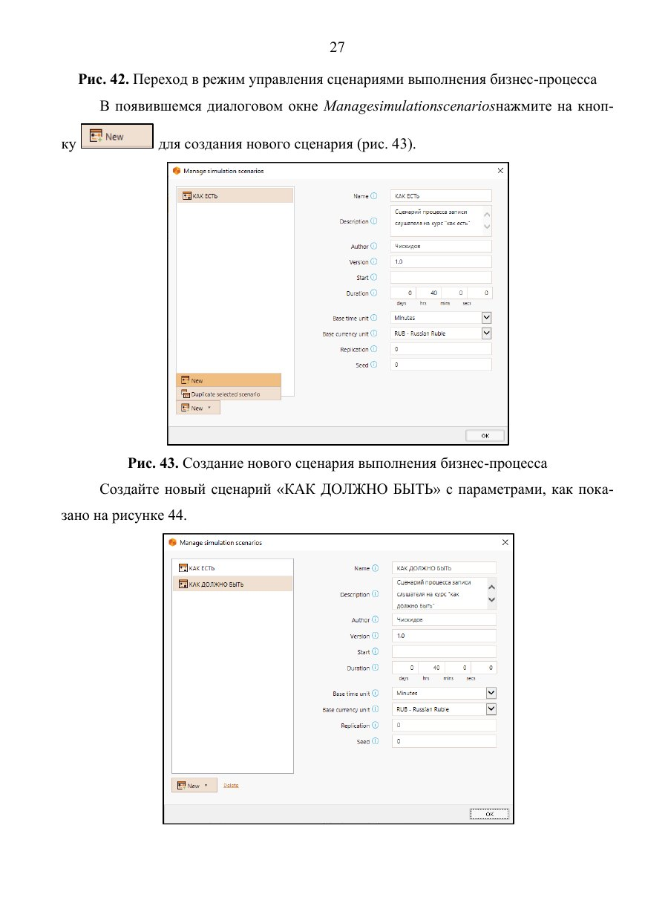

5. На вкладке ресурсов задайте: слушатель — `10`, администратор — `2`, преподаватель — `4`.
6. Оставьте фиксированную стоимость ресурсов: `0`, `30000`, `60000`.

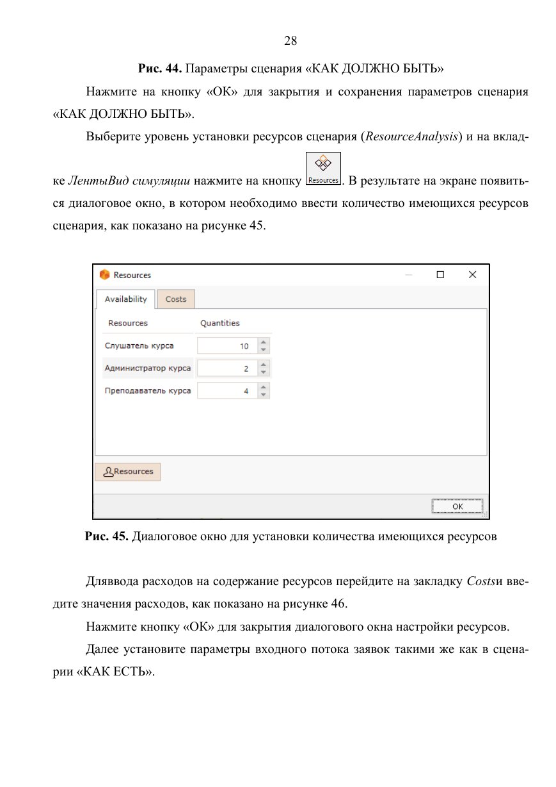

7. Измените параметры оптимизированных операций:

| Операция «КАК ДОЛЖНО БЫТЬ» | Ожидание, мин | Выполнение, мин | Стоимость | Ресурс |
|---|---:|---:|---:|---|
| Рассмотреть заявку на обучение | 3 | 10 | 500 | Администратор, 2 |
| Сообщить об отклонении заявки | 0 | 1 | 100 | Администратор, 2 |
| Сформировать график обучения | 5 | 15 | 2000 | Администратор, 2 |
| Подготовить материалы по курсу | 5 | 30 | 5000 | Преподаватель, 3 |
| Сформировать профиль слушателя | 5 | 5 | 1000 | Преподаватель, 3 |
| Отчитаться о проведении обучения | 5 | 10 | 3000 | Преподаватель, 3 |

8. Для `Оформить заявку на обучение` и `Начать обучение` оставьте параметры сценария `КАК ЕСТЬ`.
9. Оставьте вероятности шлюза `20%/80%`.
10. Запустите симуляцию и откройте результаты.

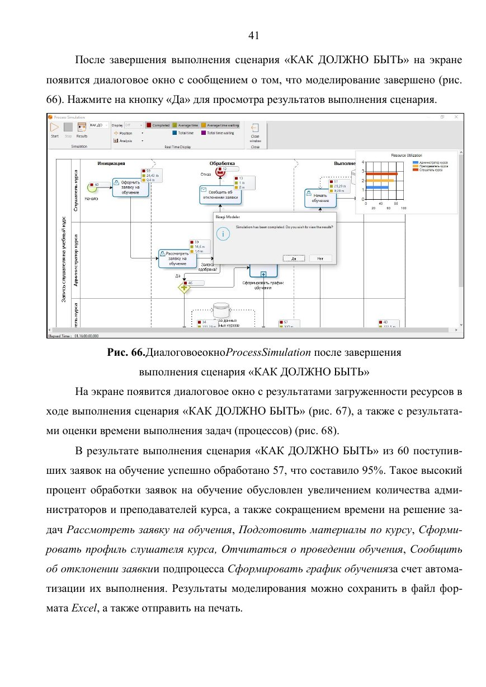

#### Шаг 9. Сравнить сценарии в отчёте

Создайте таблицу со столбцами `Показатель`, `КАК ЕСТЬ`, `КАК ДОЛЖНО БЫТЬ`, `Изменение`, `Объяснение`. Обязательно сравните:

- число поступивших и завершённых заявок;
- долю успешно обработанных заявок;
- среднее и максимальное время цикла;
- время ожидания по операциям;
- загрузку администратора и преподавателя;
- стоимость выполнения процесса.

Контрольный ориентир для оптимизированного сценария - `57` завершённых экземпляров из `60`, то есть `95%`. Из-за случайной генерации поступлений фактическое число может отличаться. В таблицу отчёта переносите собственный результат, а значение `57/60` используйте только как ориентир для проверки порядка величины.

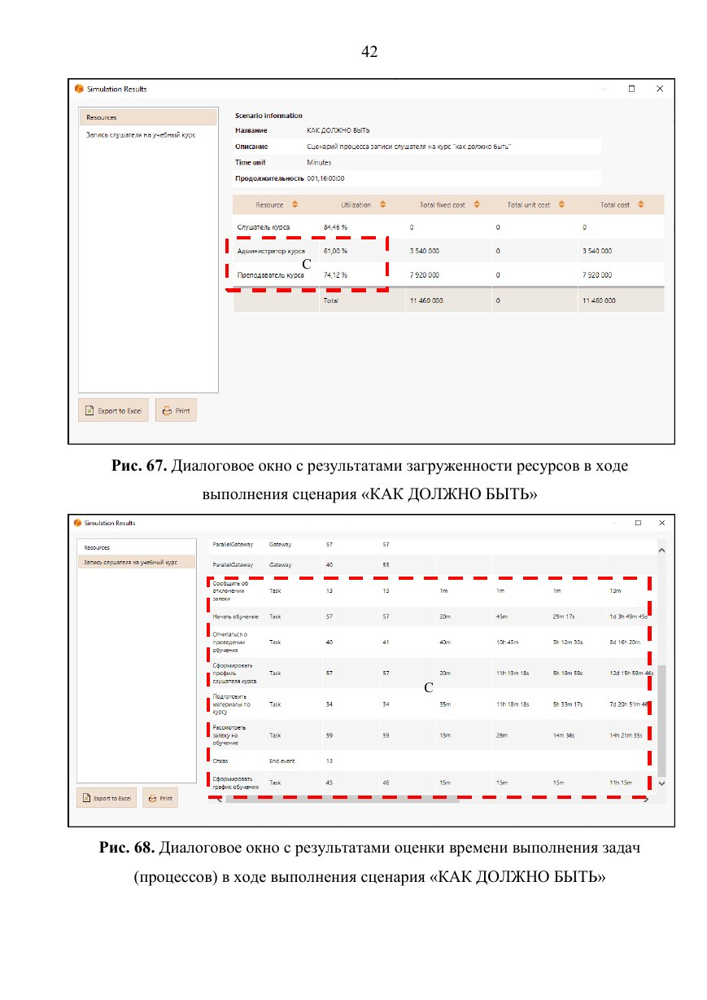

*Иллюстрация из ПЗ 7, стр. 42: именно из этих таблиц переносятся загрузка, стоимость и показатели времени в сравнительный анализ.*

### 6.3. Комплект сдачи

- `<ФИО студента>.bpm` с двумя сценариями;
- два Excel-файла результатов;
- электронный отчёт со сравнением сценариев и научно обоснованным выводом.

## 7. Практическая работа № 5: проектирование приложения в Bizagi Studio

### 7.1. Граница возможностей Bizagi Process Modeler

Для работ № 5 и № 6 используется `Bizagi Studio`, а итог проверяется на портале Bizagi. Полное выполнение включает:

- создание проекта `TrainingCourse`;
- импорт модели процесса;
- модель данных и сущности;
- экранные формы;
- бизнес-правила;
- исполнители и организационная структура;
- запуск экземпляров процесса в веб-приложении;
- вычисляемые атрибуты и автонумерация;
- администрирование процессов и ресурсов;
- BAM- и аналитические отчёты портала.

Эти функции относятся к созданию и исполнению приложения, а не к настольному моделированию BPMN. Поэтому инструкция, обещающая выполнить их только в Process Modeler, была бы технически невыполнимой.

### 7.2. Подготовка модели в Bizagi Process Modeler

1. Завершить и валидировать процесс из работ № 2-4.
2. Проверить названия задач, шлюзов, событий, дорожек и потоков.
3. Заполнить описания элементов и исполнителей.
4. Убедиться, что подпроцесс оформлен корректно.
5. Сохранить `.bpm` и дополнительно экспортировать BPMN, если это потребуется для переноса.
6. Сформировать PDF/Word-публикацию как контрольную спецификацию перед импортом.

В отчёт для подготовительного этапа следует включить: итоговую диаграмму, успешную валидацию, свойства процесса и перечень подготовленных файлов.

### 7.3. Пошаговое выполнение в Bizagi Studio

#### Шаг 1. Проверить службу, создать проект и импортировать процесс

1. Запустите Bizagi Studio. Если проект не открывается или портал не запускается, откройте окно служб Windows и убедитесь, что `BizagiStandardOperationsService` имеет состояние **Выполняется/Running**; остановленную службу запустите.
2. В стартовом окне Studio нажмите **New**.
3. Введите имя проекта `TrainingCourse`, выберите рабочую папку и завершите мастер создания проекта.
4. На первом этапе карусели **Model Process** выберите **Import process**.
5. Укажите файл `.bpm` из практики № 4, выберите процесс `Запись слушателя на учебный курс` и завершите импорт.
6. В поле имени процесса внутри Studio оставьте `Запись слушателя на учебный курс`, а имя проекта - `TrainingCourse`.
7. Откройте импортированный процесс, нажмите **Validate** и устраните все ошибки до сообщения об успешной проверке.

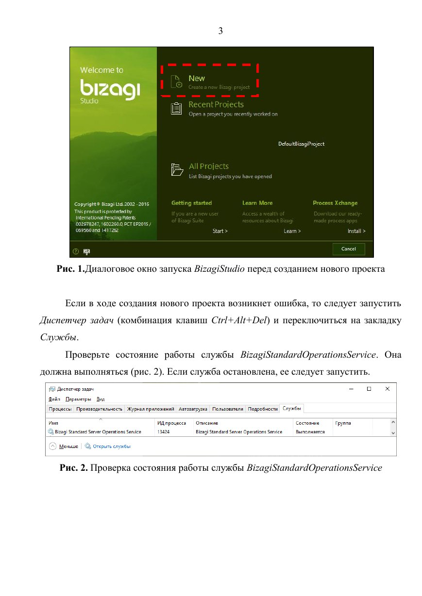

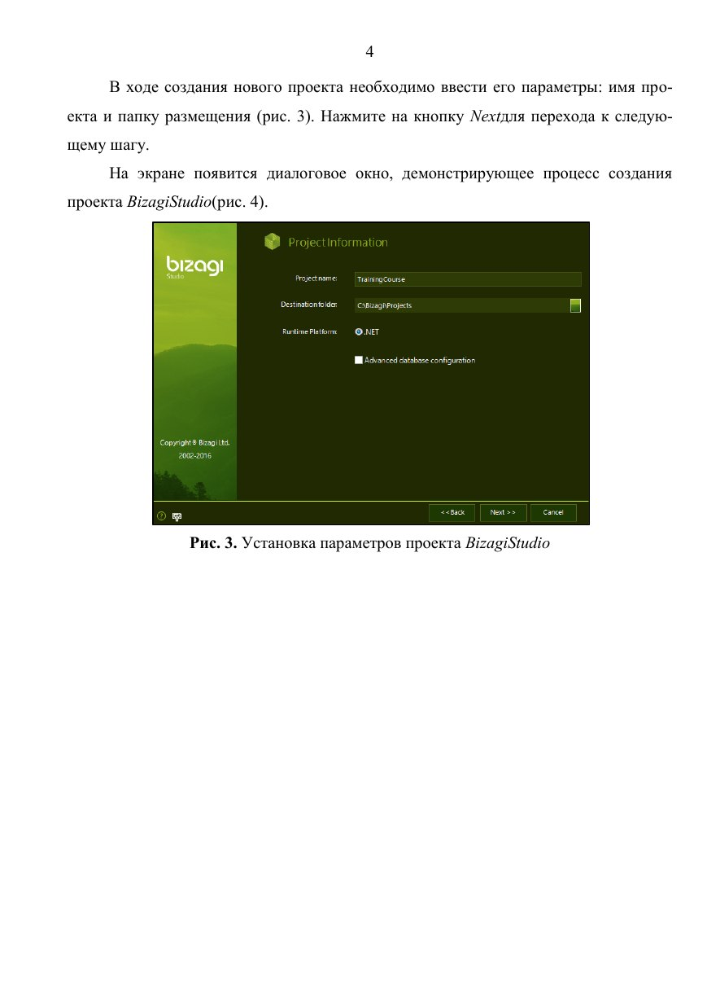

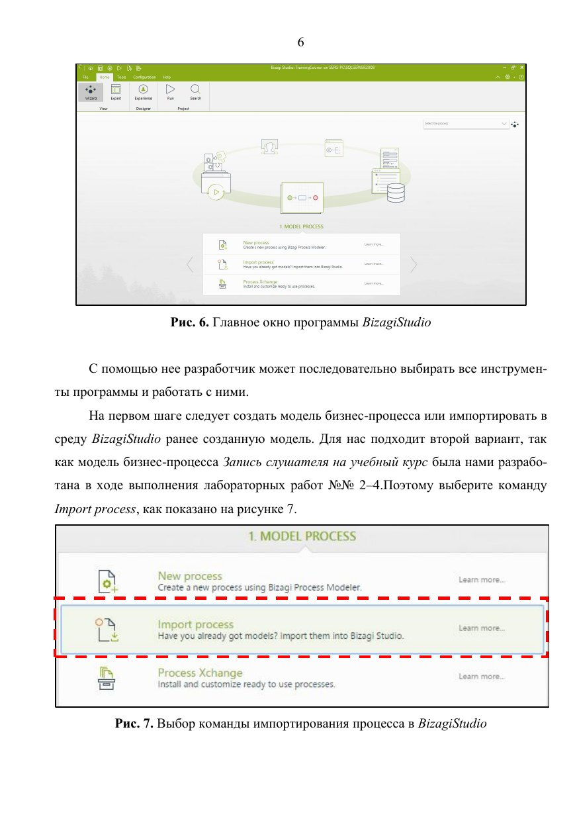

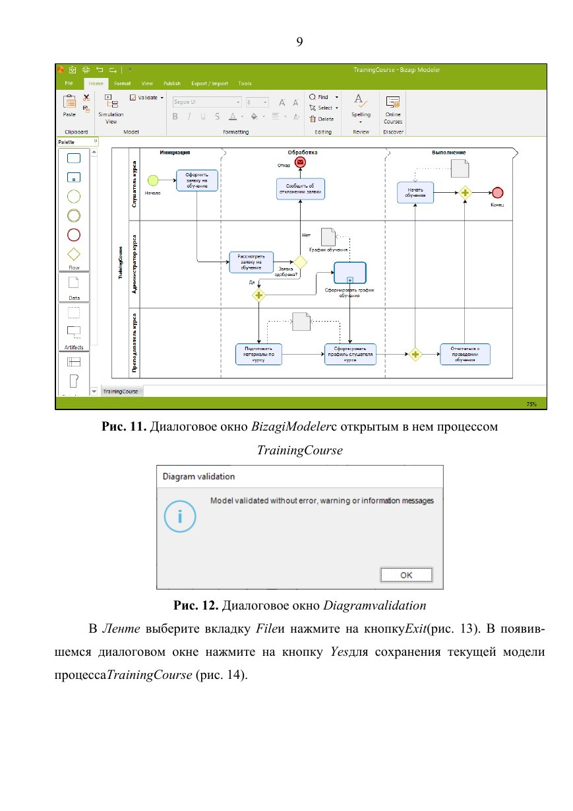

**В отчёт:** работающая служба, заполненные параметры проекта, выбранный файл импорта, общий вид процесса и итог успешной валидации.

#### Шаг 2. Создать главную сущность «Заявка на обучение»

1. На карусели выберите **Model Data**.
2. Выберите главную сущность процесса и задайте ей отображаемое имя `Заявка на обучение`.
3. Откройте **Edit attributes**, нажимайте **Add** и создайте атрибуты в следующем порядке:

| Атрибут главной сущности | Тип | Настройка |
|---|---|---|
| Номер заявки | Integer | целое число |
| Дата заявки | Date-time | дата и время |
| Статус заявки | String на первом этапе | далее заменяется на Parameter Entity |
| Описание заявки | String | Length = 300 |
| Слушатель курса | String на первом этапе | далее заменяется на Master Entity |
| Название курса | String на первом этапе | Length = 50, далее Master Entity `Учебный курс` |
| Администратор курса | String на первом этапе | далее Master Entity |
| Дата начала обучения | Date-time | дата и время |
| Дата рассмотрения заявки | Date-time | дата и время |
| Причина отклонения заявки | String | текст причины |

4. Нажмите **Finish**, снова откройте список и проверьте порядок и типы.

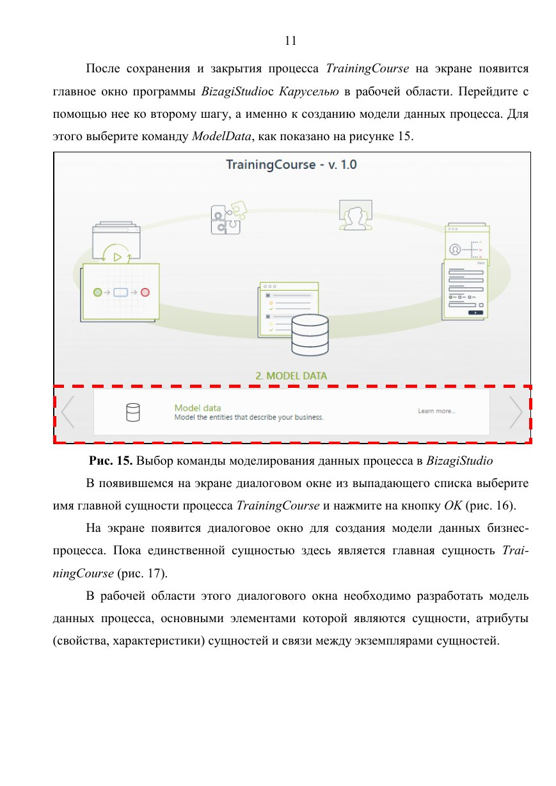

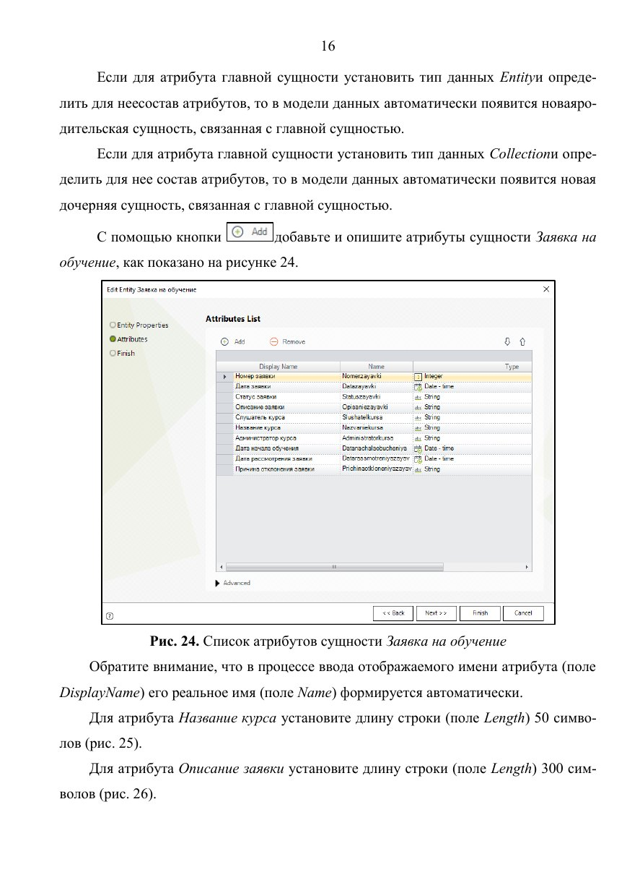

#### Шаг 3. Создать справочные и мастер-сущности

1. Для атрибута `Статус заявки` выберите тип **Entity → Parameter → New Entity**. Назовите сущность `Статус заявки`, создайте одноимённый строковый атрибут и добавьте значения: `Новая`, `Одобрена`, `Отклонена`, `Исполнена`.
2. Для `Слушатель курса` выберите **Entity → Master → New Entity**. Создайте атрибуты `ФИО слушателя` (String), `Телефон слушателя` (String), `Почта слушателя` (String) и связь с параметрической сущностью `Уровень подготовки`.
3. В `Уровень подготовки` добавьте значения `Нулевой`, `Базовый`, `Основной`, `Продвинутый`.
4. Для `Название курса` создайте мастер-сущность `Учебный курс` со следующими атрибутами:
   - `Название курса` - String;
   - `Дата создания курса` - Date-time;
   - `Описание курса` - String;
   - `Автор курса` - связь с мастер-сущностью `Преподаватель курса`;
   - `Сложность курса` - связь с параметрической сущностью;
   - `Продолжительность курса` - Integer;
   - `Ссылка на ЭОР курса` - String.
5. Создайте `Преподаватель курса`: `ФИО педагога` (String), `Телефон педагога` (String), `Почта педагога` (String), `Стаж работы` (Tiny Integer 0-255), `Область интересов` (String).
6. В `Сложность курса` внесите `Начальный`, `Продвинутый`, `Профессиональный`.
7. Для `Администратор курса` создайте мастер-сущность с полями `ФИО администратора`, `Телефон администратора`, `Почта администратора` типа String.
8. После каждого мастера нажимайте **Finish** и проверяйте, что исходный строковый атрибут главной сущности заменился отношением к новой сущности.

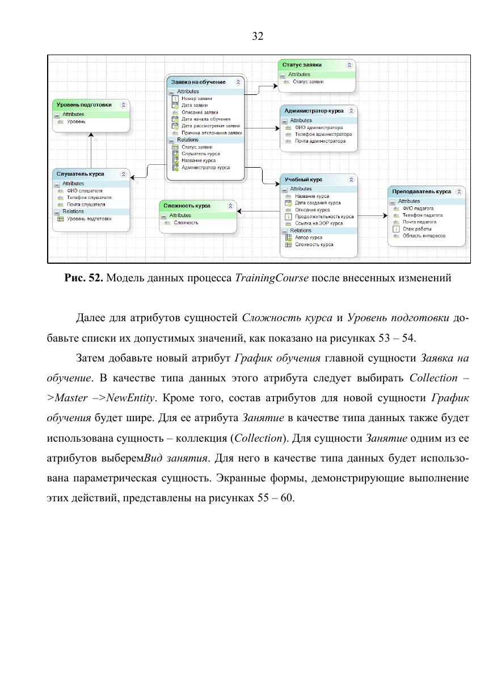

#### Шаг 4. Создать график, занятия и допустимые виды занятий

1. В главную сущность `Заявка на обучение` добавьте атрибут `График обучения` типа **Collection → Master → New Entity**.
2. В сущности `График обучения` создайте:
   - `Занятие` - коллекционная связь с сущностью `Занятие`;
   - `TrainingCourse` - обратная связь с `Заявка на обучение`;
   - `Номер занятия` - String;
   - `Дата начала занятия` - Date-time;
   - `Дата окончания занятия` - Date-time;
   - `Балл за занятие` - Tiny Integer 0-255;
   - `Отчёт за занятие` - File.
3. В сущности `Занятие` создайте `Тема занятия` (String), связь с `График обучения`, `Вид занятия` (Parameter Entity), `Продолжительность` (Float), `Описание занятия` (String), `Ссылка на ЭОР к занятию` (String).
4. В параметрической сущности `Вид занятия` внесите `Лекция`, `Практика`, `Семинар`, `Тестирование`.
5. Разложите сущности на схеме так, чтобы линии не перекрывали карточки; сравните число отношений у заявки, курса, графика и занятия.


**Контроль:** у `Заявка на обучение` есть связи со статусом, слушателем, курсом, администратором и коллекцией графика; у графика - коллекция занятий; у занятия - параметрический вид.

**В отчёт:** таблица сущностей и типов, окно значений каждого из четырёх справочников и общий вид модели данных.

#### Шаг 5. Создать форму «Оформить заявку на обучение»

1. Вернитесь к карусели и выберите **Define Forms**.
2. Щёлкните `Оформить заявку на обучение`. В пустой форме добавьте контейнер вкладок и создайте вкладки `Сведения о слушателе` и `Сведения о заявке`.
3. На первую вкладку перетащите `ФИО слушателя`, `Телефон слушателя`, `Почта слушателя`, `Уровень подготовки`.
4. Для `ФИО слушателя` и `Уровень подготовки` установите `Required = Yes`; для телефона и почты - `Required = No`.
5. Для всех подписей увеличьте шрифт на 5 пунктов относительно исходного размера и включите **Bold**.
6. На вторую вкладку добавьте `Название курса`, `Описание курса`, `Сложность курса`, `Продолжительность курса`, `Дата начала обучения`, `Описание заявки`.
7. Установите `Required = Yes` для `Название курса` и `Дата начала обучения`.
8. Для `Описание курса`, `Сложность курса`, `Продолжительность курса` установите `Editable = No`.
9. Разместите сложность и продолжительность в контейнере `50%-50%`; для описаний установите `Display type = Vertical` и `Is Extended = Yes`; для выбора курса установите `Layout = 25,75`.
10. У поля `Название курса` в `Select a form` выберите **New search form**. Назовите форму `Выбор учебного курса`; в область фильтра добавьте `Сложность курса`, в таблицу результата - `Название курса`.
11. Сохраните дочернюю и основную формы.

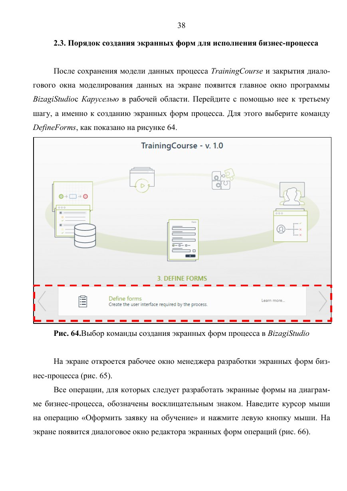

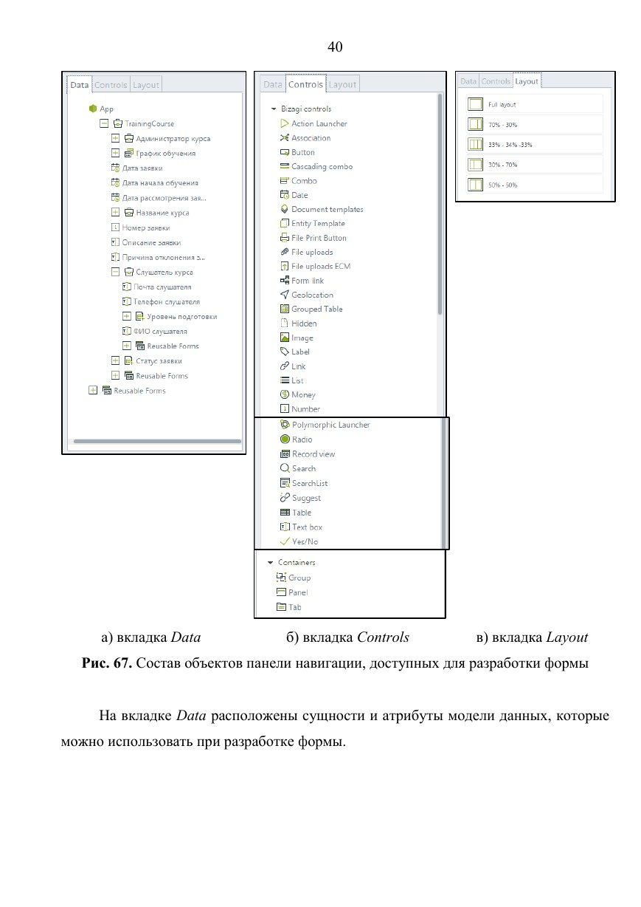

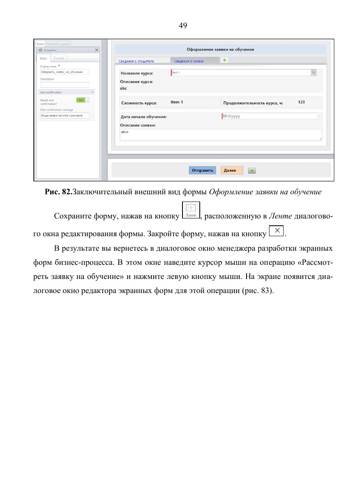

#### Шаг 6. Создать остальные формы процесса

1. Форму `Рассмотреть заявку на обучение` создайте копированием формы заявки. Сохраните две вкладки, добавьте `Статус заявки`, `Дата рассмотрения заявки`, `Причина отклонения заявки`, `Администратор курса`; сделайте статус, дату и администратора обязательными. Для администратора создайте формы поиска и добавления записи.
2. Форму `Сообщить об отклонении заявки` создайте из предыдущей формы. Оставьте данные заявки, статус, дату и причину; сделайте поля только для чтения.
3. Форму `Сообщить об одобрении заявки` создайте из формы рассмотрения. Показывайте данные слушателя, курса, дату начала, статус и администратора; поля решения сделайте только для чтения.
4. В `Подготовить материалы по курсу` добавьте сведения о курсе и поле `Автор курса`; подключите формы поиска/создания преподавателя.
5. В `Сформировать профиль слушателя курса` создайте вкладки `Профиль слушателя` и `График обучения`. Если у слушателя ещё нет полей `Логин слушателя` и `Пароль слушателя`, добавьте оба как String длиной 50.
6. На вкладке графика разместите коллекцию `График обучения` как таблицу. Создайте дочерние формы `График обучения`, `Занятия курса` и `Занятие`, чтобы можно было добавлять строки и редактировать тему, вид, длительность, даты и электронный ресурс.
7. Форму `Начать обучение` создайте копированием формы профиля. Для данных профиля установите `Editable = No`; у таблицы графика отключите `Add`, `Edit`, `Delete`; для номера и дат занятий установите только чтение; для `Отчёт за занятие` оставьте загрузку файла и установите `Required = Yes`.
8. Форму `Отчитаться о проведении обучения` создайте из формы начала обучения. Оставьте просмотр вложенных отчётов и сделайте `Балл за занятие` редактируемым для проверяющего.
9. На каждой форме нажмите **Save**, закройте и откройте её повторно; проверьте вкладки, обязательность, режим редактирования и дочерние формы.


**В отчёт:** по одному общему снимку каждой формы и крупные снимки свойств `Required`, `Editable`, `Add/Edit/Delete` там, где они менялись.

#### Шаг 7. Настроить маршрутизацию «Да/Нет»

1. На карусели выберите **Business Rules → Define expressions**.
2. Откройте поток `Нет` от шлюза `Заявка одобрена?`.
3. Выберите условие **Based on the result of an expression**, создайте выражение и сравните `Заявка на обучение → Статус заявки → Статус заявки` со значением `Отклонена`.
4. Для потока `Да` установите **Else**. Это гарантирует, что все статусы, кроме `Отклонена`, переходят по положительной ветви.
5. Сохраните оба потока и снова откройте их, чтобы проверить выражение и `Else`.

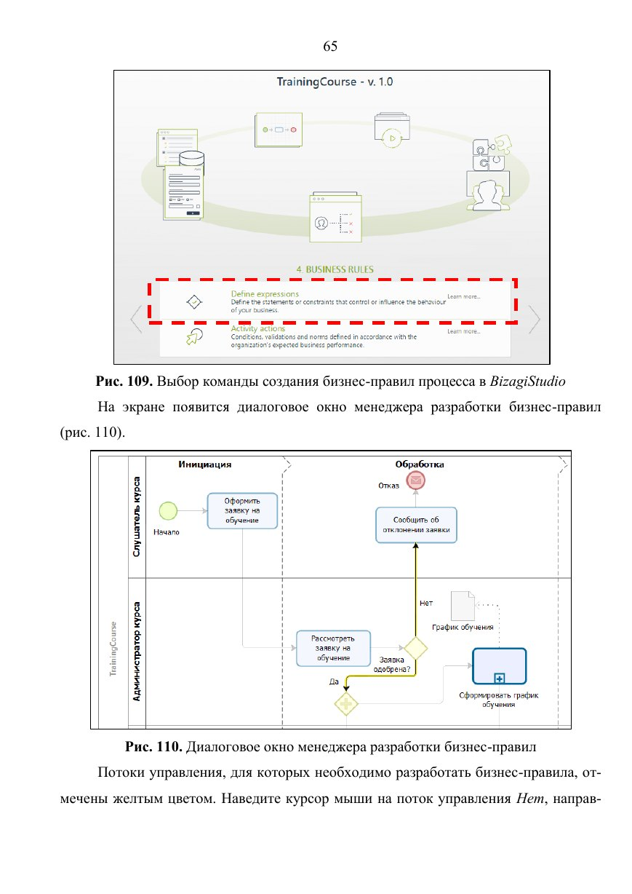

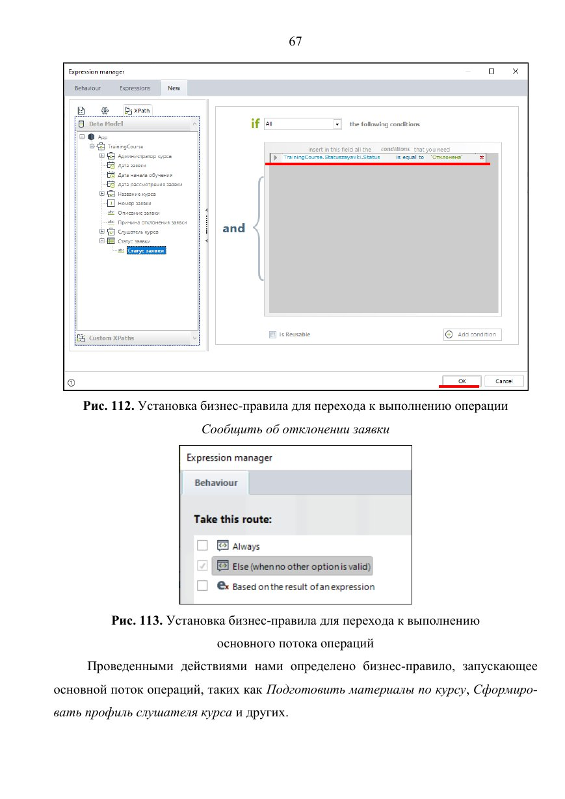

#### Шаг 8. Запустить портал и проверить полный маршрут

1. На карусели выберите **Execute → Run process**, затем среду **Development**. Studio запустит локальный IIS Express и откроет портал Bizagi.
2. В портале выберите **Новые процессы → TrainingCourse**.
3. Заполните слушателя и заявку: выберите уровень, найдите курс через форму поиска, задайте дату начала и описание; нажмите **Отправить**, затем **Далее**.
4. Убедитесь, что появилось сообщение `Ваша заявка принята к рассмотрению!`.
5. В задаче рассмотрения выберите `Одобрена`, заполните дату и администратора. Пройдите положительную ветвь: график, материалы, профиль, начало обучения и отчёт.
6. В графике создайте несколько занятий, задайте номера, даты, темы, виды и продолжительность.
7. На этапе начала обучения приложите отдельный тестовый файл отчёта к каждому занятию.
8. На этапе проверки откройте вложения и поставьте баллы. Убедитесь, что на форме отображается рассчитанный средний балл; контрольный пример на иллюстрации даёт `77`.
9. Отдельно создайте второй экземпляр, выберите статус `Отклонена`, заполните причину и убедитесь, что процесс перешёл к уведомлению об отказе, не открывая положительную ветвь.

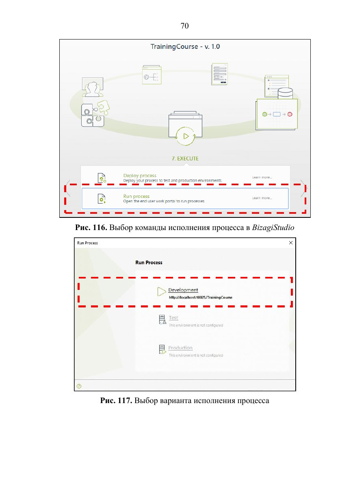

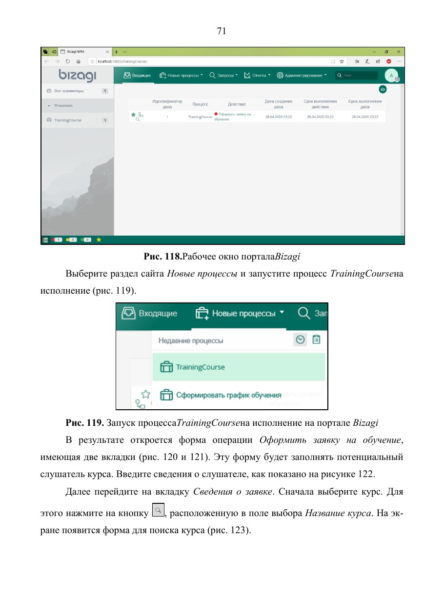

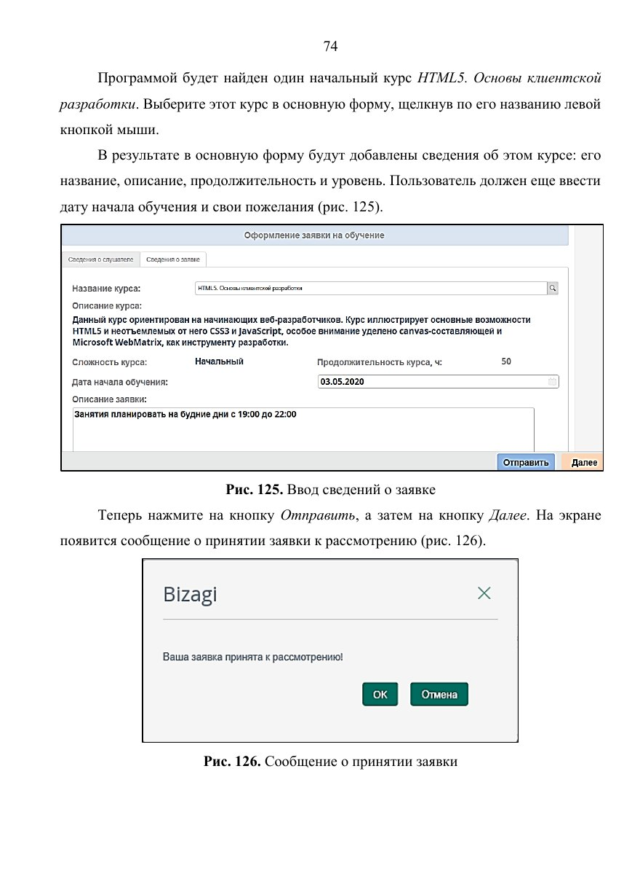

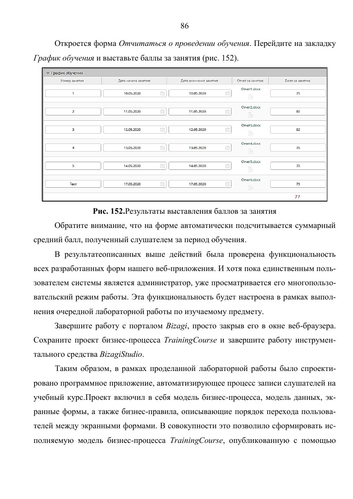

**Контроль:** один экземпляр завершён по ветви одобрения, второй - по ветви отказа; формы сохраняют данные, отчёты открываются, баллы отображаются.

### 7.4. Комплект сдачи и содержание отчёта

В отчёт необходимо добавлять по ходу работы:

1. Окно создания проекта и успешный импорт процесса.
2. Общий вид импортированной процессной модели.
3. Модель данных со связями и свойства ключевых сущностей/атрибутов.
4. Формы каждой операции и настройки обязательности/доступности полей.
5. Бизнес-правила и условия маршрутизации.
6. Экраны портала при запуске и последовательном выполнении задач разными ролями.
7. Итоговую страницу завершённого экземпляра.

Комплект сдачи: файлы проекта `TrainingCourse` и электронный отчёт.

## 8. Практическая работа № 6: прототипирование и администрирование в Bizagi Studio

### 8.1. Требуемая программная среда

Работа № 6 продолжает проект TrainingCourse и требует Bizagi Studio и портала Bizagi. Вычисляемые атрибуты, организационная структура, пользователи, исполнение экземпляров, администрирование и BAM-отчёты недоступны в настольном Bizagi Process Modeler 4.0.0.012.

### 8.2. Подготовка перед выполнением

Перед началом откройте и проверьте проект TrainingCourse, созданный в работе № 5. Убедитесь, что процесс, сущности, формы и правила сохранены, а тестовый экземпляр запускается. Сделайте резервную копию проекта и не включайте пароли учебных пользователей в отчёт.

### 8.3. Пошаговое выполнение в Bizagi Studio и на портале

#### Шаг 1. Добавить три служебных атрибута заявки

1. Откройте проект `TrainingCourse`, на карусели выберите **Model Data** и выделите главную сущность `Заявка на обучение`.
2. Откройте **Edit attributes**, нажмите **Add** и создайте:

| Display Name | Рекомендуемое Name | Тип |
|---|---|---|
| Заказчик | Zakazchik | String |
| Время заказа | Vremyazakaza | Date-time |
| Методист | Metodist | String |

3. Нажмите **Finish**, сохраните модель данных и снова откройте список. Новые строки должны находиться в главной сущности, а не в сущности слушателя.

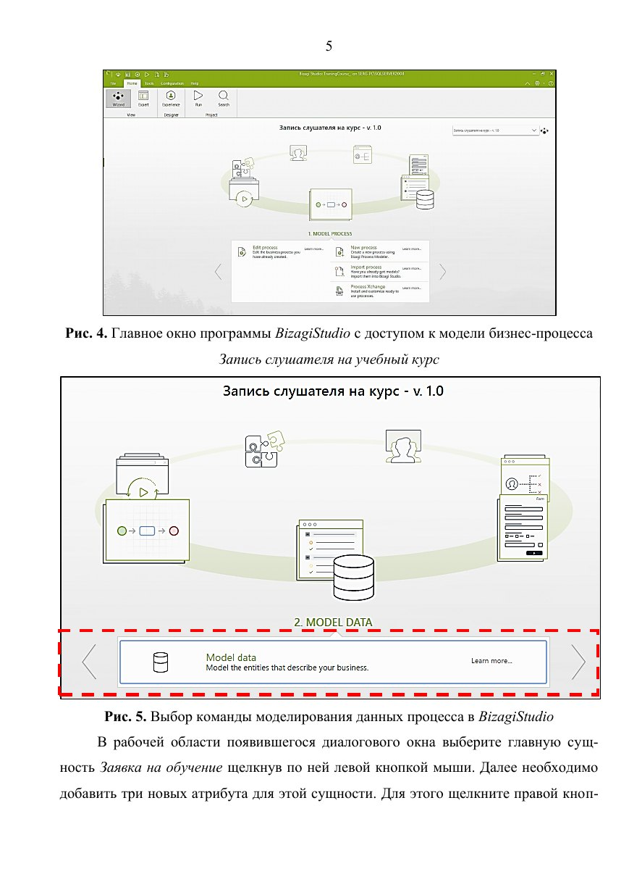

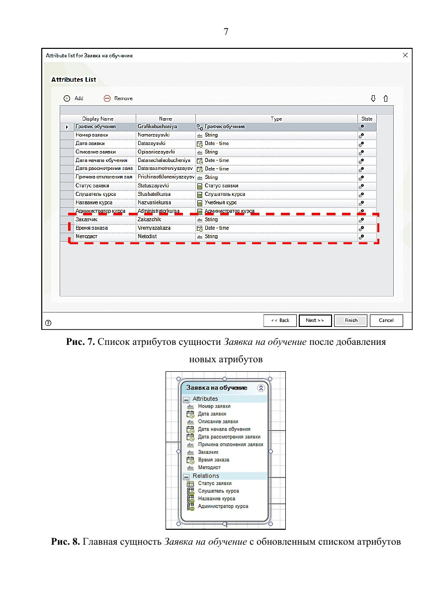

**В отчёт:** список атрибутов с видимыми именами и типами всех трёх полей.

#### Шаг 2. Автоматически заполнить заказчика и время заказа

1. На карусели выберите **Business Rules → Activity actions**.
2. Щёлкните задачу `Оформить заявку на обучение`.
3. В колонке **On Enter** нажмите `+` и выберите **Expression**.
4. В Expression Manager нажмите **New**. Укажите `Display Name = Заполнить заказчика`, `Name = StoreCustomer`.
5. Щёлкните стрелку между началом и концом схемы, выберите **Add Expression**, оставьте имя блока по умолчанию.
6. Откройте свойства блока и введите две строки:

```text
<ZapisSlushatelyaNaKurs.Zakazchik> = Me.Case.Creator.FullName;
<ZapisSlushatelyaNaKurs.Vremyazakaza> = Me.Case.CreationDate;
```

7. Вставляйте пути к атрибутам через **Data Model**, чтобы Bizagi создал корректные внутренние ссылки. Если внутреннее имя процесса отличается, сохраните правую часть формул, а левые пути выберите из дерева данных.
8. Нажмите **OK** в редакторе, Expression Manager и Activity Actions. У задачи должен появиться красный маркер автоматического действия.

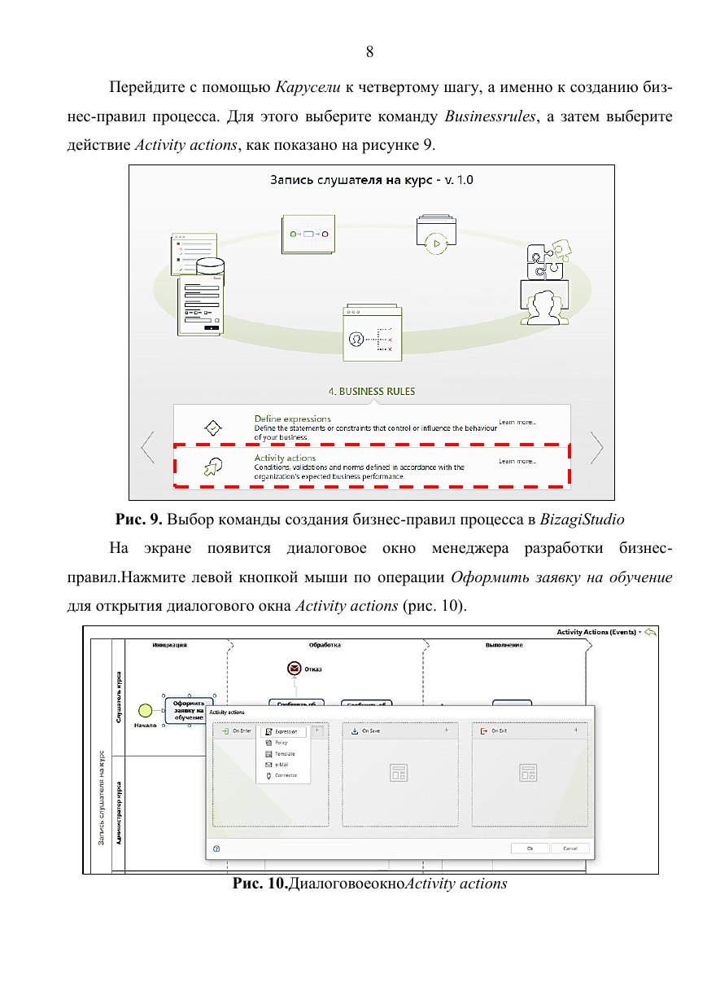

#### Шаг 3. Автоматически заполнить методиста

1. В **Activity actions** щёлкните `Начать обучение`.
2. В колонке **On Exit** нажмите `+ → Expression`.
3. Создайте выражение `Display Name = Заполнить методиста`, `Name = Zapolnitmetodista`.
4. Добавьте блок Expression и введите:

```text
<ZapisSlushatelyaNaKurs.Metodist> = Me.Case.WorkingCredential.FullName;
```

5. Путь к `Методист` выберите из Data Model; `WorkingCredential.FullName` сохраняет полное имя пользователя, завершившего задачу.
6. Сохраните выражение и убедитесь, что маркер действия прикреплён именно к `Начать обучение` и расположен в **On Exit**.

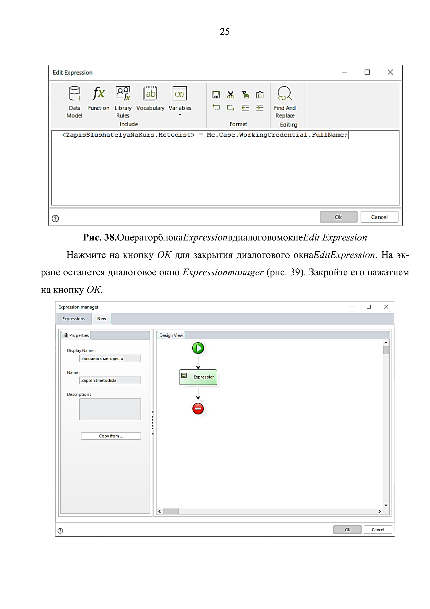

#### Шаг 4. Доработать две экранные формы

1. Откройте **Define Forms → Сообщить об одобрении заявки**.
2. Добавьте поля `Заказчик` и `Время заказа` в блок со сведениями о заявке.
3. Для обоих полей установите `Editable = No`, увеличьте шрифт подписи на 5 пунктов и включите **Bold**.
4. Откройте форму `Отчитаться о проведении обучения`, вкладку `График обучения`.
5. Добавьте поля `Заказчик`, `Время заказа`, `Методист` над таблицей занятий.
6. Для всех трёх полей установите `Editable = No`; подписи увеличьте на 5 пунктов и сделайте полужирными.
7. Сохраните формы, закройте и повторно откройте их, чтобы проверить свойства.

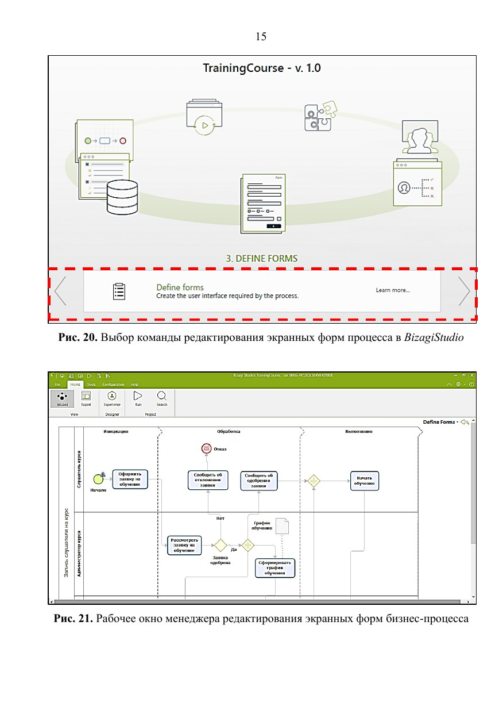

#### Шаг 5. Выполнить промежуточную проверку вычислений

1. Запустите **Execute → Run process → Development**.
2. Создайте тестовую заявку и перейдите до `Сообщить об одобрении заявки`.
3. Проверьте: `Заказчик` содержит полное имя инициатора, `Время заказа` - дату и время создания экземпляра.
4. Продолжите процесс до `Начать обучение`, завершите задачу и откройте `Отчитаться о проведении обучения`.
5. Проверьте, что `Методист` равен имени пользователя, завершившего `Начать обучение`, а три служебных поля недоступны для ручного редактирования.
6. Если портал показывает старую форму, сохраните проект, закройте портал и повторно выполните запуск Development.

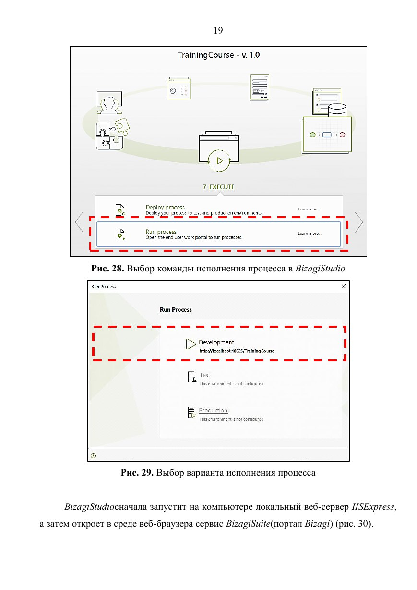

**В отчёт:** формулы, маркеры действий и две формы с фактически заполненными значениями.

#### Шаг 6. Построить организационную структуру

1. Переключитесь в режим **Expert** и откройте модуль **Organization**.
2. В `Positions` оставьте системную должность `Administrator`.
3. Создайте `Начальник учебного центра`, а под ней три должности: `Администратор курса`, `Преподаватель курса`, `Методист курса`.
4. Отдельно создайте должность `Слушатель курса`.
5. В `Locations` создайте `Офис`.
6. В `Areas` создайте `Администрация` и `Учебная лаборатория`.
7. Сохраните и разверните узлы дерева, чтобы все должности и области одновременно были видны.

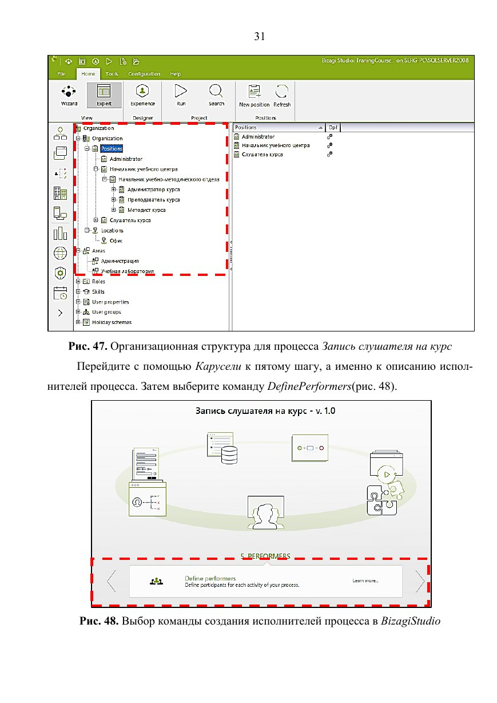

#### Шаг 7. Назначить исполнителей всех пользовательских задач

1. На карусели откройте **Define Performers**.
2. Для `Рассмотреть заявку на обучение` и `Сформировать график обучения` задайте условие `Area = Администрация AND Position = Администратор курса`.
3. Для `Подготовить материалы по курсу` и `Сформировать профиль слушателя курса` задайте `Area = Учебная лаборатория AND Position = Преподаватель курса`.
4. Для `Отчитаться о проведении обучения` создайте условие `Area = Учебная лаборатория AND (Position = Администратор курса OR Position = Методист курса)`.
5. Для `Оформить заявку на обучение`, `Сообщить об отклонении заявки`, `Сообщить об одобрении заявки` и `Начать обучение` задайте `Area = Учебная лаборатория AND Position = Слушатель курса`.
6. Для каждого назначения оставьте метод распределения **By load**, нажмите **OK** и повторно откройте условие для проверки логических узлов AND/OR.

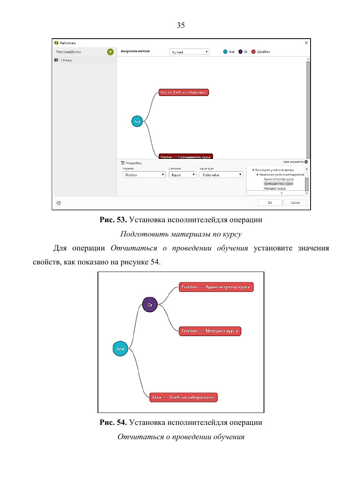

#### Шаг 8. Зарегистрировать четырёх учебных пользователей

1. Запустите портал с правами администратора и откройте **Администрирование → Пользователи**.
2. Создайте записи:

| Логин | ФИО | Должность | Область |
|---|---|---|---|
| iip | Иванов Игорь Петрович | Слушатель курса | Учебная лаборатория |
| pdo | Петров Дмитрий Олегович | Администратор курса | Администрация |
| smi | Степанов Михаил Иванович | Преподаватель курса | Учебная лаборатория |
| bis | Борисова Ирина Сергеевна | Методист курса | Учебная лаборатория |

3. Назначьте локальные временные пароли и проверьте вход каждой учётной записью. Пароли не помещайте в текст отчёта и закройте их на снимках.

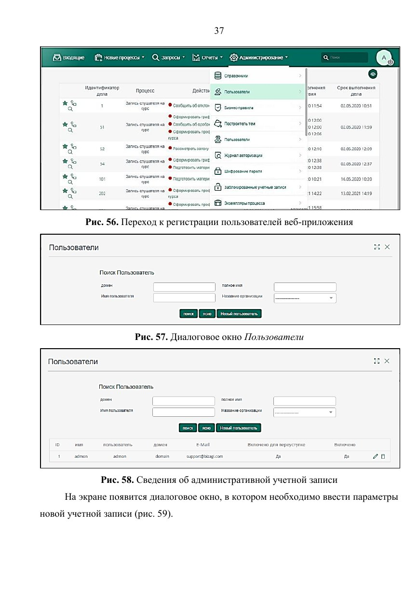

#### Шаг 9. Пройти процесс под разными ролями

1. Войдите как `iip`, запустите заявку, заполните две вкладки и отправьте её.
2. Войдите как `pdo`, выполните рассмотрение, выберите `Одобрена`, затем заполните график обучения.
3. Войдите как `smi`, подготовьте материалы и сформируйте профиль слушателя.
4. Снова войдите как `iip`, выполните `Начать обучение` и приложите тестовые отчёты по занятиям.
5. Войдите как `bis`, откройте `Отчитаться о проведении обучения`, проверьте служебные поля и завершите процесс.
6. Повторите короткий тест по отрицательной ветви: `iip` создаёт заявку, `pdo` устанавливает `Отклонена` и причину, `iip` получает уведомление.

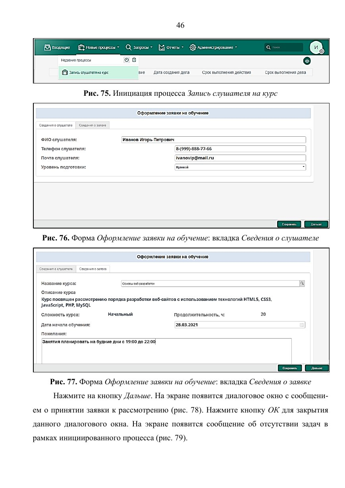

#### Шаг 10. Настроить последовательность и номер дела

1. В режиме Expert откройте вкладку **Configuration → Sequences**.
2. Нажмите **Add** и создайте последовательность: `Name = TrainSeq`, `Seed = 1`, `Increment = 1`.
3. Откройте **Configuration → Case Numbering**.
4. Выберите последовательность `TrainSeq`, задайте префикс `ОБУ-` и установите `Assign the case number = End of creation phase`.
5. Вернитесь в редактор процесса, откройте свойства фазы `Инициация` и установите тип `Case Creation`.
6. Запустите два новых экземпляра. Номера должны иметь форму `ОБУ-1`, `ОБУ-2` и увеличиваться на единицу.

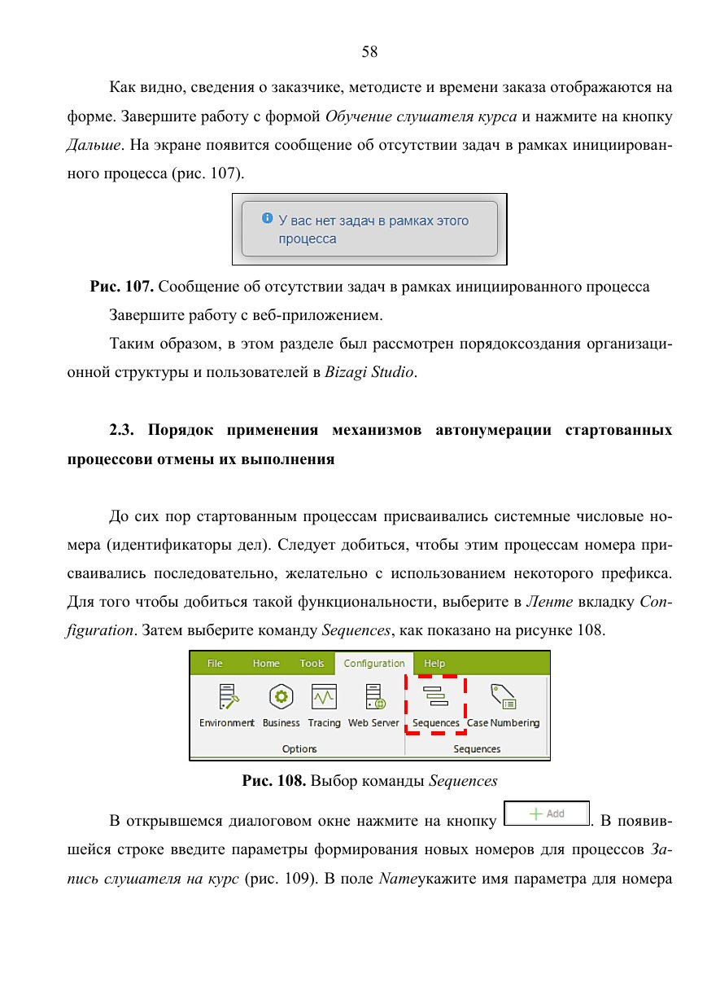

#### Шаг 11. Проверить администрирование и безопасно аннулировать тестовые экземпляры

1. Под администратором откройте справочники, пользователей, журнал авторизации и настройки оформления портала. Сделайте снимки списков без паролей.
2. Откройте **Администрирование → Экземпляры процесса**, найдите созданный вами незавершённый тестовый экземпляр, отметьте его и нажмите **Аннулировать**. Подтвердите действие и зафиксируйте итоговый статус.
3. Номера `351`, `401`, `451` используются как учебные примеры старой нумерации. Аннулируйте их только тогда, когда они действительно присутствуют в вашей учебной базе и вы убедились, что это тестовые экземпляры данного проекта. Не аннулируйте чужие или рабочие процессы.

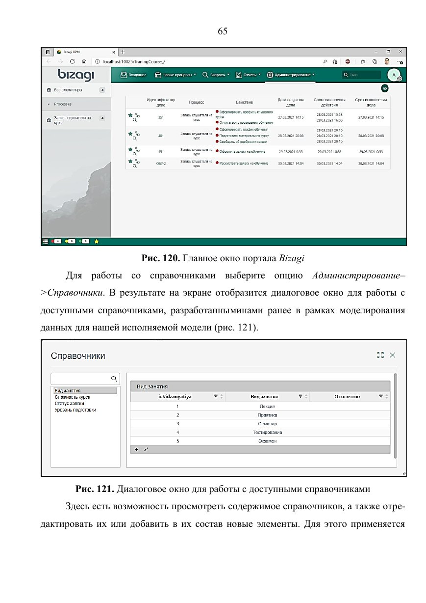

#### Шаг 12. Просмотреть карточку и графическую трассу экземпляра

1. Откройте список процессов и найдите `ОБУ-2` либо собственный актуальный номер.
2. Откройте сводку дела. Проверьте дату создания, инициатора, исполнителя, текущую задачу, срок, имя и номер процесса.
3. Откройте графический запрос. На схеме текущая задача должна быть выделена зелёной рамкой; наведите указатель, чтобы увидеть сведения о ней.
4. Зафиксируйте как минимум один активный и один завершённый экземпляр.

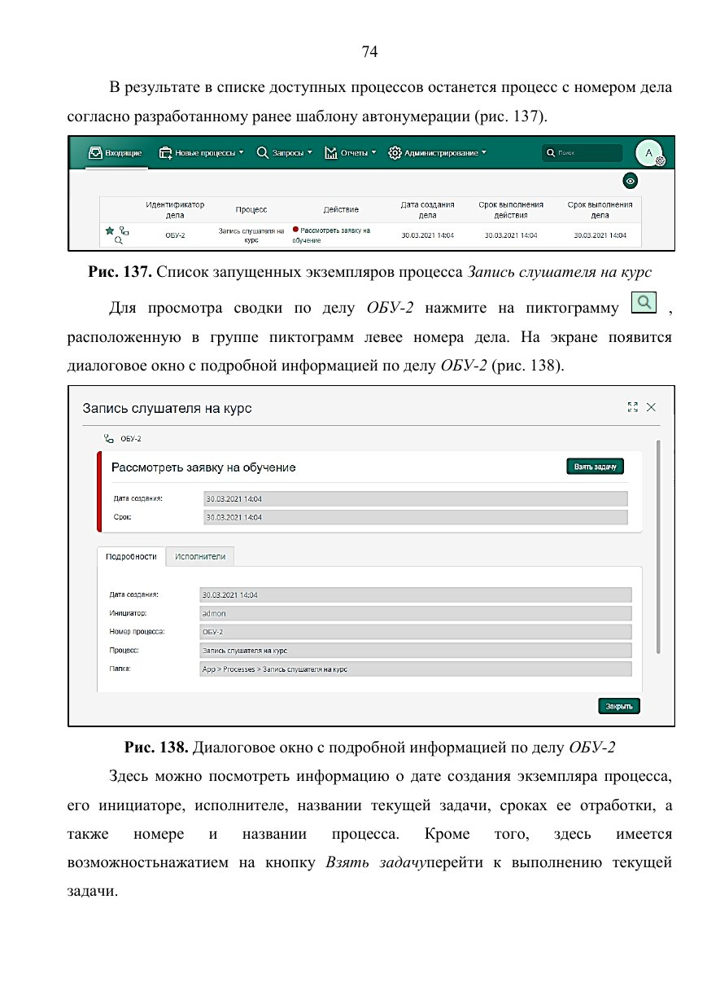

#### Шаг 13. Задать нормативное время и сформировать отчёты

1. В редакторе процесса задайте воспроизводимый набор нормативов: для основного процесса `480` минут; для операций используйте длительности из сценария `КАК ЕСТЬ` практики № 4: `15, 30, 5, 40, 90, 20, 15, 30` минут для соответствующих восьми задач.
2. Создайте несколько экземпляров: часть доведите до конца, часть оставьте активными, а один тестовый экземпляр намеренно оставьте после истечения короткого норматива, чтобы в отчёте появилась просрочка.
3. Откройте **Отчёты → BAM → Процесс** и сохраните `Анализ нагрузки` и `Незавершённые работы`.
4. Откройте **BAM → Действия** и сохраните нагрузку и незавершённые работы по операциям.
5. Откройте **BAM → Мониторинг ресурсов**, выберите столбец пользователя и откройте детализацию невыполненных действий.
6. Откройте **Отчёты → Аналитика → Процесс** и сформируйте `Продолжительность цикла`, `Гистограмма продолжительности`, `Активность процессов`, `Рейтинг запусков`.
7. Сохраните доступные отчёты как веб-страницы или XLSX.

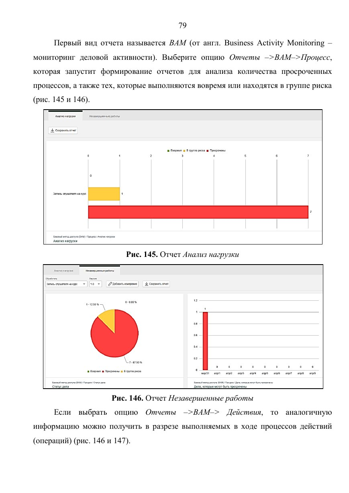

**В отчёт:** для каждого отчёта напишите, что измеряется, какой процесс/пользователь создаёт наибольшую нагрузку, где есть просрочка и чем фактическое время отличается от норматива.

### 8.4. Комплект сдачи и содержание отчёта

В отчёт необходимо добавлять:

1. Формулы/настройки вычисляемых атрибутов и фактический результат вычисления.
2. Организационную структуру, должности, роли и созданных учебных пользователей без публикации паролей.
3. Настройку автонумерации и номера реально запущенных экземпляров.
4. Экран отмены процесса и состояние экземпляра после отмены.
5. Списки активных и завершённых процессов.
6. Настройку нормативной длительности процесса и операций.
7. BAM-отчёты по процессам, действиям и ресурсам.
8. Аналитические отчёты: длительность цикла, гистограмма длительности, активность процессов, рейтинг запусков.
9. Собственный анализ просрочек, загрузки и различий между нормативным и фактическим временем.

## 9. Практическая работа № 7: ELMA 4.1 Community Edition

### 9.1. Почему работа не переносится в Bizagi Process Modeler

В этой работе необходимо установить и активировать ELMA 4.1 Community Edition, создать организационную структуру и пользователей, бизнес-процесс, модель данных, экранные формы и сценарии, опубликовать приложение на портале ELMA и исполнить процесс под разными пользователями. Интерфейс, проектный формат, портал и механизмы исполнения ELMA не являются функциями Bizagi Process Modeler.

### 9.2. Что можно подготовить в Modeler как проектную основу

Можно подготовить BPMN-спецификацию процесса `Запись слушателя на учебный курс`: дорожки, операции, шлюзы, события, данные, описания и опубликованную документацию. Это полезный проектный материал, но не заменяет проект ELMA и не считается полным выполнением работы № 7.

### 9.3. Пошаговое выполнение в ELMA 4.1

#### Шаг 1. Установить, активировать и проверить ELMA 4.1

1. Запустите установщик ELMA 4.1 Community Edition от имени обычного пользователя с правом установки программ.
2. Пройдите проверку системных требований, оставьте выбранными сервер приложений, веб-портал и компоненты базы данных, укажите локальный экземпляр БД и завершите установку.
3. Дождитесь сообщения об успешном завершении, затем запустите сервер ELMA, веб-Дизайнер и портал.
4. В окне активации введите законно полученный ключ Community Edition и подтвердите активацию. Ключ не включайте в отчёт.
5. Откройте портал через локальный адрес, войдите как `admin` и убедитесь, что доступны разделы администрирования и веб-Дизайнер.

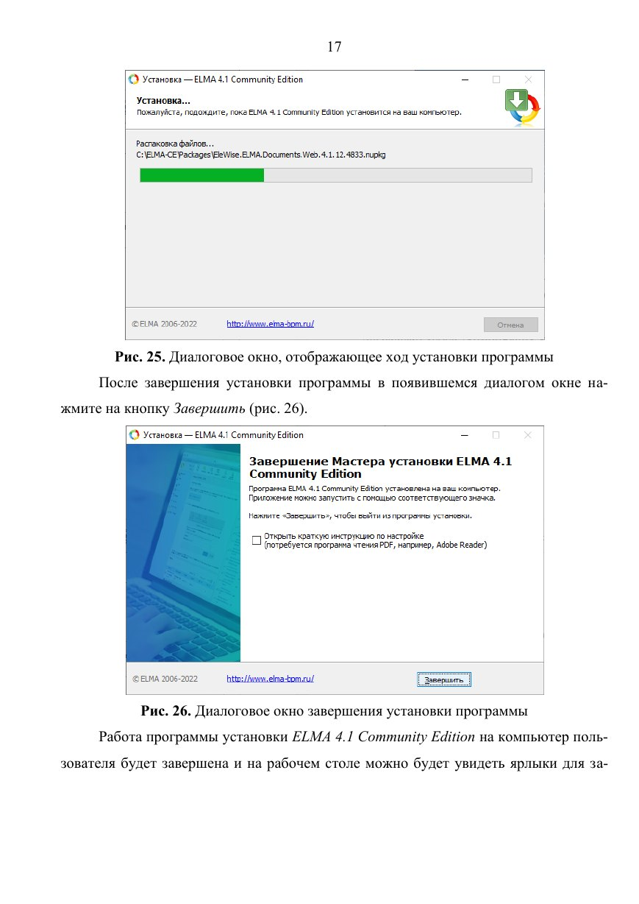

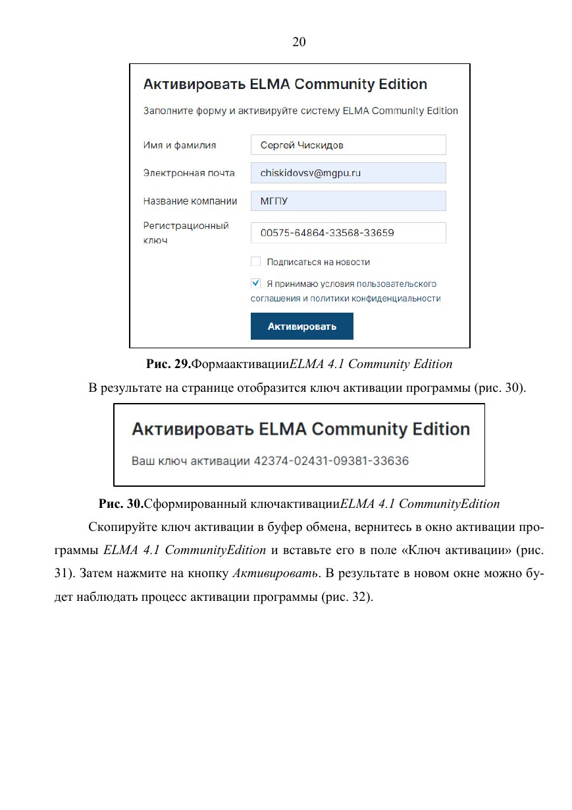

**В отчёт:** завершение установки, успешная активация с закрытым ключом и главная страница портала.

#### Шаг 2. Построить и опубликовать оргструктуру учебного центра

1. В веб-Дизайнере откройте **Оргструктура**.
2. Переименуйте корневую должность в `Директор учебного центра` и включите признак руководителя.
3. Создайте подчинённые должности `Начальник учебно-методического отдела`, `Начальник ИТ-отдела`, `Начальник учебного отдела`.
4. Под `Начальник учебно-методического отдела` создайте `Преподаватель курса`, `Методист курса`, `Администратор курса`.
5. Под `Начальник ИТ-отдела` создайте `Системный администратор`.
6. Под `Начальник учебного отдела` создайте подразделение `Учебный отдел`, а внутри него должность `Слушатель курса`.
7. Нажмите **Сохранить**, затем **Проверить**. Исправьте пустые названия или несвязанные элементы.
8. Переключите вид в дерево и сравните родительские связи с перечнем выше. После успешной проверки опубликуйте оргструктуру.

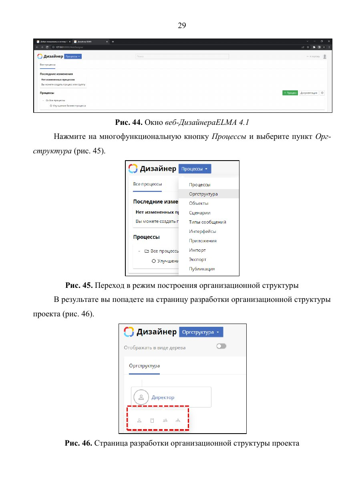

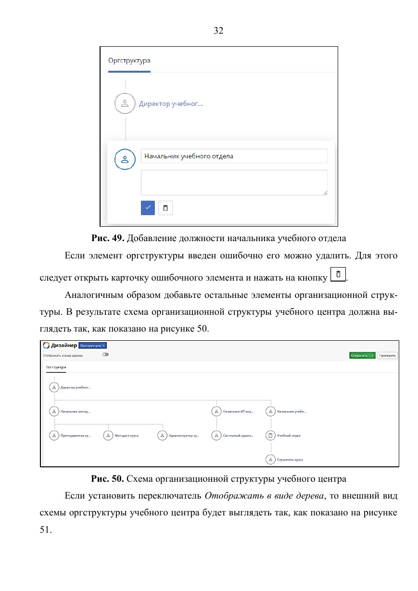

#### Шаг 3. Создать пользователей и назначить должности

1. На портале откройте **Администрирование → Пользователи**.
2. Пользователю `admin` назначьте должность `Системный администратор`.
3. Создайте четыре учебные записи:

| Логин | ФИО | Должность |
|---|---|---|
| iip | Иванов Игорь Петрович | Слушатель курса |
| pdo | Петров Дмитрий Олегович | Администратор курса |
| smi | Степанов Михаил Иванович | Преподаватель курса |
| bis | Борисова Ирина Сергеевна | Методист курса |

4. Назначьте временные пароли, сохраните каждого пользователя и выполните пробный вход. В отчёте показывайте логин, ФИО и должность, но скрывайте пароль.

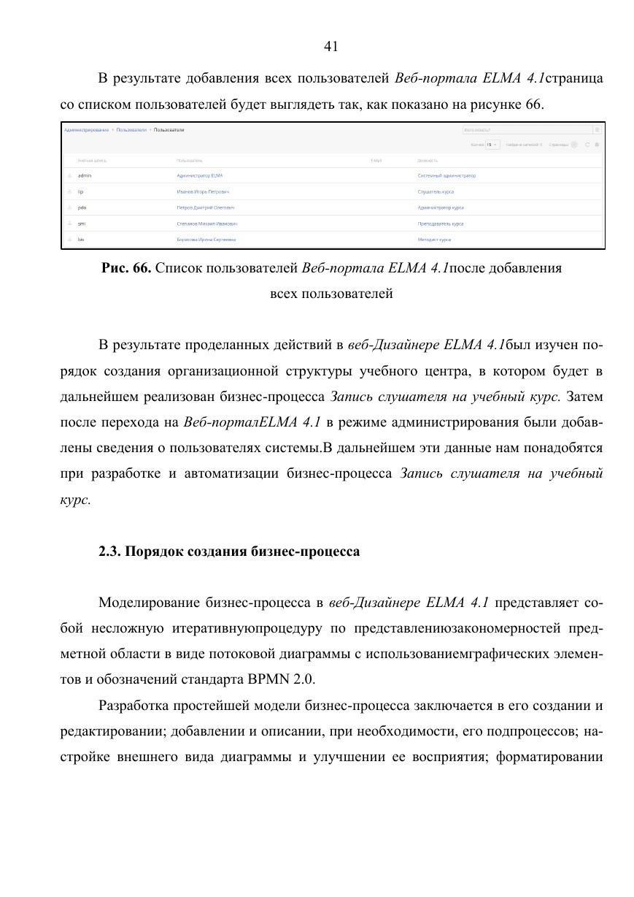

#### Шаг 4. Создать каркас процесса

1. В веб-Дизайнере откройте **Процессы → Создать процесс**.
2. Введите название `Запись слушателя на учебный курс`.
3. Выберите горизонтальное расположение зон ответственности и создайте три зоны: `Слушатель курса`, `Администратор курса`, `Преподаватель курса`; каждой зоне назначьте одноимённую должность.
4. Завершите мастер и откройте диаграмму.
5. В дорожке слушателя создайте начальное событие и задачу `Оформить заявку на обучение`.
6. В дорожке администратора создайте `Рассмотреть заявку на обучение` и шлюз `Заявка одобрена?`.
7. Ветвь `Нет` направьте в дорожку слушателя к `Сообщить об отклонении заявки`, затем к конечному событию отказа.
8. Ветвь `Да` направьте к `Сформировать график обучения`, затем в дорожку преподавателя к `Подготовить материалы по курсу` и `Сформировать профиль слушателя курса`.
9. Продолжите положительную ветвь задачей слушателя `Начать обучение`, затем задачей преподавателя `Проверить результаты обучения` и конечным событием.
10. Подпишите потоки `Да` и `Нет`, выровняйте элементы и сохраните процесс.

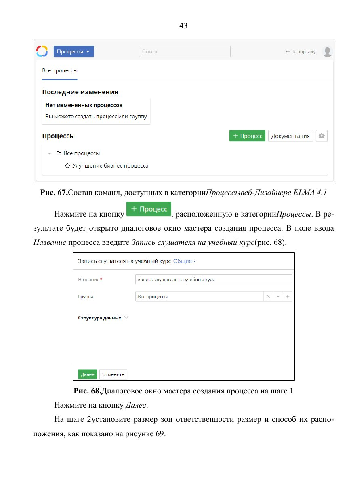

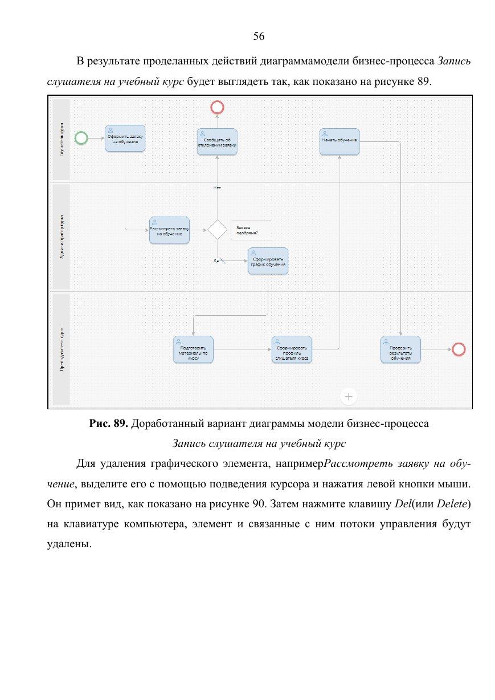

#### Шаг 5. Проверить, документировать и опубликовать процесс

1. Нажмите **Проверить**. Для каждой ошибки откройте элемент, добавьте отсутствующее имя, соединение, исполнителя или условие перехода.
2. После сообщения об успешной проверке откройте **Документация**, включите схему, свойства элементов и зоны ответственности, укажите папку практики и сформируйте документ.
3. Откройте документ, проверьте читаемость диаграммы и наличие всех задач.
4. Нажмите **Публикация**, подтвердите публикацию процесса и дождитесь сообщения об успехе.
5. Войдите на портал и проверьте, что процесс появился в списке запускаемых процессов.

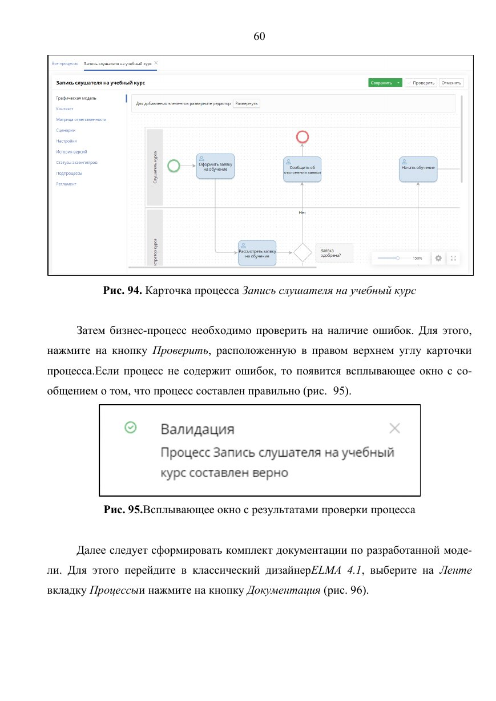

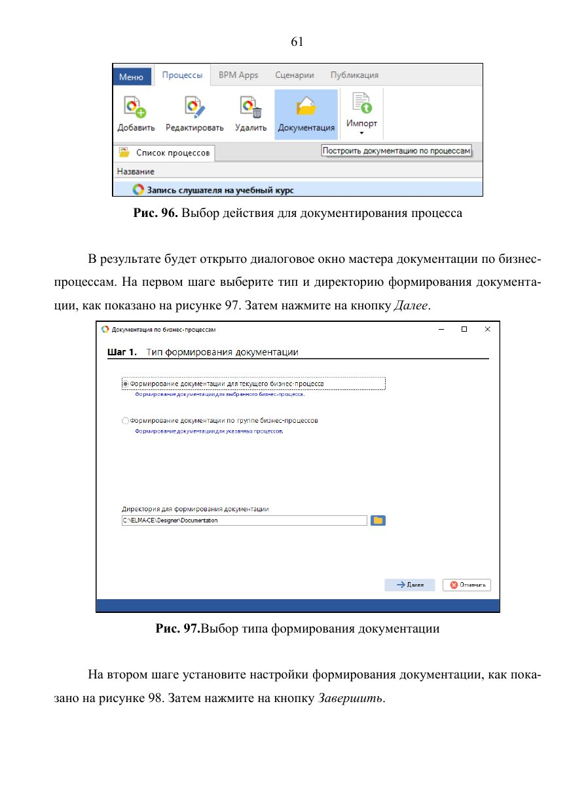

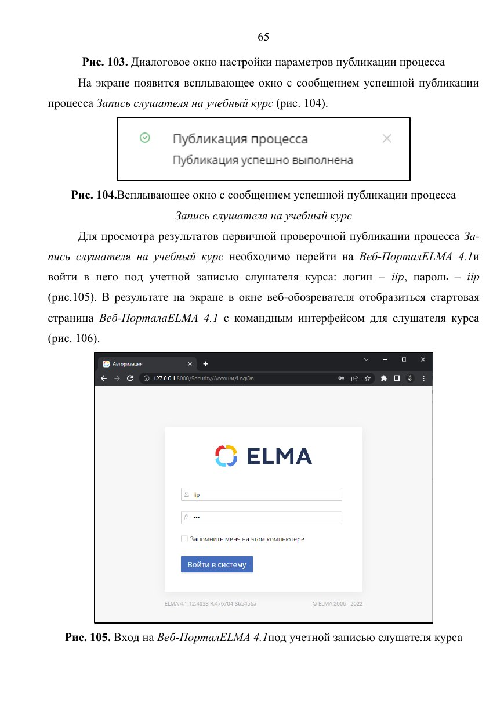

#### Шаг 6. Создать модель данных

1. Откройте **Процессы → Объекты**, создайте группу объектов `Запись слушателя на учебный курс`.
2. Создайте перечисления/справочники `Статус заявки`, `Уровень подготовки`, `Сложность курса`, `Вид занятия`.
3. Заполните значения:
   - статус: `Новая`, `Одобрена`, `Отклонена`, `Исполнена`;
   - уровень: `Нулевой`, `Базовый`, `Основной`, `Продвинутый`;
   - сложность: `Начальный`, `Продвинутый`, `Профессиональный`;
   - вид занятия: `Лекция`, `Практика`, `Семинар`, `Тестирование`.
4. Создайте объект `Слушатель курса`: `ФИО слушателя`, `Телефон слушателя`, `Почта слушателя`, `Логин слушателя`, `Пароль слушателя` - строки; `Уровень подготовки` - связь со справочником.
5. Создайте `Администратор курса`: `ФИО администратора`, `Телефон администратора`, `Почта администратора` - строки.
6. Создайте `Преподаватель курса`: `ФИО педагога`, `Телефон педагога`, `Почта педагога`, `Область интересов` - строки; `Стаж работы` - целое число.
7. Создайте `Учебный курс`: `Название курса` (строка), `Дата создания курса` (дата), `Описание курса` (многострочный текст), `Продолжительность курса` (число), `Ссылка на ЭОР курса` (строка/гиперссылка), `Автор курса` (связь с преподавателем), `Сложность курса` (справочник).
8. Создайте `Заявка на обучение`: `Номер заявки` (целое), `Дата заявки` (дата/время), `Описание заявки` (текст), `Дата начала обучения` и `Дата рассмотрения заявки` (дата/время), `Причина отклонения заявки` (текст), `Статус заявки`, `Слушатель курса`, `Название курса`, `Администратор курса` - связи с созданными объектами.
9. Создайте объект `График обучения`: `Номер занятия`, `Дата начала занятия`, `Дата окончания занятия`, `Балл за занятие`, `Отчёт за занятие` (файл), связь `Заявка на обучение`.
10. Внутри `График обучения` создайте блок `Занятие` со свойствами `Тема занятия`, `Вид занятия`, `Продолжительность`, `Описание занятия`, `Ссылка на ЭОР к занятию`.
11. Сохраните каждый объект и проверьте, что ссылки указывают на уже созданные справочники/объекты, а не являются обычным текстом.

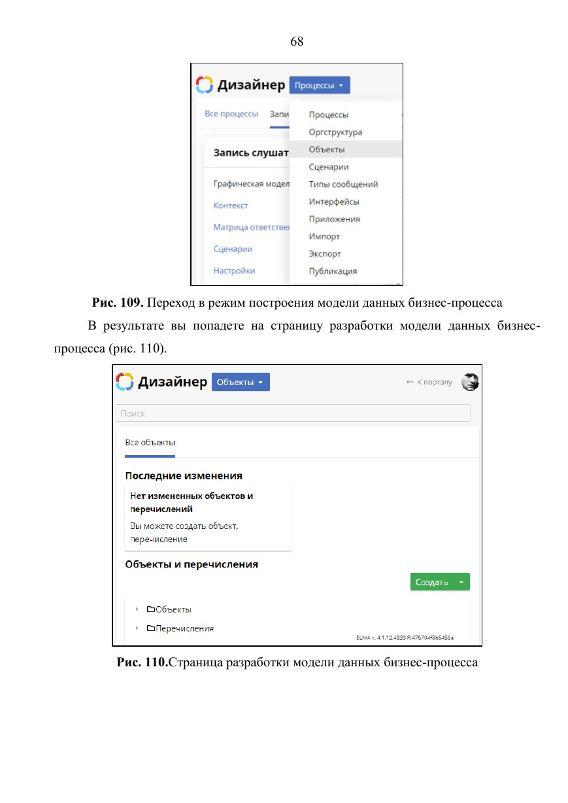

**В отчёт:** сводная таблица `Объект → Свойство → Тип → Связанный объект`, карточки ключевых объектов и список значений четырёх справочников.

#### Шаг 7. Опубликовать объекты и заполнить справочники

1. Для каждого справочника и объекта выберите **Сохранить → Публиковать** и подтвердите публикацию.
2. Если новые свойства не появились на портале, откройте классический Дизайнер ELMA, вкладку **Публикация**, нажмите **Перезапустить сервер** и дождитесь успешного запуска.
3. На портале создайте как минимум одного слушателя, одного администратора, одного преподавателя и один курс.
4. Для учебного курса заполните название, дату создания, описание, длительность, ссылку, автора и сложность; проверьте, что автор выбирается из справочника преподавателей.

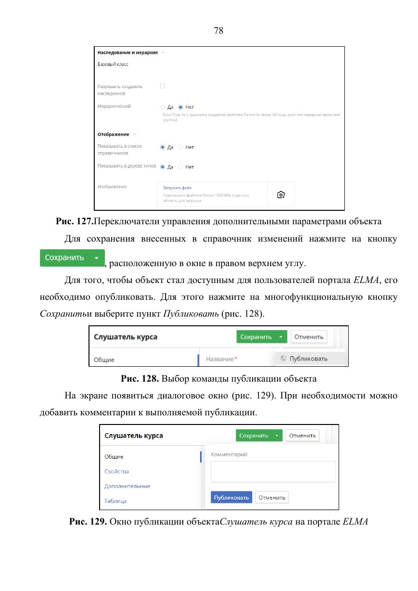

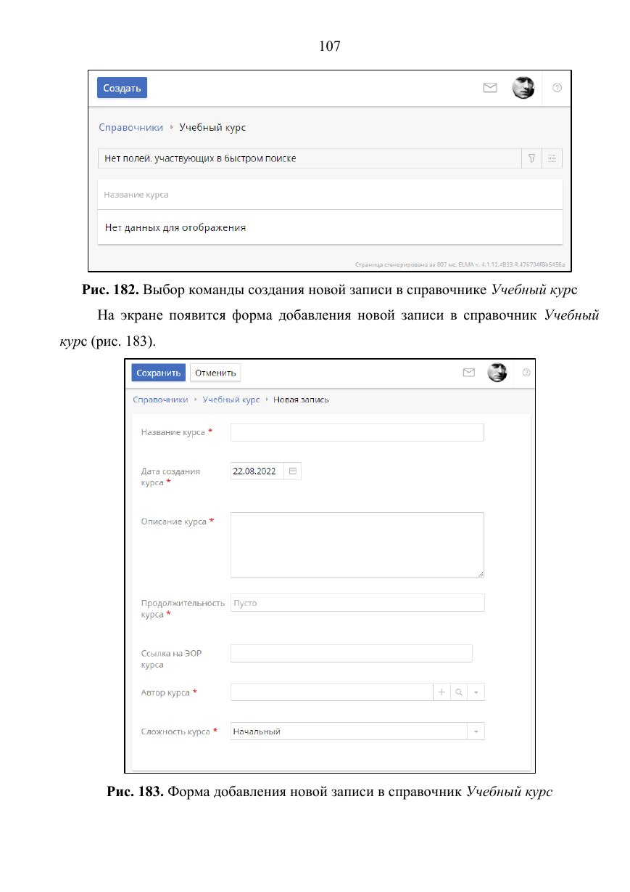

#### Шаг 8. Создать формы операций

1. Откройте задачу и выберите настройку формы. Добавляйте данные через свойства объекта и контекстные переменные, а не как несвязанные текстовые поля.
2. Сформируйте формы по таблице:

| Операция | Данные на форме | Что разрешено изменять |
|---|---|---|
| Оформить заявку | слушатель, уровень, курс, дата начала, описание заявки | все поля ввода заявки |
| Рассмотреть заявку | заявка, статус, дата рассмотрения, причина, администратор | статус, дата, причина, администратор |
| Сообщить об отклонении | заявка, статус, причина | только просмотр |
| Сформировать график | заявка и строки графика | добавление/изменение занятий |
| Подготовить материалы | курс, преподаватель, тема, вид, длительность, описание, ссылка | сведения о материалах |
| Сформировать профиль | слушатель, логин, пароль, график | логин, пароль и график |
| Начать обучение | профиль, график, отчёт за занятие | только загрузка отчётов |
| Проверить результаты | график, прикреплённые отчёты, баллы | просмотр файлов и ввод баллов |

3. Обязательными сделайте курс, слушателя, дату начала, статус решения, строки графика и файл отчёта. Системные и уже утверждённые сведения переведите в режим только чтения.
4. Сохраните каждую форму и откройте предпросмотр; подписи не должны обрезаться, а коллекция занятий должна отображаться таблицей.

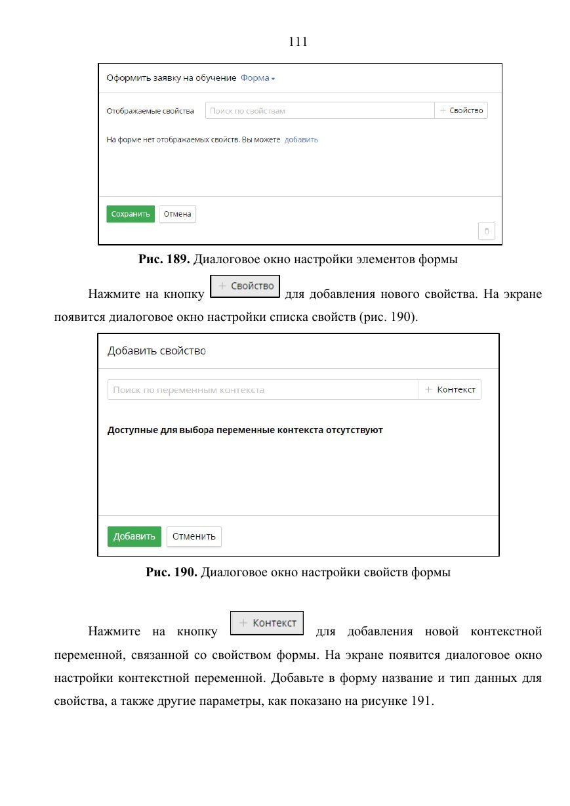

#### Шаг 9. Настроить сценарий шлюза

1. Выделите поток `Да`, откройте **Условие перехода** и выберите `Вид условия = Сценарий`.
2. Создайте сценарий `ZayavkaOdobrena`. ELMA сформирует сигнатуру `ZayavkaOdobrena(Context context, object GatewayVar)`.
3. В тело функции вставьте:

```csharp
if (context.ZayavkaNaObuchenie.StatusZayavki != "Отклонена")
{
    return true;
}
else
{
    return false;
}
```

4. Нажмите **Проверить** в редакторе, устраните ошибки имён по подсказкам модели данных и сохраните сценарий.
5. Для потока `Нет` выберите этот же сценарий с инверсией результата либо создайте условие, которое срабатывает при `StatusZayavki == "Отклонена"`.
6. Повторно проверьте и опубликуйте процесс.

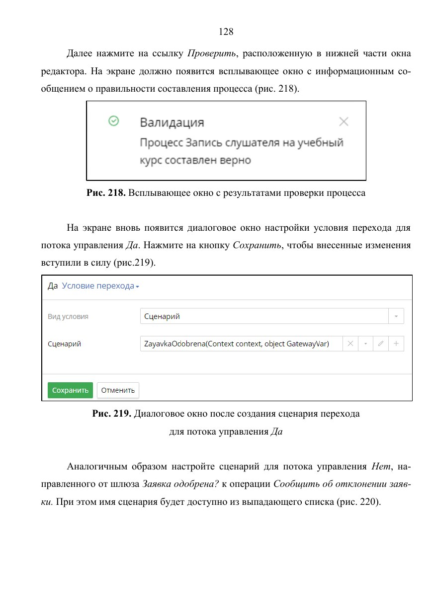

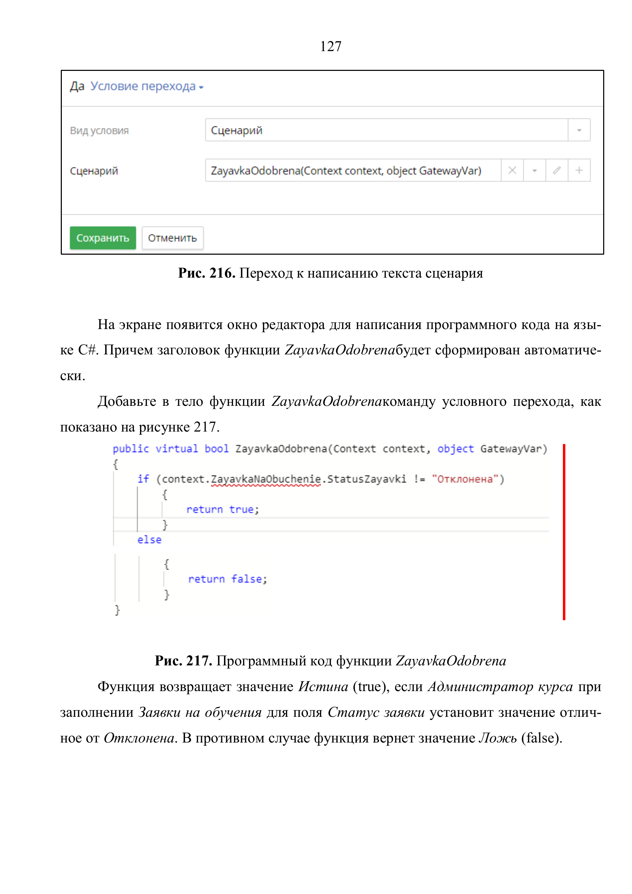

#### Шаг 10. Пройти положительный и отрицательный маршруты

1. Войдите как `iip`, запустите процесс и заполните заявку.
2. Войдите как `pdo`, откройте задачу рассмотрения. Для положительного теста задайте статус, отличный от `Отклонена`, и сформируйте график.
3. Войдите как `smi`, подготовьте материалы и сформируйте профиль.
4. Снова войдите как `iip`, откройте `Начать обучение`, прикрепите отдельный безопасный файл отчёта к каждому занятию и завершите задачу.
5. Войдите как `smi`, откройте `Проверить результаты обучения`, просмотрите каждый файл и поставьте балл.
6. После каждого переключения открывайте карту экземпляра и фиксируйте активную задачу.
7. Создайте второй экземпляр. На рассмотрении установите `Отклонена`, заполните причину и убедитесь, что слушатель получил только задачу уведомления об отказе.

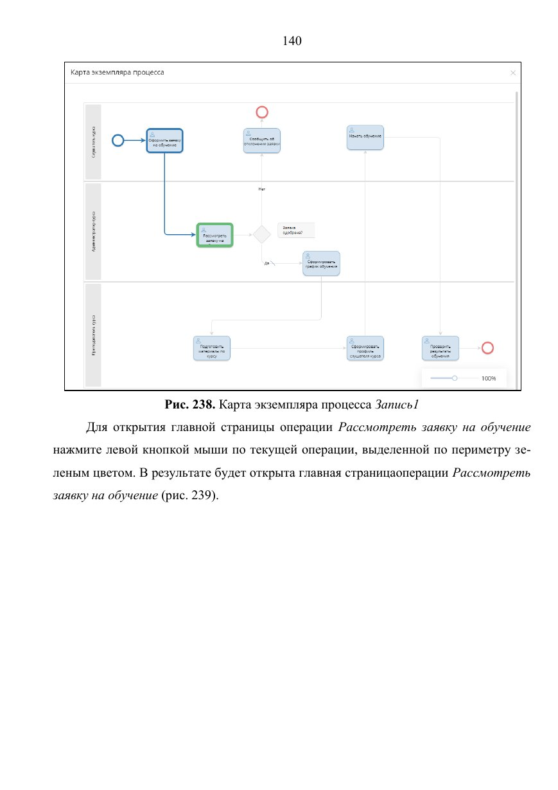

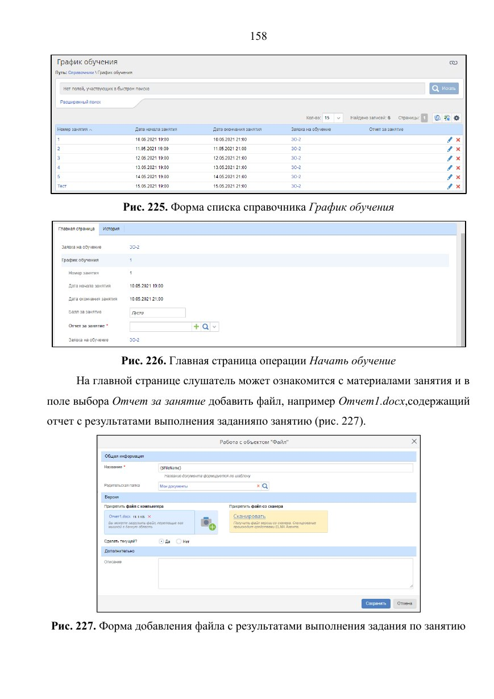

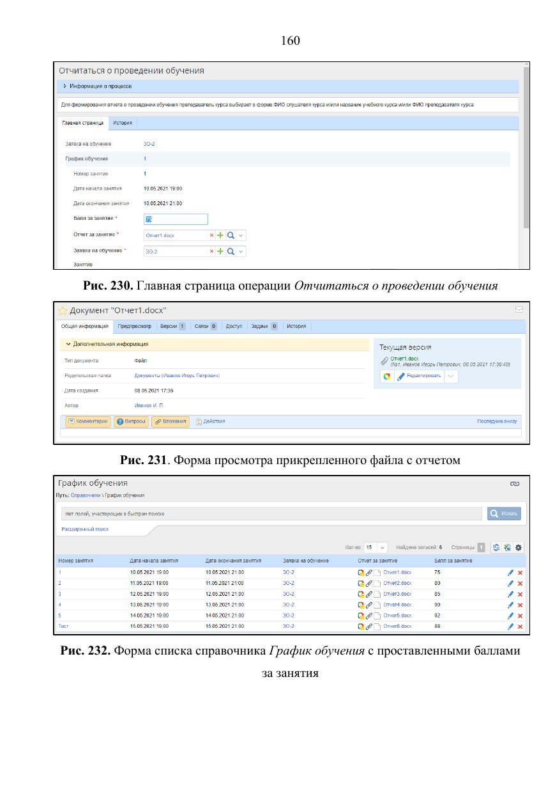

#### Шаг 11. Подтвердить завершение

1. Завершите последнюю задачу положительного маршрута.
2. Убедитесь, что портал показывает состояние `Процесс завершён`, а в истории доступны все выполненные переходы.
3. Проверьте, что оценки сохранены, вложения открываются и незавершённых задач по экземпляру нет.

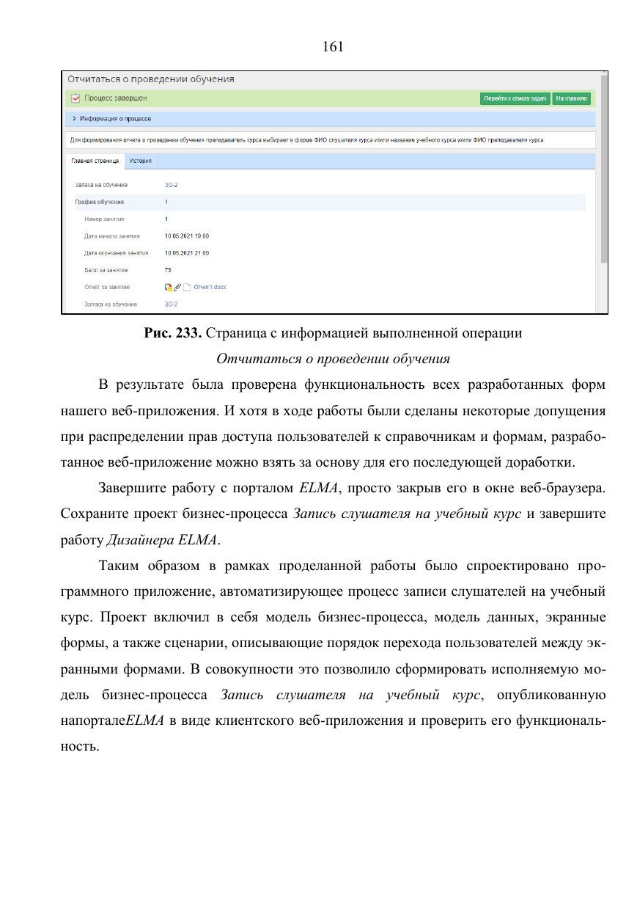

**В отчёт:** финальная страница, карта маршрута, список оценок и краткое объяснение того, как статус заявки определил выбранную ветвь.

Снимок BPMN из Bizagi Modeler можно использовать в работах № 5–7 как проектный эскиз, но не как доказательство действий в Bizagi Studio или ELMA.

### 9.4. Комплект сдачи и содержание отчёта

1. Установка, активация и успешный запуск ELMA.
2. Созданный проект и организационная структура.
3. Пользователи и назначенные роли без раскрытия паролей.
4. Первоначальная и доработанная BPMN-диаграммы.
5. Результат проверки, документирования и публикации процесса.
6. Модель данных: справочники, объекты, перечисления, свойства и связи.
7. Публикация объектов и заполненные справочники.
8. Экранные формы всех операций.
9. Сценарии переходов и обработчики действий.
10. Запуск экземпляра на портале и последовательность выполнения под ролями администратора, преподавателя и слушателя.
11. Прикрепление отчётов по занятиям, их просмотр и оценивание.
12. Страница завершённого процесса и анализ результата.

Комплект сдачи: файлы проекта ELMA `Запись слушателя на учебный курс` и электронный отчёт.

## 10. Итоговый контроль перед сдачей

Проверьте для каждой работы:

- название и цель совпадают с формулировками соответствующего раздела этой инструкции;
- постановка задачи перечисляет фактически выполненные действия;
- каждый важный этап подтверждён читаемым снимком;
- подписи к рисункам последовательны и на них есть ссылки в тексте;
- модель сохранена под именем из комплекта сдачи соответствующей практики и повторно открывается;
- валидация выполнена для всех диаграмм;
- экспортированные документы действительно открываются;
- в выводе есть анализ, а не только фраза «цель достигнута»;
- в отчёт не включены пароли, персональные данные и лишние окна рабочего стола;
- к отчёту приложены все файлы из подраздела `Комплект сдачи` соответствующей практики этой инструкции.

## 11. Источники и оговорки о версии

Основой инструкции являются семь уникальных PDF из выданного комплекта. Текст извлечён через MarkItDown MCP; страницы с числовыми параметрами симуляции дополнительно проверены визуально.

Для разграничения продуктов использована официальная документация Bizagi:

- Modeler: генерация документации - https://help.bizagi.com/platform/en/generating_documentation.htm
- Modeler: симуляция - https://help.bizagi.com/platform/en/simulation_in_bizagi.htm
- Modeler: сценарии - https://help.bizagi.com/platform/en/scenarios.htm
- Studio: Process Wizard - https://help.bizagi.com/platform/en/process_wizard.htm

Официальная онлайн-документация отражает текущий продукт и не является точным архивом сборки 4.0.0.012. Поэтому в спорных местах приоритет отдан реально доступному интерфейсу установленной версии, а отсутствие команды предлагается документировать скриншотом, не имитируя её выполнение.
