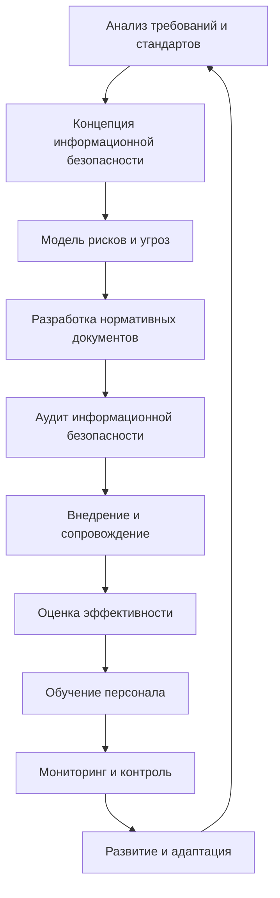

# Лекция 1. Разработка проектов нормативных документов по защите информации

## 1. Что понимается под защитой информации

Защита информации включает принятие **правовых, организационных и технических мер**, направленных на защиту информации от:

- неправомерного доступа;
- уничтожения;
- модификации;
- разглашения.

В рамках данной дисциплины особое значение имеют **организационные меры**, поскольку значительная часть таких мер закрепляется документально. Нормативные и организационно-распорядительные документы (ОРД) регламентируют, как организация обеспечивает информационную безопасность, кто отвечает за конкретные действия и как подтверждается выполнение установленных требований.

Ключевая мысль лекции: **выполнение требований в области защиты информации должно иметь документальное подтверждение**. Устного утверждения о том, что требования соблюдаются, для проверки недостаточно.

## 2. Цикл разработки документов по защите информации

Разработка документов представляет собой не разовое действие, а повторяющийся процесс.




| Этап                                                  | Содержание                                                                                                                                                                                    |
| --------------------------------------------------------- | ------------------------------------------------------------------------------------------------------------------------------------------------------------------------------------------------------- |
| Анализ требований и стандартов | Определение требований, которым должна соответствовать система защиты информации                                                |
| Формирование концепции ИБ          | Определение стратегии, принципов, целей и задач защиты информации                                                                               |
| Создание модели рисков                | Выявление и анализ угроз, оценка последствий их реализации                                                                                            |
| Разработка документов                 | Создание политик, регламентов, инструкций, руководств, деклараций, планов превентивных и корректирующих мер |
| Аудит                                                | Проверка соответствия системы применимым требованиям и документам                                                                            |
| Внедрение и сопровождение          | Реализация установленных правил, контроль их исполнения, адаптация к изменениям                                                    |
| Оценка эффективности                   | Периодическая проверка эффективности документов и системы защиты, внесение корректировок                                 |
| Обучение персонала                       | Подготовка работников с учётом функций организации и применимых требований                                                            |
| Мониторинг и контроль                  | Постоянное наблюдение за состоянием ИБ, выявление уязвимостей и недостатков                                                           |
| Развитие и адаптация                    | Учёт новых технологий, новых угроз и изменений нормативной базы                                                                                   |

После этапа развития организация вновь анализирует требования и при необходимости пересматривает концепцию, модель угроз и комплект документов.

## 3. Как из требования закона возникает конкретный документ

Законодательство не всегда прямо называет документ, который организация обязана разработать. Нередко необходимость документа следует из содержания отдельной нормы.

Преподаватель разбирает **часть 2 статьи 19 Федерального закона № 152-ФЗ «О персональных данных»**. Из перечисленных в ней мер можно вывести необходимость следующих документов и механизмов:


| Требование                                                                                       | Практический документ или результат                                                                                                          |
| ---------------------------------------------------------------------------------------------------------- | ---------------------------------------------------------------------------------------------------------------------------------------------------------------------------- |
| Определение угроз безопасности персональных данных           | Модель угроз                                                                                                                                                      |
| Применение организационных и технических мер                       | Комплект ОРД, описывающий меры защиты                                                                                                        |
| Применение средств защиты, прошедших оценку соответствия | Документы на сертифицированные средства защиты и подтверждение законности их применения        |
| Оценка эффективности мер до ввода ИСПДн в эксплуатацию      | Программа и методика оценки эффективности, протоколы испытаний подсистем и средств защиты      |
| Учёт машинных носителей персональных данных                         | Правила учёта и журнал учёта машинных носителей                                                                                     |
| Обнаружение несанкционированного доступа и принятие мер  | Правила регистрации и обработки инцидентов, при необходимости группа реагирования                    |
| Восстановление изменённых или уничтоженных данных             | Правила резервного копирования и восстановления                                                                                   |
| Установление правил доступа, регистрация и учёт действий  | Ролевая модель доступа, правила управления доступом и журналирование действий пользователей |
| Контроль принимаемых мер и уровня защищённости                    | План периодического контроля и журнал результатов контроля                                                               |

Следовательно, даже если закон не содержит фразу «оператор обязан разработать модель угроз», документ может быть необходим для доказательства того, что организация выполнила требование об определении угроз.

### Пример преподавателя: журнал учёта носителей в районной больнице

Специалист больницы готовит положение и пишет, что форма журнала учёта машинных носителей установлена законом № 152-ФЗ. Такая ссылка некорректна: закон устанавливает общую обязанность вести учёт, но не утверждает конкретную форму журнала.

Правовое обоснование выстраивается в несколько звеньев:

1. Пункт 5 части 2 статьи 19 закона № 152-ФЗ устанавливает общую обязанность учитывать машинные носители.
2. Приказ ФСТЭК России № 21 для ИСПДн или № 117 для информационных систем государственных учреждений закрепляет конкретную меру защиты.
3. Методический документ ФСТЭК раскрывает содержание этой меры.
4. Локальный приказ больницы утверждает применяемую в организации форму журнала.

Если пропустить одно из звеньев, нормативное обоснование становится непроверяемым.

## 4. Актуальность нормативной базы

Документы организации должны соответствовать действующим нормативным актам. Если регулятор заменил методический документ или приказ, старые ссылки в моделях угроз, технических проектах и ОРД требуется пересмотреть.

В лекции отмечены следующие изменения:


| Период                  | Изменение, названное преподавателем                                                                                                                                                                                                                                 |
| ----------------------------- | --------------------------------------------------------------------------------------------------------------------------------------------------------------------------------------------------------------------------------------------------------------------------------------------------- |
| 2021 год                   | Введена методика оценки угроз безопасности информации ФСТЭК России вместо более ранних методик                                                                                                                   |
| 1 мая 2022 года        | Указ Президента РФ № 250 ввёл дополнительные организационные и кадровые требования по обеспечению ИБ для определённых категорий организаций                                  |
| май 2025 года          | Усилена административная ответственность, упомянуты оборотные штрафы                                                                                                                                                                  |
| 2026 год                   | Приказ ФСТЭК России № 117 заменил ранее применявшийся приказ № 17 и распространил требования на более широкий круг государственных информационных систем             |
| апрель 2026 года    | Начал применяться новый методический документ ФСТЭК о составе и содержании мероприятий и мер по защите информации; документ 2014 года больше не применяется        |
| 30 января 2026 года | По словам преподавателя, вступил в силу приказ ФСБ России № 547 о порядке информирования о компьютерных атаках и инцидентах, а приказ № 282 от 2019 года утратил силу |
| 2026 год                   | Упомянуты изменения порядка аттестации, утверждённого приказом ФСТЭК № 77, и усиление требований к контролю защищённости с 1 сентября 2026 года                                  |

> В расшифровке названия некоторых актов, номера и даты местами распознаны неуверенно. Для подготовки реального документа следует сверить их по официальным публикациям. В конспекте сохранён смысл объяснения преподавателя, а не проведена внешняя правовая экспертиза.

### Пример преподавателя: ссылка на отменённый документ

При проверке модели угроз обнаружили ссылку на методический документ 2014 года «Меры защиты информации в государственных информационных системах», а меры выбрали по этому же документу. Если документ утратил применимость, внутреннюю документацию необходимо переработать и привести в соответствие с новым методическим документом.

## 5. Обязательные и ситуационные документы

Комплект документов зависит от:

- типа организации;
- вида информационной системы;
- категорий обрабатываемой информации;
- использования средств криптографической защиты информации (СКЗИ);
- наличия объектов критической информационной инфраструктуры (КИИ);
- применяемых технологий и фактических процессов.

Есть **общие документы**, которые требуются широкому кругу организаций независимо от классификации конкретной системы. Есть **специальные блоки**, которые добавляются только при наличии соответствующего основания.

Например, положение о видеонаблюдении не нужно, если организация не ведёт видеонаблюдение. Разделы о виртуализации можно исключить, если виртуализация не применяется. Всё, что прямо или косвенно требуется законодательством, должно быть отражено обязательно. Дополнительные положения включаются только тогда, когда они нужны конкретной организации.

Организация самостоятельно решает, оформить ли каждую меру отдельным документом или объединить связанные правила в политику информационной безопасности. Однако нельзя без разбора смешивать в одном тексте документы с разным назначением.

## 6. Иерархия источников требований

Нижестоящий документ конкретизирует вышестоящий и не может ему противоречить.

```text
Конституция Российской Федерации
└── федеральные законы
    └── указы Президента Российской Федерации
        └── постановления Правительства Российской Федерации
            └── приказы ФСТЭК России и ФСБ России
                └── методические документы регуляторов
                    └── национальные стандарты
                        └── локальные ОРД организации
```

### Пример преподавателя: личное облачное хранилище

Локальная инструкция разрешает работнику хранить служебные файлы на личном облачном диске. Работник полагает, что действует правомерно, поскольку инструкцию утвердил руководитель.

Однако локальная инструкция находится на нижнем уровне иерархии. Если её норма противоречит требованиям регулятора или акту более высокого уровня, такая норма не применяется. Инструкцию следует немедленно переработать, а руководитель отвечает за содержание утверждённого им документа.

## 7. Компетенции регуляторов


| Орган               | Основная компетенция, обозначенная в лекции                                                                                                                                                                                                                                                                                                                                                                                                                                                       |
| ------------------------ | --------------------------------------------------------------------------------------------------------------------------------------------------------------------------------------------------------------------------------------------------------------------------------------------------------------------------------------------------------------------------------------------------------------------------------------------------------------------------------------------------------------------------------------- |
| ФСТЭК России  | Техническая защита информации некриптографическими методами; требования к защите информации в информационных системах, АСУ ТП и на объектах КИИ; лицензирование деятельности по технической защите конфиденциальной информации; аттестация объектов информатизации; банк данных угроз |
| ФСБ России      | Криптографическая защита; требования к СКЗИ и их эксплуатации; ГосСОПКА и НКЦКИ; реагирование на компьютерные инциденты                                                                                                                                                                                                                                                                                                           |
| Роскомнадзор | Контроль и надзор за обработкой персональных данных; реестр операторов; приём уведомлений об обработке персональных данных и инцидентах                                                                                                                                                                                                                                                                            |
| Росстандарт   | Национальные стандарты, в том числе требования к оформлению документации                                                                                                                                                                                                                                                                                                                                                                                                 |

Ошибка в выборе адресата может привести к пропуску установленного срока или неправильному оформлению обязательных сведений.

### Пример преподавателя: куда направлять документы

Администратор государственного учреждения решил согласовывать журнал поэкземплярного учёта СКЗИ с территориальным органом ФСТЭК и туда же направить уведомление об обработке персональных данных.

Такое распределение неверно:

- вопросы СКЗИ относятся к компетенции ФСБ России;
- уведомления об обработке персональных данных относятся к Роскомнадзору;
- ФСТЭК отвечает за некриптографическую техническую защиту, аттестацию и связанные требования.

## 8. Специальные блоки документов

Если организация применяет сертифицированное СКЗИ, к комплекту по линии ФСТЭК добавляется самостоятельный комплект по линии ФСБ. По формулировке преподавателя, объём документации в такой ситуации фактически удваивается. Если криптография не используется, соответствующий раздел исключается.

### Пример преподавателя: областной центр социального обслуживания

Исходные условия:

- центр обрабатывает персональные данные работников и получателей услуг;
- для защищённого канала с региональным министерством применяется сертифицированный ViPNet;
- объектов КИИ у организации нет;
- комплект документов создаётся с нуля.

Преподаватель предлагает сформировать следующие блоки:

1. **Общий блок:** политика ИБ, приказы о назначении ответственных и иные общие документы.
2. **Блок государственных информационных систем:** требования приказа ФСТЭК № 117, акт классификации, модель угроз и документы по аттестации.
3. **Блок персональных данных:** № 152-ФЗ, постановления Правительства и приказ ФСТЭК № 21.
4. **Блок СКЗИ:** документы по линии ФСБ, поскольку используется ViPNet.

Блок КИИ не формируется, так как соответствующих объектов нет.

## 9. Правила оформления нормативных ссылок

Некорректная ссылка обесценивает положение документа: проверяющий не может сопоставить его с требованием регулятора.

Полная ссылка должна содержать:

1. вид акта: федеральный закон, указ, постановление, приказ, методический документ и т. п.;
2. орган, издавший акт;
3. дату;
4. номер;
5. полное официальное название документа в кавычках, без пересказа и произвольных сокращений;
6. при необходимости указание на действующую редакцию.

> В устной лекции преподаватель сначала говорит о «пяти элементах», но далее отдельно называет ещё и редакцию документа. Практически редакцию следует учитывать как дополнительный обязательный реквизит, когда она имеет значение.

Цель издания документа не заменяет правового основания. Формулировки вида «в целях повышения уровня информационной безопасности» недостаточно. Нужно добавить: **на основании** или **в соответствии с** конкретными актами.

## 10. Виды локальных документов и их назначение


| Вид документа | Для чего нужен                                                                                                                                                                                        |
| ------------------------- | ----------------------------------------------------------------------------------------------------------------------------------------------------------------------------------------------------------------- |
| Политика          | Закрепляет постоянно действующие принципы и правила; изменяется сравнительно редко                                                       |
| Приказ              | Оформляет конкретное управленческое решение: назначить ответственное лицо, создать группу, утвердить инструкцию |
| Инструкция      | Определяет порядок действий конкретной категории работников в определённых ситуациях                                                  |
| Журнал              | Фиксирует факты и позволяет проследить действия, события, выдачу носителей или ключей, результаты контроля             |

### Пример преподавателя: «одна инструкция на все случаи жизни»

Организация включила в одну большую инструкцию принципы защиты, решение о создании группы реагирования, формы записей о выданных ключах и другие разнородные положения.

Такой подход неверен, потому что политика, приказ, инструкция и журнал решают разные задачи. Политика может состоять из нескольких связанных документов или томов, но смешивать все виды управленческих решений и записей в одном тексте не следует.

## 11. Базовый приказ о назначении ответственных

Один из первых документов для организации: **приказ о назначении ответственного за организацию обработки персональных данных и администратора безопасности информации**.

Это две разные функции:


| Функция                                                                                                  | Основной акцент                                                                                                                                             |
| --------------------------------------------------------------------------------------------------------------- | ------------------------------------------------------------------------------------------------------------------------------------------------------------------------- |
| Ответственный за организацию обработки персональных данных | Организационная и документальная часть, соблюдение законодательства о персональных данных |
| Администратор безопасности информации                                        | Техническая часть, управление доступом и средствами защиты, контроль технических процедур   |

Обе функции может выполнять один сотрудник, но его обязанности по каждой функции должны быть разграничены. Закон, по словам преподавателя, не устанавливает специальных требований к образованию или стажу ответственного за обработку персональных данных. Руководитель выбирает сотрудника с учётом реальных процессов организации.

Назначать на эту функцию работника кадровой службы удобно, если речь идёт главным образом о данных сотрудников. Но если организация обрабатывает данные клиентов, логичнее учитывать, кто реально организует эту обработку.

Кроме ответственного лица, руководитель определяет **круг работников, которым персональные данные необходимы для исполнения должностных обязанностей**. В него могут входить бухгалтеры, кадровые работники и сотрудники, работающие с клиентами.

Ответственный за обработку персональных данных и администратор безопасности не являются отдельными должностями сами по себе. Это дополнительные функции сотрудников, уже занимающих определённые должности.

### Содержание приказа

Приказ должен включать:

1. наименование организации или фирменный бланк;
2. вид документа;
3. регистрационный номер, дату и место составления;
4. заголовок, обычно начинающийся с «О» или «Об»;
5. констатирующую часть с целью и правовыми основаниями;
6. распорядительную часть со словом «ПРИКАЗЫВАЮ»;
7. должности и Ф. И. О. назначенных работников;
8. утверждение отдельных инструкций или внесение изменений в действующие должностные инструкции;
9. лицо, контролирующее исполнение приказа;
10. подпись руководителя;
11. сведения об ознакомлении заинтересованных работников.

Если новые обязанности вносятся в должностную инструкцию работника, преподаватель обращает внимание на необходимость оформить дополнительное соглашение к трудовому договору.

### Примеры ошибок

**Ошибка 1.** Проект начинается сразу словами «Назначить администратора безопасности» и не содержит заголовка и основания.
**Последствие:** документ становится уязвимым в трудовом споре. Следует восстановить обязательные реквизиты, констатирующую и распорядительную части, подпись и ознакомление.

**Ошибка 2.** В приказе написано только «В целях повышения уровня информационной безопасности приказываю».
**Исправление:** указать не только цель, но и конкретные нормативные основания.

**Ошибка 3.** В одном приказе организация назначила ответственного за персональные данные, возложила полномочия по ИБ на заместителя руководителя, утвердила акт классификации и ввела режим коммерческой тайны, сославшись только на № 152-ФЗ.
**Почему неверно:** каждое решение имеет собственное основание. В лекции названы № 152-ФЗ для обработки персональных данных, Указ Президента № 250 для полномочий по ИБ, приказ ФСТЭК № 117 для классификации и статья 10 № 98-ФЗ для режима коммерческой тайны. Такие решения целесообразно оформить разными приказами.

## 12. Инструкция администратора безопасности

Инструкция закрепляет функции, права, обязанности и ответственность администратора.

### Основные функции

- управление учётными записями: регистрация и удаление;
- разграничение и корректировка прав доступа;
- учёт работников, допущенных к информационной системе;
- выдача электронных и бумажных носителей защищаемой информации;
- контроль смены паролей;
- контроль соблюдения правил печати, регистрации и учёта защищаемых документов;
- проверка данных, остающихся на рабочих станциях после работы пользователей;
- обеспечение антивирусной защиты;
- создание и выдача электронных ключей;
- проверка целостности пломб и защитных знаков на оборудовании;
- контроль соблюдения правил работы с персональными данными и коммерческой тайной;
- информирование руководства об угрозах.

### Права администратора

Администратор вправе:

- требовать от работников соблюдения правил защиты и хранения информации;
- участвовать в расследовании несанкционированного доступа;
- останавливать обработку защищаемой информации при сбоях средств защиты, истечении сертификатов или выявлении признаков технической разведки.

## 13. Инструкция ответственного за организацию обработки персональных данных

Рекомендуемая структура:

1. **Общие положения:** статус ответственного, подчинённость, общие обязанности и ответственность.
2. **Функции:** организация обработки персональных данных, обеспечение соблюдения законодательства, взаимодействие с работниками, контроль выполнения требований защиты.
3. **Права:** принятие решений в пределах компетенции, взаимодействие с подразделениями, внесение руководству предложений по улучшению процессов.
4. **Ответственность:** за неисполнение или ненадлежащее исполнение обязанностей и за нарушение требований законодательства.

Приведённая структура является минимальной. Содержание следует расширять с учётом деятельности конкретной организации и её внутренних документов.

## 14. Группа реагирования на инциденты

Для реагирования на инциденты преподаватель выделяет два связанных, но самостоятельных документа:

1. приказ о назначении группы реагирования на инциденты информационной безопасности;
2. инструкция или правила регистрации инцидентов и реагирования на них.

Приказ определяет состав группы и утверждает инструкцию. Администратор безопасности обычно входит в группу и может быть её руководителем. По словам преподавателя, на практике группа часто включает не менее трёх человек: руководителя и специалистов, отвечающих за разные стороны технической и программной безопасности.

Не следует перегружать приказ подробным регламентом. Приказ оформляет решение о создании группы, а порядок её действий раскрывает инструкция.

## 15. Инструкция по реагированию на инциденты

Инструкция должна описывать:

1. **Анализ инцидента:** оценка ущерба, выявление ранее неучтённых угроз, установление причин.
2. **Устранение последствий:** действия администратора безопасности и системных администраторов по установленным правилам и срокам.
3. **Предотвращение повторения:** план мероприятий, направленных на недопущение аналогичных ситуаций.
4. **Внутреннее расследование:** сбор и оценка материалов, определение причин и виновных лиц, при необходимости создание комиссии.
5. **Участие работников:** ознакомление с материалами расследования и возможность представить комментарии и дополнительные сведения.
6. **Конфиденциальность материалов:** сохранность материалов расследования и ограничение доступа к ним.
7. **Результаты и ответственность:** ознакомление заинтересованных работников с выводами и применение мер к виновным лицам.

В эту же инструкцию можно включить перечень регистрируемых событий безопасности, сроки хранения сведений и состав фиксируемой информации. Это позволяет не создавать несколько лишних документов.

### Пример преподавателя: файл с персональными данными на личной почте

Работник отправил на личную почту файл с персональными данными клиентов. Правила обращения с информацией и инструкция по реагированию утверждены, но работника с ними письменно не ознакомили. Руководитель объявил выговор.

Работник сможет оспорить взыскание, поскольку организация не подтвердит, что довела требования до него. К каждой инструкции нужен лист или журнал ознакомления.

Работников знакомят с внутренними актами при приёме на работу. При изменении документов их также необходимо уведомлять. В лекции названы возможные способы: корпоративная электронная почта, внутренняя система электронного документооборота, облачное хранилище или сайт организации. Главное, чтобы факт доведения изменений можно было подтвердить.

### Ситуативный пример из самой лекции

Во время занятия заведующая кафедрой позвонила преподавателю, чтобы узнать, где можно увидеть приказ о приёме сотрудников на работу. Преподаватель использовала этот звонок как иллюстрацию: работника необходимо знакомить с приказами и иными документами, которые относятся к нему. На практике даже в крупных организациях эта процедура выполняется не всегда.

## 16. Требования Указа Президента РФ № 250

Для органов государственной власти, государственных фондов и корпораций, стратегических и системообразующих организаций, субъектов КИИ и других перечисленных в указе организаций действуют самостоятельные кадровые требования.

По объяснению преподавателя, такие организации должны:

- возложить полномочия по обеспечению ИБ, как правило, на заместителя руководителя;
- создать структурное подразделение по ИБ или возложить эти функции на существующее подразделение;
- обеспечить уполномоченным должностным лицам ФСБ России возможность мониторинга защищённости информационных ресурсов, включая в установленных случаях удалённый доступ.

Поэтому в комплект документов добавляются:

- приказ о возложении полномочий на заместителя руководителя;
- приказ о создании или определении подразделения ИБ;
- положение об этом подразделении.

Назначение только администратора безопасности не закрывает отдельные кадровые требования Указа № 250.

### Пример преподавателя: один системный администратор по устной договорённости

В государственном учреждении вопросами ИБ фактически занимается один системный администратор, но приказов и выделенного подразделения нет. Правильное оформление включает приказ о возложении полномочий по ИБ на заместителя руководителя и приказ о создании или определении подразделения с утверждением положения о нём.

## 17. Инструкция пользователя государственной информационной системы

Во многих организациях работники используют государственные информационные системы. В качестве примера преподаватель приводит образовательную организацию, которая работает с **ФИС ФРДО** и передаёт туда сведения о документах об образовании выпускников. По словам преподавателя, сведения необходимо передать в установленный срок после выдачи документа.

Инструкция пользователя ГИС нужна, чтобы:

- регламентировать доступ к информационным ресурсам;
- закрепить обязанности пользователей по защите информации;
- юридически оформить ответственность за нарушение требований;
- определить обучение и контроль пользователей.

### Рекомендуемая структура

1. **Общие положения:** перечень используемых ГИС и их пользователей, цели автоматизации, администраторы системы и безопасности.
2. **Права и обязанности пользователей:** минимально необходимый доступ, ответственность за конфиденциальную информацию, соблюдение нормативных актов.
3. **Общие обязанности по защите:** неразглашение, уведомление администратора о подозрительной активности, запрет личных технических средств и другие правила.
4. **Меры защиты:** визуальная проверка целостности оборудования, контроль посторонних лиц, защита информации на экране.
5. **Работа с криптографическими средствами:** правила применения СКЗИ, если они используются.
6. **Парольная защита:** вход в систему, смена паролей, периодичность и требования к паролям.
7. **Ответственность:** последствия нарушения правил в соответствии с законодательством и локальными актами.
8. **Заключительные положения:** порядок изучения инструкции новыми пользователями и срок её действия.

Инструкция должна быть понятной и полезной. Избыточно тяжёлый текст снижает вероятность того, что пользователи действительно усвоят требования.

## 18. Основные выводы лекции

1. Законодательное требование часто не называет документ напрямую, поэтому разработчик должен уметь вывести необходимый документ из содержания нормы.
2. Выполнение требований подтверждается документами, журналами, протоколами и записями об ознакомлении.
3. Локальный документ должен иметь проверяемое правовое основание и не противоречить актам более высокого уровня.
4. Комплект документов строится под фактическую деятельность организации. Неиспользуемые технологии и неприменимые режимы не должны механически включаться в документы.
5. Компетенции ФСТЭК, ФСБ, Роскомнадзора и Росстандарта различаются. Неверный выбор регулятора создаёт юридические и организационные риски.
6. Политика, приказ, инструкция и журнал выполняют разные функции. Их нельзя бездумно объединять в один документ.
7. Назначение ответственных требует не только приказа, но и понятных инструкций, полномочий и подтверждённого ознакомления.
8. Реагирование на инциденты должно охватывать регистрацию, анализ, устранение последствий, расследование и предотвращение повторения.
9. Документы необходимо регулярно пересматривать вслед за изменением нормативной базы и условий работы организации.
10. Базовый комплект, рассмотренный на лекции, включает приказы о назначении ответственных, инструкции ответственного за обработку персональных данных и администратора безопасности, документы группы реагирования, а для применимых организаций также документы по Указу № 250 и инструкцию пользователя ГИС.
